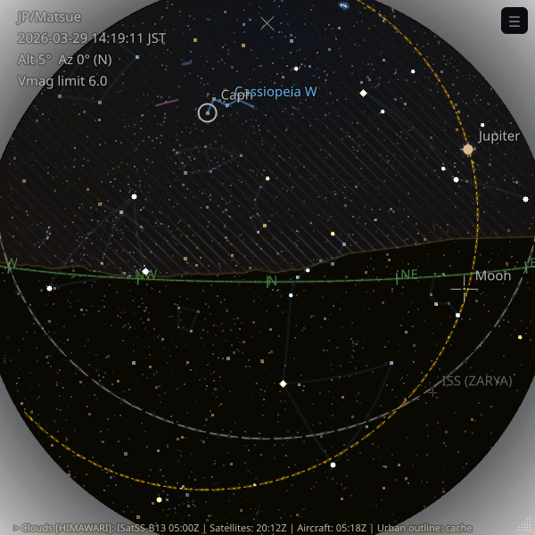

# zstarview 🌌

See the starry sky, even when it's cloudy or the sun is out.

**Zenith Star View** is an application that displays the starry sky from any city on Earth.
The name emphasizes the *zenith*—the point directly overhead—conveying the experience of looking straight up into the night sky from your location.

**Features:**

- Real-time rendering of bright stars, planets, the celestial equator, and the ecliptic.
- Named deep-sky objects (galaxies/open clusters/globular clusters) are shown as soft blue extents; DSO hover is independent from star hover.
- Asterism overlay (not IAU constellations): shown as dim ambient lines; hovering a member star brightens the matching pattern and shows its label, with 3-second rotation when multiple asterisms share that star.
- Supports Sun, Moon, and major planets. Minor planets (asteroids) are not displayed yet.
- Location specified by city name (based on GeoNames), or directly by latitude/longitude.
- Adjustable view center: `-A` (altitude) and `-Z` (azimuth).
- Real-time satellite cloud imagery (Himawari/GOES), rendered as a stylized hatched (striped) overlay.
- Cloud fetch and cloud render are decoupled: camera moves can re-render from cached source data immediately.
- When satellite coverage is partial, missing regions are shown with a faint yellow tint.
- Optional terrain horizon overlay from Copernicus DEM adds a subtle ocher terrain line aligned to the local terrain.
- Below the geometric or terrain horizon, the disc is filled with a ground color for orientation.
- During view-center changes or window resize, the app briefly switches to a simplified viewport-interaction mode that keeps only bright stars, guide lines, and the terrain horizon responsive while heavier layers catch up after idle.
- A red tint marks the *never-rises* celestial region for the current latitude.
- The project is routinely tested on CPython 3.10, 3.11, 3.12, and 3.13.

  

## Installation (Recommended: `pipx`)

It is intended to be installed using [`pipx`](https://pypa.github.io/pipx/).

```bash
pipx install zstarview
```

Upgrade:

```bash
pipx upgrade zstarview
```

> Note: Troubleshooting tips (including X11 libraries and slow network) are summarized below.

## Usage

```bash
zstarview [options] [location]
```

> Note (Ubuntu/Wayland, GNOME): If the taskbar icon does not appear when launching from a terminal, follow the steps in [Generating a `.desktop` launcher (GNOME only)](#generating-a-desktop-launcher-gnome-only).

### GUI

#### Key Operations

* **← / →**: Rotate view azimuth by ±5°
* **↑ / ↓**: Change view altitude by ±5° (clamped to 0°..90°)
  While arrow-key input continues, the app keeps a simplified viewport-interaction mode for about 0.7 seconds after the last input. In this mode, it shows stars up to `Vmag <= 4.0`, the celestial equator, ecliptic, horizon, terrain horizon, direction labels, and the zenith marker; planets, full star density, sky-color disc, clouds, DSO, and asterisms are temporarily hidden.
* **M**: Toggle moon enlarged to 5x size
* **D**: Toggle DSO overlays
* **A**: Toggle asterism overlays
* **S**: Toggle sky-color shading between gradient and flat-disc mode
* **C**: Toggle cloud overlays
* **T**: Toggle terrain horizon overlay
* **Ctrl+J**: Open Jump to Named Star
* **Ctrl+F**: Open Search Stars and Asterisms
* **F11**: Toggle fullscreen display
* **ESC**: Exit fullscreen
* **Q**: Quit

#### Menu Operations

From the hamburger menu (`☰`), you can use:

* **Jump to Named Star...**: Choose from representative named stars (`Vmag <= 2.0`), grouped into North / Equatorial / South, then jump the view center to that star.
* **Search Stars and Asterisms...**: Search across named stars and supported asterisms, then jump to the selected target.
* **Enlarge Moon**: Toggle moon enlarged to 5x size.
* **DSO**: Toggle deep-sky object overlays on/off.
* **Asterisms**: Toggle asterism overlays on/off (when enabled, dim overlays stay visible; hovering a member star brightens the matching asterism and shows its label).
* **Sky Color Disc**: Switch between the full sky-color gradient and the flat dark-disc fallback.
* **Clouds**: Toggle real-time cloud overlays on/off.
* **Terrain Horizon**: Toggle the terrain skyline overlay on/off. If disabled from the CLI with `--terrain-horizon-opacity 0`, the menu item cannot re-enable it for that run.
* **Fullscreen**: Toggle fullscreen display.
* **Exit**: Quit the application.

After a jump/search, the selected star is highlighted for about 3 seconds using the same UI style as mouse hover (circle marker + name label).

The same simplified viewport-interaction mode is also used during window resize to keep interaction responsive while heavier layers catch up after idle.

### CLI

#### Argument

| Argument | Description                                                                                                                                                                                                                                                           | Default                           |
| :------- | :-------------------------------------------------------------------------------------------------------------------------------------------------------------------------------------------------------------------------------------------------------------------- | :-------------------------------- |
| `location`   | Specify a city name, a tower name, or latitude/longitude in the form `"<lat>;<lon>"`. Examples: `Tokyo`, `Tokyo Skytree`, `35.68;139.76`, `N35.68;E139.76`, `-35.68;139.76`. If omitted, the last run location will be used (defaults to `Tokyo` on the first run). | Last run location (or `Tokyo`) |

#### Options

| Option                                      | Description                                                                 | Default |
| :------------------------------------------ | :-------------------------------------------------------------------------- | :------ |
| `-h`, `--help`                              | Show this help message and exit.                                            |         |
| `-Z`, `--view-center-az VIEW_CENTER_AZ`     | Viewing azimuth (degrees or compass points).                                | `180`   |
| `-A`, `--view-center-alt VIEW_CENTER_ALT`   | Viewing altitude angle (90=zenith, 0=horizon).                              | `90`    |
| `--observer-height-m METERS`                | Observer height above local ground in meters. Default: `1.7` for city/latlon, tower height for tower-name input. | location-dependent |
| `-c`, `--cloud-opacity CLOUD_OPACITY`       | Opacity of cloud rendering (0.0–1.0). Use 0.0 to disable. \*2                | `0.2`   |
| `--cloud-missing-tint-opacity OPACITY`      | Opacity of missing-cloud-data yellow tint (0.0–1.0).                          | `0.176` |
| `--sky-opacity SKY_OPACITY`                 | Opacity of the simulated sky-color disc (0.0–1.0). Use 0.0 to disable.      | `0.2`   |
| `--terrain-horizon-opacity OPACITY`         | Opacity of the terrain horizon polyline (0.0–1.0). Use 0.0 to disable DEM download, terrain-horizon calculation, and drawing. \*4 | `0.05` |
| `--ground-tint-opacity OPACITY`             | Strength of the ground-color fill below the geometric/terrain horizon (0.0–1.0). | `0.1` |
| `-m`, `--enlarge-moon`                      | Show the moon in 5x size.                                                   |         |
| `-s`, `--star-base-radius STAR_BASE_RADIUS` | Base size of 2nd-magnitude stars.                                           | `4.0`   |
| `-w`, `--expected-render-width EXPECTED_RENDER_WIDTH` | Expected window width for full-resolution star rendering. When celestial-disc width exceeds this, star rendering uses square-root scaling. | `600` |
| `--window-geometry restore\|X,Y,W,H` | Set initial window geometry. Use `restore` to load the last saved position/size, or `X,Y,W,H` to specify explicit integers. Note: on Wayland, window position restore is not available (size restore works). |         |
| `-V`, `--vmag-limit V_MAG_LIMIT`            | Maximum visual magnitude of stars to display.                               | `6.0`   |
| `--vmag-brightness-multiplier MULTIPLIER`   | Brightness multiplier per magnitude step (allowed range 1.58–2.512, default `2.5`; 2.512 is the historical Pogson ratio). \*3 | `2.5`   |
| `-i`, `--sky-update-interval SECONDS`       | Interval for updating stars/sky-color disc in seconds.                      | `60`   |
| `--show-dso-initial true\|false`            | Whether DSO overlays are shown at startup.                                  | auto (`show` when catalog is available) |
| `--show-asterisms-initial true\|false`      | Whether asterism overlays are shown at startup.                             | `show` |
| `-t`, `--theme {night,day,white,black}`     | Theme preset for background and star contrast.                              | `night` |
| `-H`, `--hours HOURS`                       | Number of hours to add to the current time. \*1                              | `0`     |
| `-D`, `--days DAYS`                         | Number of days to add to the current time. \*1                               | `0`     |
| `--datetime "YYYY-MM-DD HH[:MM[:SS]] [TZ]"` | Specify an absolute date/time. Time may be given as `HH`, `HH:MM`, or `HH:MM:SS`. If no TZ is specified, UTC is assumed. \*1 |         |

\*1 When using non-realtime sky options (`--hours`, `--days`, `--datetime`), cloud rendering will not be shown.

\*2 Cloud rendering uses infrared data from meteorological satellites (**Himawari** and **NOAA GOES** series), retrieved from their public S3 buckets.
   See Troubleshooting for tips on slow networks or offline use (e.g., disabling clouds with `-c 0`).

*3 The brightest-magnitude multiplier cannot exceed the classical Pogson value of \(100^{1/5}\approx2.512\).

\*4 Terrain horizon rendering downloads Copernicus DEM tiles on first use and reuses the cached DEM later. When enabled, the terrain profile also becomes the boundary for the ground-color fill inside the disc.

#### Overlay visibility at startup

Use these options to control initial overlay states without post-launch menu operations:

```bash
# Start with DSO hidden and asterisms visible
zstarview --show-dso-initial false --show-asterisms-initial true Tokyo
```

#### About the view center options

The `-Z` (azimuth) and `-A` (altitude) options specify the center of the displayed sky.

By default, `-Z 180` (facing south) and `-A 90` (zenith) are used.
In this view, the bottom of the screen is south, the left side is east, and the display is a circular view looking straight up toward the zenith.

For example, setting `-Z 90` (facing east) and `-A 25` (altitude 25° above the horizon) produces a sky view toward the eastern sky.  
The screenshot below shows the Summer Triangle (Vega, Altair, and Deneb) rendered using this configuration.

[→ Example: Eastern sky at 25° altitude showing the Summer Triangle](docs/images/screenshot2.png)

Azimuth can be given in degrees or compass points (case-insensitive).
Examples: `-Z E`, `-Z ne`, `-Z SSW` (202.5°).
(Compass mapping: 0=N, 90=E, 180=S, 270=W; accepts N, NNE, NE, ENE, E, ESE, SE, SSE, S, SSW, SW, WSW, W, WNW, NW, NNW.)

#### About magnitude limit

Use `-V magnitude` to limit the displayed stars to those brighter than the given magnitude.
The default is `-V 6.0`. For example, specifying 10.0 will display about 324,000 stars.
Note that higher values will increase rendering time.

[→ Example: display up to magnitude 10.0](docs/images/screenshot3.png)

#### About the datetime option

Use `--datetime "YYYY-MM-DD HH[:MM[:SS]] [TZ]"` to specify an absolute date and time.
The time part may be just hours, hours\:minutes, or hours\:minutes\:seconds.
If no timezone (TZ) is specified, UTC is assumed.

Supported timezone formats:

* A common abbreviation (JST, UTC, GMT, KST, HKT, AWST, ACST, AEST, NZST, NZDT, MSK, EAT)
* A full IANA timezone name (e.g., `Asia/Tokyo`, `Europe/Moscow`)
* A UTC offset (e.g., `UTC+9`, `UTC-07:30`)

Examples:

```bash
zstarview --datetime "2025-08-17 21:00:00 JST" Tokyo
zstarview --datetime "2025-09-12 9" Tokyo         # 9 o'clock
zstarview --datetime "2025-09-12 09:00" Tokyo     # 9:00
zstarview --datetime "2025-09-12 9:0:0 JST" Tokyo # 9:00:00 JST
```

#### Latitude/Longitude direct input

Instead of a city name, you can directly specify coordinates as `"<lat>;<lon>"`.

* Format: `latitude;longitude` (semicolon separated)
* Examples:
  * `35.68;139.76`
  * `N35.68;E139.76`
  * `-35.68;139.76`
  * `S35.68;W139.76`
* Latitude must be between -90 and 90, longitude between -180 and 180.
* Direction letters `N/S/E/W` can be used (negative sign takes precedence if both given).
* When starting with coordinates, **the timezone defaults to UTC** (you can override with `--datetime` and a timezone).

Example:

```bash
zstarview "35.68;139.76"
zstarview "N35.68;E139.76" --datetime "2025-09-12 21 JST"
zstarview "35.68;139.76" --observer-height-m 120
```

#### Tower name input

You can also start from a built-in tower/viewpoint dataset generated from Wikidata.

* Examples:
  * `Tokyo Skytree`
  * `Tsutenkaku` (ASCII fallback for `Tsūtenkaku`)
  * `Tokyo Tower`
  * `wikidata:Q57965`
* When a tower name is used, the observer height defaults to that tower's stored height.
* You can still override it with `--observer-height-m`.
* Tower resolution also accepts ASCII fallback spellings for names with diacritics.

Example:

```bash
zstarview "Tokyo Skytree"
zstarview "Tokyo Tower" --observer-height-m 150
```

Time zone examples for `--datetime`:

- IANA zone name: `--datetime "2025-09-12 21 Asia/Tokyo"`
- UTC offset: `--datetime "2025-09-12 21 UTC+9"`

### Viewpoint Dataset CLI Queries

You can inspect the bundled tower/viewpoint and mountain/viewpoint datasets without launching the GUI.

| Option                                      | Description                                                                 | Default |
| :------------------------------------------ | :-------------------------------------------------------------------------- | :------ |
| `-h`, `--help`                              | Show this help message and exit.                                            |         |
| `--list-towers`                             | Print bundled tower/viewpoint list names and exit. Uses ASCII fallback names when available. |         |
| `--list-tower-names`                        | Print bundled tower/viewpoint names including localized and ASCII-fallback names, then exit. |         |
| `--show-tower-json NAME`                    | Resolve a bundled tower/viewpoint name and print its JSON metadata, including `ascii_name` when available, then exit. |         |
| `--list-mountains`                          | Print bundled mountain/viewpoint list names and exit. Uses ASCII fallback names when available. |         |
| `--list-mountain-names`                     | Print bundled mountain/viewpoint names including localized and ASCII-fallback names, then exit. |         |
| `--show-mountain-json NAME`                 | Resolve a bundled mountain/viewpoint name and print its JSON metadata, including `ascii_name` when available, then exit. |         |

```bash
zstarview --list-towers
zstarview --list-tower-names
zstarview --show-tower-json "Tokyo Skytree"
zstarview --list-mountains
zstarview --show-mountain-json "Mount Fuji"
```

These options are mutually exclusive, do not accept the `location` argument, and cannot be combined with time/rendering options.
`--list-towers` prefers ASCII fallback names when available.
`--list-tower-names` includes both the original spellings and ASCII fallback spellings.
`--list-mountains` prefers ASCII fallback names when available.
`--list-mountain-names` includes both the original spellings and ASCII fallback spellings.

While resizing the window, the same simplified viewport-interaction mode is used so that the view stays responsive.

### Supported Asterisms

These overlays are **asterisms** (popular line patterns), not formal IAU constellation boundaries.

- Winter: `Winter Triangle`, `Orion's Belt`, `Winter Hexagon`, `Southern Cross`, `Southern Pointers`, `Diamond Cross`, `False Cross`
- Spring: `Big Dipper`, `Little Dipper`, `Spring Triangle`, `Arc to Arcturus`, `Leo Sickle`, `Southern Triangle`
- Summer: `Summer Triangle`, `Northern Cross`, `Teapot`, `Keystone`
- Autumn: `Great Square of Pegasus`, `Circlet of Pisces`, `Water Jar of Aquarius`, `Cassiopeia W`, `House of Cepheus`, `Job's Coffin`

## Generating a `.desktop` launcher (GNOME only)

On GNOME-based environments (including Ubuntu Dock and DockToPanel),
a `.desktop` file is required for the correct icon to appear in the taskbar.

This application includes a helper command to generate it:

```bash
# Create zstarview.desktop in the current directory
zstarview-make-desktop-file

# Install to ~/.local/share/applications
zstarview-make-desktop-file --write
```

* Without `--write`, the file `zstarview.desktop` is created in the current directory.
* With `--write`, it is installed to `~/.local/share/applications` and registered with the desktop database.

> **Note:** This launcher integration is only intended for GNOME-based environments.
> It is not required on other desktop environments, and may not work as intended elsewhere.

## Troubleshooting

### X11 (Ubuntu/Debian)
Qt's xcb platform plugin may require `libxcb-cursor0` at runtime.
If you're not watching for X11 vs Wayland differences, this can be confusing — running from a terminal may show errors like:

```sh
$ zstarview
qt.qpa.plugin: From 6.5.0, xcb-cursor0 or libxcb-cursor0 is needed to load the Qt xcb platform plugin.
qt.qpa.plugin: Could not load the Qt platform plugin "xcb" in "" even though it was found.
This application failed to start because no Qt platform plugin could be initialized. Reinstalling the application may fix this problem.

Available platform plugins are: eglfs, offscreen, wayland-egl, linuxfb, wayland, minimal, xcb, vkkhrdisplay, minimalegl, vnc.
```

Install the missing `libxcb-cursor0` package with:

`sudo apt install libxcb-cursor0`

### Slow or Unstable Network / Offline Use
Cloud rendering downloads satellite imagery from public S3 buckets (Himawari / NOAA GOES) and relies on heavy dependencies.
If your network is slow or unavailable, disable clouds with `-c 0`.
Terrain horizon rendering downloads Copernicus DEM tiles once and then reuses the local cache. Disable it with `--terrain-horizon-opacity 0` if you do not want DEM downloads.
You can still explore stars/planets and sky colors without cloud or terrain overlays.

Cloud status text uses `idle` / `downloading` / `partial`:
- `downloading`: fetching source imagery from S3
- `partial`: rendered with available data only; missing regions are tinted faint yellow

> Note: On the very first launch, the app downloads a planetary ephemeris file (`de440s.bsp`).
> This requires network connectivity once. After it is cached, the app can run offline (especially with clouds disabled).

### Sky Update Interval and CPU Load
Frequent sky updates can be CPU‑intensive on lower‑end machines. Increase the interval to reduce load (e.g., `-i 300` for every 5 minutes). Lower it only if your machine can keep up.

### Viewing Logs
Launching from a terminal as `$ zstarview` shows startup messages and errors.
Logs are also written to a file (platform‑dependent). Examples:
- Linux: `~/.cache/zstarview/logs/app.log`
- macOS: `~/Library/Logs/zstarview/app.log`
- Windows: `%LOCALAPPDATA%/tos-kamiya/zstarview/Logs/app.log`

## Star Catalog Regeneration (Developer)

Use the catalog generator script:

```bash
uv run -p .venv/bin/python src/zstarview/data/stars/generate_star_catalog.py
```

Detailed options (including optional Tycho-2 input and split outputs):

- `docs/developer/star-catalog-generation.md`

## License

This software is provided under the [MIT](LICENSE.txt) License.

However, the **included data** is redistributed according to their respective licenses.

All paths below are relative to `src/zstarview/data/`.

| File                                                           | Content                                          | Source                                                             | License                                                                                                                             |
| -------------------------------------------------------------- | ------------------------------------------------ | ------------------------------------------------------------------ | ----------------------------------------------------------------------------------------------------------------------------------- |
| `cities1000.txt`, `admin1CodesASCII.txt`                       | List of cities with a population of 1000 or more | [GeoNames](https://download.geonames.org/export/dump/)             | [CC BY 4.0](https://creativecommons.org/licenses/by/4.0/)                                                                           |
| `viewpoints/tower_viewpoints.json`                             | Tower/viewpoint dataset packaged for tower-name startup resolution (derived and normalized from Wikidata) | [Wikidata](https://www.wikidata.org/) via local normalization/query workflow documented in `dev-samples/` | [CC0 1.0](https://creativecommons.org/publicdomain/zero/1.0/) (Wikidata data) |
| `dso.csv`                                                       | Deep-sky object catalog (named galaxies/open clusters/globular clusters; generated from OpenNGC) | [OpenNGC](https://github.com/mattiaverga/OpenNGC) via [PyOngc](https://github.com/mattiaverga/PyOngc) | [CC BY-SA 4.0](https://creativecommons.org/licenses/by-sa/4.0/) (OpenNGC database) |
| On-demand terrain DEM cache under the app cache directory | Terrain horizon source data (Copernicus DEM GLO-90) | [Copernicus DEM / Copernicus Data Space Ecosystem](https://dataspace.copernicus.eu/explore-data/data-collections/copernicus-contributing-missions/collections-description/COP-DEM) via public AWS S3 distribution used by the app | ESA User Licence for Copernicus DEM (Copernicus Contributing Mission data access terms) |
| `stars/IAU-Catalog of Star Names (always up to date).csv`      | IAU WGSN catalog of approved star names          | [exopla.net](https://exopla.net/star-names/modern-iau-star-names/) | [CC BY 4.0](https://creativecommons.org/licenses/by/4.0/)                                                                           |
| `Noto_Sans/*`                                                   | Font for displaying text                          | [Google Fonts](https://fonts.google.com/)                          | [SIL Open Font License 1.1](https://openfontlicense.org)                                                                            |

## Credits

* Astronomical data provided by CDS Strasbourg and the ESA Hipparcos Mission.
* City data based on GeoNames.
* Tower/viewpoint startup data are derived from Wikidata and redistributed under Wikidata's CC0 data terms.
* Star proper names provided by the IAU Working Group on Star Names (via [exopla.net](https://exopla.net/star-names/modern-iau-star-names/)).
* Cloud data are based on infrared observations from the **Himawari** satellite (provided by JMA) and the **NOAA GOES** series (provided by NOAA/NESDIS), retrieved from their public S3 buckets.
* Terrain horizon data are based on **Copernicus DEM GLO-90**, managed by ESA on behalf of the European Commission and obtained by the app through its public AWS distribution/cache flow.
* Thanks to AWS and dataset providers for making the public S3 distribution/mirror endpoints available for cloud imagery and terrain DEM access.
* Fonts provided by the Google Noto Project.
* The window title "Zenith Star View" was suggested by ChatGPT.
* Specification discussions, code generation, and debugging were greatly assisted by Gemini and ChatGPT.

## Appendix

→ [Developer Docs](docs/developer/README.md)

→ [Specification](docs/specification.md), [Design](docs/design.md)

→ [Lunar eclipses in 2026-2028, Solar eclipses 2026-2028](docs/appendix-eclipses.md)
