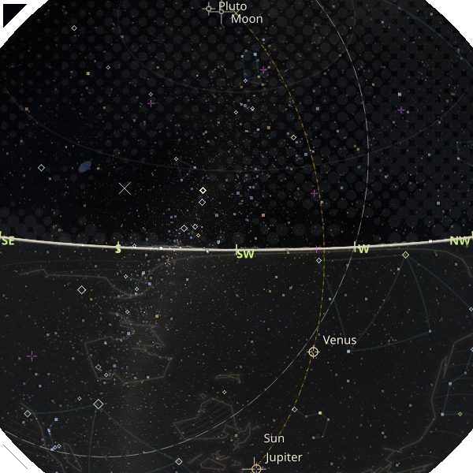

# zstarview 🌌

See the starry sky, even when it's cloudy or the sun is out.

**Zenith Star View** is a desktop sky viewer for your chosen location.
The name emphasizes the *zenith*, the point directly overhead.

<table align="right">
  <tr>
    <td align="center">
      
      <br />
      <sub>clickpy Top 25 as of 2026-07-13</sub>
      <br />
      <sub><a href="https://clickpy.clickhouse.com/">Open ClickPy and search for zstarview</a></sub>
    </td>
  </tr>
</table>

It renders an all-sky view with stars, the Sun, Moon, planets, deep-sky objects, and guide overlays.
When enabled, it can also add real-time cloud imagery, terrain horizon, urban outlines, night lights, and nearby aircraft.
Locations can be set by city or viewpoint name, direct coordinates, online place search, or supported Google Maps URLs.

<p align="center">
  <a href="https://pypi.org/project/zstarview/">
    
  </a>
  <a href="https://pepy.tech/projects/zstarview">
    
  </a>
  <a href="https://www.python.org/">
    
  </a>
</p>

**Features:**

- **Stars**: the sky view shows stars from the selected catalog, with asterisms and other overlays layered on top.
- **Solar-system bodies**: supports Sun, Moon, and major planets. Minor planets (asteroids) are not displayed yet.
- **Search**: search named stars, asterisms, places, ISS, and JPL-backed spacecraft from one dialog. When local matches are not found, ISS uses the app's current position first; if ISS is recognized but its current position cannot be obtained, the search fails instead of falling back to JPL. Persistent marker mode keeps both the marker and label visible on the selected target.
- **Overlay groups**: the features below are grouped by display layer, and each overlay can be toggled individually from the menu or with its keyboard shortcut.
- **Flexible location and view center**: specify the observer location with a city name, tower name, mountain name, direct latitude/longitude input, supported Google Maps coordinate URLs, or online place/station search via Nominatim. Adjust the view center with `-A` / `-Z` or the arrow keys. The HUD also shows the observer location and the current `alt/az` view center.
- **Terminal image export**: `zstarview-export-image` can render the sky headlessly and write it to a file or display it directly in sixel-capable terminals.
- **Python support**: the project is routinely tested on CPython 3.10, 3.11, 3.12, 3.13, and 3.14.

**Celestial overlays:**

- **Deep-sky objects**: named galaxies/open clusters/globular clusters are shown as soft blue extents.
- **AKARI IR bands**: an optional false-color overlay shows 90, 140, and 160 micrometre far-infrared dust maps as an independent sky layer.
- **Asterism overlay**: popular line patterns rather than formal IAU constellation boundaries are shown as dim ambient lines. Mouse-hovering a star in an asterism brightens the matching pattern and shows its label, with 3-second rotation when multiple asterisms share that star.
- **Sky Guides**: guide overlays include the never-rises region as a guide-line style solid circle, and the celestial equator as a dashed line with longer on-segments in the same neutral gray, along with direction labels around the horizon, a zenith marker, and celestial pole markers.

**Atmospheric and man-made overlays:**

- **Sky Color**: the sky-color disc is generated dynamically from a spherical-atmosphere scattering model that combines Rayleigh scattering and Mie scattering. It responds to the Sun's position and observing conditions.
- **Clouds**: real-time Himawari/GOES satellite data are downloaded and rendered as a round-dot halftone overlay, and the sky-color disc remains visible beneath the clouds. An experimental Geo-satellite path is also available for Europe-band observers when `--geo-satellite true` is specified. Missing regions are shown in faint yellow when satellite coverage is partial. See [an example with partial coverage and yellow missing-data tint](docs/images/screenshot5.png).
- **Tropical cyclones**: active hurricanes / typhoons from a public ArcGIS `Active_Hurricanes_v1` FeatureServer can be shown as small markers with projected current-position tracking and a distance cutoff.
- **Artificial satellites**: ISS, JWST, Voyager 1, Voyager 2, Parker, Europa Clipper, Lucy, Psyche, JUICE, Solar Orbiter, and BepiColombo can be drawn as small purple markers between the planet and aircraft layers.
- **Aircraft**: nearby aircraft from OpenSky can be drawn as purple predicted-motion polylines.

**Building and ground guide overlays:**

- **Earth guide**: an independent layer draws a simplified continental hatch pattern below the horizon in the same ground tone to help with orientation.
- **Terrain horizon**: Copernicus DEM data can be downloaded to render the local terrain skyline. The terrain overlay shows banded ridge lines in the same horizon color, with nearby bands drawn thicker and distant bands drawn thinner. Blue-tinted ridge lines mark the parts visible from the observer, not hidden by nearer ridges. The disc is filled with the same ground tone below the terrain horizon, or below the geometric horizon when terrain is disabled.
- **Water surface**: nearby water bodies are rendered as small blue dots. Sea points come from OSM Water Polygons sea-mask tiles, while inland water points come from OpenStreetMap features fetched via Overpass API. See [About Water Surface](docs/cli-overlays.md#about-water-surface).
- **Urban outline**: major rooflines are drawn as a white urban outline overlay for the current viewpoint, with a faint fill added inside closed loops. In some skyscraper-heavy cities, distant skyscrapers can also be added from within a 60km radius.
- **Night lights**: The 2025 annual VIIRS Nighttime Lights VNL v2.2 GeoTIFF is downloaded from a GitHub Release on demand, cached locally, and rendered as a separate glow layer above the horizon and terrain ridges.

## Screen descriptions

> Note: The screenshots below have the optional coastline data and
> urban outline data and AKARI IR bands data described in the Installation
> section enabled.

<table>
  <tr>
    <td valign="top" width="33%"></td>
    <td valign="top"><p>This view shows the night sky over a Japanese city, displayed with <code>-p "Matsue Station" -A5 -Anw</code>. The mouse is hovering near Vega, so the asterism it belongs to, the Summer Triangle, is shown. Buildings are displayed as an <em>urban outline</em>.</p><p>Clouds are visible on the left side of the image, which is the western sky, rendered as a halftone pattern of circular dots. Clouds are rendered from cloud amounts estimated from satellite data such as GOES and Himawari.</p><p>Building data is generally obtained from Overture Maps, but <a href="#plateau-building-data-preparation">PLATEAU data</a> is also available for some Japanese cities. This screenshot uses PLATEAU data.</p></td>
  </tr>
</table>

<table>
  <tr>
    <td valign="top" width="33%"></td>
    <td valign="top"><p>This view shows Atlanta airport and the busy airspace above it, with more than ten aircraft visible. Aircraft trails are rendered as purple ribbons, and the ellipse below the horizon marks the <em>never-rises</em> region: the part of the celestial sphere that never comes above the horizon. The celestial equator and ecliptic are shown as dashed reference lines.</p><p>The celestial equator is a great circle whose normal axis is the Earth's rotation axis, the line connecting the north and south celestial poles. The never-rises boundary is a smaller circle around the same axis.</p></td>
  </tr>
</table>

<table>
  <tr>
    <td valign="top" width="33%"></td>
    <td valign="top"><p>This view looks straight up from Salar de Uyuni, known as one of the flattest places in the world. The horizon forms an almost complete circle around the view because the difference in elevation along the horizon is very small. The <code>-V9</code> option displays stars down to visual magnitude 9, while <code>-s5</code> makes the stars slightly larger than the default so that the smaller stars stand out. <code>--akari-ir-bands 0.3</code> enhances the far-infrared dust map.</p><p>Note: higher magnitude limits increase rendering time. See <a href="docs/cli-sky-and-stars.md#about-magnitude-limit">About magnitude limit</a>.</p></td>
  </tr>
</table>

<table>
  <tr>
    <td valign="top" width="33%"></td>
    <td valign="top"><p>This view is from a tower 108 meters above the ground, with the viewing altitude lowered slightly to <code>-A-5</code> degrees. Some towers, such as Kobe Port Tower, have their locations and heights registered in the internal database. This view also uses <em>night lights</em>, a dataset of the brightness of the ground as seen from space, which makes the ground glow differently over urban and sea areas.</p></td>
  </tr>
</table>

<table>
  <tr>
    <td valign="top" width="33%"></td>
    <td valign="top"><p>This view uses <code>-A40</code> to change the altitude of the viewing direction and shows a view looking upward into the sky. The field of view reaches 90 degrees at the edge of the screen, producing a subtle fisheye-lens effect.</p><p>The Moon is enlarged to 5x its normal apparent size after the mouse is moved over it. The enlargement makes the Moon's lunar phase—the shape of its illuminated and dark portions—easier to see. Unlike stars and planets, which are drawn according to visual magnitude, the Moon is rendered as a disk using its apparent angular size.</p></td>
  </tr>
</table>

<table>
  <tr>
    <td valign="top" width="33%"></td>
    <td valign="top"><p>This view shows a mountainous region of Switzerland, where steep terrain is visible along the horizon. Because the Sun is above the horizon, the sky is colored rather than fully dark. Terrain ridges are drawn in olive.</p><p>For cloud rendering, most of Europe is outside the coverage of GOES and Himawari, so clouds are not drawn by default. Experimental support is available through <code>--geo-satellite true</code>, which processes cloud imagery from a geostationary satellite.</p></td>
  </tr>
</table>

<table>
  <tr>
    <td valign="top" width="33%"></td>
    <td valign="top"><p>This view is a star-field image generated with <code>zstarview-export-image</code>, rather than a GUI application screenshot. The object search option <code>--search "Torifune"</code> is used to show the position of the minor body. Osaka Castle, a Japanese building, is visible on the right.</p></td>
  </tr>
</table>

<details>
<summary>Other screenshots</summary>

These screenshots show urban outline and terrain horizon examples from several places worldwide. They are `zstarview-export-image` outputs, not GUI screenshots, and they carry location/time/view metadata in embedded PNG text chunks that tools such as `exiftool` can inspect:

<table>
  <tr>
    <td align="center" width="25%"></td>
    <td align="center" width="25%"></td>
    <td align="center" width="25%"></td>
    <td align="center" width="25%"></td>
  </tr>
  <tr>
    <td align="center"><sub>Circular Quay, Sydney</sub></td>
    <td align="center"><sub>Near Tokyo Tower, Tokyo</sub></td>
    <td align="center"><sub>View of Mt. Fuji, Japan</sub></td>
    <td align="center"><sub>Izumo Taisha, Japan</sub></td>
  </tr>
  <tr>
    <td align="center"></td>
    <td align="center"></td>
    <td align="center"></td>
    <td align="center"></td>
  </tr>
  <tr>
    <td align="center"><sub>Marina Bay, Singapore</sub></td>
    <td align="center"><sub>Near Burj Khalifa, Dubai</sub></td>
    <td align="center"><sub>Manarola, Italy</sub></td>
    <td align="center"><sub>Jungfraujoch, Switzerland</sub></td>
  </tr>
  <tr>
    <td align="center"></td>
    <td align="center"></td>
    <td align="center"></td>
    <td align="center"></td>
  </tr>
  <tr>
    <td align="center"><sub>Sagrada Familia, Barcelona</sub></td>
    <td align="center"><sub>Westminster Bridge, London</sub></td>
    <td align="center"><sub>Alternate view of Salar de Uyuni, Bolivia</sub></td>
    <td align="center"><sub>Wizard Island, Oregon</sub></td>
  </tr>
  <tr>
    <td align="center"></td>
    <td colspan="3"></td>
  </tr>
  <tr>
    <td align="center"><sub>Bliss hill, California</sub></td>
    <td colspan="3"></td>
  </tr>
</table>

Note: Some of these screenshots use PLATEAU data. See [PLATEAU Building Data Preparation](#plateau-building-data-preparation) for details.
</details>

## Installation (Recommended: `pipx`)

Zstarview is intended to be installed using [`pipx`](https://pypa.github.io/pipx/).

```bash
pipx install zstarview
```

Upgrade:

```bash
pipx upgrade zstarview
```

> Note: Linux x86_64 is the primary tested platform. The cloud-disc path no
> longer depends on `pyresample`, so its previous Windows on Arm64 installation
> blocker has been removed.

First run check:

```bash
zstarview-gui
```

This opens the startup dialog first. Use `zstarview-gui` for the default GUI
launch flow after installation.
If you select `City` as the location source and press `Auto Search`, the
startup dialog fills in your current location automatically.

### (1) Optional coastline data

To display the optional coastline overlay, download the coastline vector data
separately from the
[coastline vector data Release](https://github.com/tos-kamiya/zstarview/releases/tag/coastline-data-20260725).
The GUI does not download this data automatically. To download all global
coastline columns and the optional global 25m water mask, run:

```bash
zstarview-download-coastline --all
```

The data is installed under the zstarview cache and verified with the Release
manifest and SHA-256 checksums before it becomes available to the coastline
overlay. For a smaller download, use `--lon-min` together with `--lon-max` to
select a longitude range; the downloader expands the range to complete
11.25-degree grid columns. Use `--water-25m` to download only the optional
global 25m water-mask asset, and `--cache-dir` to choose another cache base.

### (2) Optional AKARI IR bands data

The optional AKARI IR bands overlay uses the [AKARI Far-infrared All-Sky
Survey Maps](https://darts.isas.jaxa.jp/en/datasets/darts%3Aakari-fis-image-allsky-map-2.1/).
In simple terms, these are maps of the far-infrared glow from interstellar
dust and the molecular clouds where stars form, observed by AKARI's
Far-Infrared Surveyor (FIS); they are not visible-light photographs. The
source dataset contains 65, 90, 140, and 160 micrometre bands, and zstarview
uses the three longer-wavelength bands as an independent false-color sky layer.
The source files are downloaded from the [NASA LAMBDA AKARI image
directory](https://lambda.gsfc.nasa.gov/data/foregrounds/akari/images), which
mirrors data provided by ISAS/JAXA. The application does not download these
large source maps automatically. Download and prepare the local display cache
explicitly with:

```bash
zstarview-download-akari-ir-bands
```

The command downloads the three bands used by zstarview, reduces them to a
display-oriented 2048x1024 cache, and stores the result under the zstarview
cache. Use `--bands` to select bands, `--width` and `--height` to change the
display-cache dimensions, `--cache-dir` to choose another cache base, and
`--delete-source` to remove the source FITS files after successful preparation.
The default source maps are large, so the preparation may take some time and
disk space.

### (3) Optional Urban outline data

The urban outline overlay draws building outlines, such as major rooflines,
around the selected viewpoint. It is optional. On non-Arm64 platforms, install
the `overturemaps` package with `pipxu`:

```bash
pipxu install -f overturemaps
```

On Windows Arm64, install `zstarview` with `pipx`, download a Windows x64
`overturemaps` v1.0.1 or newer executable from the
[Overture Maps releases](https://github.com/OvertureMaps/overturemaps-py/releases),
and stage it with `zstarview-install-overturemaps-exe-cli.exe`. This is needed
because the `overturemaps` dependency chain does not currently provide all
required Windows Arm64 wheels.

## Usage

Use `zstarview-gui` for the interactive startup dialog, `zstarview` for GUI
launches driven by CLI options, and `zstarview-export-image` for headless
one-shot image export.

After launching `zstarview-gui`, the `Auto` button in the Location tab uses
network connection information to estimate the current observer location and
fills it into the dialog.

The CLI reference below documents `zstarview` and `zstarview-export-image`.

```bash
zstarview [options] [location]
```

> Note (Ubuntu/Wayland, GNOME): If the taskbar icon does not appear when launching from a terminal, follow the steps in [Tools](#tools) under [Generating a `.desktop` launcher (GNOME only)](#generating-a-desktop-launcher-gnome-only).

Quick examples:

```bash
zstarview Tokyo
zstarview auto
zstarview "Tokyo Skytree"
zstarview "35.68;139.76" --datetime "2025-09-12 21 JST"
zstarview --place "Matsue Station" --place-countrycode jp
zstarview --search Ceres
```

### CLI Reference

#### Argument

| Format | Description | Default |
| :----- | :---------- | :------ |
| City Name | City name (e.g., `Tokyo`) | Last run location (or `Tokyo`) |
| Tower/Mountain | Tower (e.g., `t/Tokyo Skytree`) or Mountain (e.g., `m/Mount Fuji`) | |
| Coordinates | Direct coordinates (e.g., `35.68;139.76`, `@35.68,139.76`) or Google Maps URL | |
| `auto` | Automatically detect current location via IP | |

The links below cover the detailed option groups, and the linked docs files contain the detailed option tables, footnotes, and examples.

<details>
  <summary>Detailed option groups</summary>

  - [Observing Location and Time](docs/cli-observing-location-and-time.md)
  - [Viewpoint Dataset Queries for Observing Locations](docs/cli-viewpoint-dataset-queries.md)
  - [Search Objects at startup](docs/cli-search-objects.md)
  - [Sky and Stars](docs/cli-sky-and-stars.md)
  - [Overlays](docs/cli-overlays.md)
  - [General](docs/cli-general.md)
</details>

<details>
  <summary>Tools</summary>

## Tools

### `zstarview-export-image`

Use `zstarview-export-image` for one-shot image export without starting the GUI.

```bash
zstarview-export-image Matsue -o matsue.png
```

`zstarview-export-image` writes the usual location/time/view/vmag summary to `stderr` after rendering, or immediately before terminal image output when `--sixel` is used.
When exporting to PNG, the image also carries metadata with the app version and HUD-related information, and you can inspect it with tools such as `exiftool`.
If you use `--place` or `--search`, the resolved location or search target is included there as well.

For troubleshooting or manual cache maintenance, you can print the cache root directory without rendering:

```bash
zstarview-export-image --print-cache-dir
```

If you really need to bypass the `--clear-long-lived-cache` cooldown, first run `zstarview-export-image --print-cache-dir`, then remove these subdirectories under that cache root before startup:

- `copernicus-dem`
- `overture_buildings`
- `overture_skyscrapers`

### Generating a `.desktop` launcher (GNOME only)

On GNOME-based environments (including Ubuntu Dock and DockToPanel),
a `.desktop` file is required for the correct icon to appear in the taskbar.

This application includes a helper command to generate it:

```bash
# Create zstarview-gui.desktop in the current directory
zstarview-make-desktop-file

# Install to ~/.local/share/applications
zstarview-make-desktop-file --write
```

* Without `--write`, the file `zstarview-gui.desktop` is created in the current directory.
* With `--write`, it is installed to `~/.local/share/applications` and registered with the desktop database.

> **Note:** This launcher integration is only intended for GNOME-based environments.
> It is not required on other desktop environments, and may not work as intended elsewhere.

</details>

The GUI supports direct keyboard, mouse, and menu-based navigation, search, overlay toggles, and hover-driven labels/highlights.

<details>
  <summary>GUI operations</summary>

### GUI

#### Key Operations

* **← / →**: Rotate view azimuth by ±5°
* **↑ / ↓**: Change view altitude by ±5° (clamped to -45°..90°)
* **Shift + arrow keys**: Fine-tune view direction by 1°
  While arrow-key input continues, the app keeps a simplified viewport-interaction mode for about 0.7 seconds after the last input. In this mode, it shows stars up to `Vmag <= 4.0`, the Sun, Moon, planets, the celestial equator, ecliptic, horizon, terrain horizon, direction labels, the zenith marker, and the celestial pole markers; full star density, sky-color disc, clouds, night lights, DSO, asterisms, and urban outlines are temporarily hidden.
* **Space**: Cycle the simplified view through three states: `normal`, `simplified view (no labels)`, and `simplified view (labels)`. The HUD shows `Simplified: no labels [Space]` or `Simplified: with labels [Space]` for the two simplified states.
* **M**: Toggle moon enlarged to 5x size
* **D**: Toggle DSO overlays
* **A**: Toggle asterism overlays
* **G**: Toggle sky guides
* **S**: Toggle sky color visibility
* **C**: Toggle cloud overlays
* **L**: Toggle night lights overlay
* **P**: Toggle aircraft overlay
* **I**: Toggle artificial satellite overlay
* **T**: Toggle terrain horizon overlay
* **E**: Toggle earth guide overlay
* **U**: Toggle urban outline overlay
* **Ctrl+J**: Open Jump to Named Star
* **Ctrl+F**: Open Search Objects
* **F11**: Toggle fullscreen display
* **ESC**: Exit fullscreen
* **Q**: Quit

#### Mouse Operations

* **Hover on celestial objects**: Move the mouse over a named star to show its label, over a DSO to show its overlay info, and over an asterism member to brighten the matching pattern and show its label.
* **Hover on direction labels**: Move the mouse over a direction label to show the direction-grid hover state.
* **Simplified view [Space]**: `Space` toggles a simplified view that hides non-celestial elements as much as possible and can also show labels. In the simplified view, clouds, night lights, Earth guide, secondary ridges, water, and urban outlines are hidden; the main terrain horizon stays visible in a fast-mode-like thin-line form; hover labels remain available.
* **Drag window**: Drag the window background to move the window.
* **Resize grip**: Drag the resize grip to resize the window.

The same simplified viewport-interaction mode is also used during window resize to keep interaction responsive while heavier layers catch up after idle.

#### Menu Operations

From the hamburger menu (`☰`), you can use:

* **Search**
  * **Jump to Named Star...**: Choose from representative named stars (`Vmag <= 2.0`), grouped into North / Equatorial / South, then jump the view center to that star.
  * **Search Objects...**: Search across named stars, supported asterisms, places, ISS, and JPL-backed spacecraft, then jump to the selected target. If the local star/asterism search finds nothing, ISS uses the app-side current position first; if ISS is recognized but its current position cannot be obtained, the search fails instead of falling back to JPL. Use `Keep marker` to keep both the marker and label visible after the jump.
  * **Search Places...**: Open a separate place-search dialog backed by OpenStreetMap Nominatim, list matching places/stations/facilities, and jump toward the selected ground location.
* **Layers**
  * **Enlarge Moon**: Toggle moon enlarged to 5x size.
  * **DSO**: Toggle deep-sky object overlays on/off.
  * **Asterisms**: Toggle asterism overlays on/off (when enabled, dim overlays stay visible; hovering a member star brightens the matching asterism and shows its label).
  * **Guidelines**: Toggle the geometric horizon, celestial equator, ecliptic, never-rises solid circle, direction labels, zenith marker, and celestial pole markers on/off. The celestial equator uses a longer dashed stroke in the same neutral gray as the never-rises circle.
  * **Observation Info**: Toggle the observation-info block on/off. When shown, it stays at the bottom-left by default; `auto` keeps the older hover-avoid placement behavior.
  * **Sky Color**: Switch between the full sky-color gradient and the flat dark-disc fallback.
  * **Clouds**: Toggle real-time cloud overlays on/off.
  * **Night Lights**: Toggle the EOG VNL street-light overlay on/off. If disabled from the CLI with `--night-light-opacity 0`, the menu item cannot re-enable it for that run.
  * **Aircraft**: Toggle the OpenSky-based aircraft overlay on/off. If disabled from the CLI with `-a 0` / `--aircraft-opacity 0`, the menu item cannot re-enable it for that run.
  * **Satellites**: Toggle the artificial satellite / spacecraft overlay on/off. If disabled from the CLI with `--satellite-opacity 0`, the menu item cannot re-enable it for that run.
  * **Terrain Horizon**: Toggle the terrain skyline overlay on/off. If disabled from the CLI with `-d 0` / `--terrain-horizon-opacity 0`, the menu item cannot re-enable it for that run.
  * **Earth Guide**: Toggle the below-horizon earth-guide overlay on/off. If disabled from the CLI with `-e 0` / `--earth-guide-opacity 0`, the menu item cannot re-enable it for that run.
  * **Urban Outline**: Toggle the Overture-derived urban roofline overlay on/off. If disabled from the CLI with `-u 0` / `--urban-outline-opacity 0`, the menu item cannot re-enable it for that run.
* **View Direction**
  * **Set View Center...**: Open a direct Alt/Az dialog with the current values prefilled, then apply the entered view center immediately.
* **File**
  * **Square Window**: Resize the client area once so its width and height match the shorter current side.
  * **Fullscreen**: Toggle fullscreen display.
  * **Exit**: Quit the application.

After a jump/search, the selected star is highlighted for about 3 seconds using the same UI style as mouse hover (circle marker + name label).

</details>

<a id="urban-outline-data"></a>
<details>
  <summary>Urban Outline Data</summary>

`zstarview` fetches urban-outline source data on demand from Overture Maps and
caches the derived building tiles under the app cache directory. The first launch
for a new viewpoint/radius/height combination may take a few seconds while the
download finishes; the outline appears automatically after the cache is ready.

This path requires the `overturemaps` CLI to be installed separately. Confirm it
with:

```bash
overturemaps --help
```

Useful startup options:

```bash
zstarview "Tokyo Tower" -r 2.5
zstarview -p "Matsue Station" -r 2.0
```

- `-r`, `--urban-outline-radius-km`: fetch radius in kilometers

</details>

<a id="plateau-building-data-preparation"></a>
<details>
  <summary>PLATEAU Building Data Preparation (Japan only)</summary>

For PLATEAU building preparation, use the five-digit Japanese municipality code
(for example, Matsue is `32201`). Search for a municipality's five-digit
"standard area code" on [e-Stat's municipality search
page](https://www.e-stat.go.jp/municipalities/cities/areacode).

PLATEAU building data is not available for every municipality code. If no
building catalog exists for the requested area, the preparation command
reports an HTTP 404 error. For a range or list of codes, it reports the
missing area and continues with the other municipalities.

`zstarview-download-plateau-buildings` downloads Japanese PLATEAU CityGML
building data and converts it into the lightweight derived cache used by
`zstarview`. This is an explicit preparation command; `zstarview` does not
download PLATEAU data or check for PLATEAU updates at startup.

Use `--list` to list valid prepared caches. The plain output contains only the
municipality code, dataset year, and saved path, one entry per line. Add
`--city-code` to filter the list to one or more municipalities. Add `--jsonl`
to output detailed cache metadata as one JSON object per line. These modes do
not access the network or modify files.

```bash
zstarview-download-plateau-buildings --list
zstarview-download-plateau-buildings --list --city-code 27100
zstarview-download-plateau-buildings --list --jsonl
```

The command requires a five-digit Japanese municipality code. A range or a
comma-separated list can be used for multiple municipalities:

```bash
zstarview-download-plateau-buildings --city-code 32201
# Tokyo 23 wards (13100 through 13122)
zstarview-download-plateau-buildings --city-code 13100-13122
# Selected municipalities
zstarview-download-plateau-buildings --city-code 13100,13103,13122
```

For a range or list, the command first queries all requested catalogs, prints
the estimated total download size, and asks for confirmation once. For
example, a Tokyo 23-ward preparation may report:

```text
PLATEAU batch download estimate:
  13101: 21 files, 1.96 GiB (CityGML ZIP)
  13102: 22 files, 2.31 GiB (CityGML ZIP)
  ...
Total estimated download size: 19.83 GiB
Continue with PLATEAU batch download? [y/N]
```

Each municipality then shows download and CityGML conversion progress. A
successful preparation stores derived building tiles under
`~/.cache/zstarview/plateau_buildings/<city-code>_<year>/`. When the cache
covers the observation area, `zstarview` uses PLATEAU buildings and does not
download the corresponding Overture Maps building data.

Running the preparation command again checks the current PLATEAU catalog
against the cache metadata, including preparation year, registration year,
specification, building file count, and total building file size. An unchanged
cache is reused. If the catalog differs, the existing cache is moved to an
`*.outdated-<timestamp>` directory and a new cache is prepared after the
download confirmation. Old caches created before this metadata was available
are treated as outdated on the next preparation run.

The downloaded CityGML ZIP is removed after successful conversion by default.
Use `--keep-zip` to retain it as `source-citygml.zip` inside the prepared cache.
This can require substantial additional disk space.

</details>

<details>
  <summary>Troubleshooting and platform notes</summary>

## Troubleshooting

### X11 (Ubuntu/Debian)
Qt's xcb platform plugin may require `libxcb-cursor0` at runtime.
If you're not watching for X11 vs Wayland differences, this can be confusing — running from a terminal may show errors like:

```sh
$ zstarview
qt.qpa.plugin: From 6.5.0, xcb-cursor0 or libxcb-cursor0 is needed to load the Qt xcb platform plugin.
qt.qpa.plugin: Could not load the Qt platform plugin "xcb" in "" even though it was found.
This application failed to start because no Qt platform plugin could be initialized. Reinstalling the application may fix this problem.

Available platform plugins are: eglfs, offscreen, wayland-egl, linuxfb, wayland, minimal, xcb, vkkhrdisplay, minimalegl, vnc.
```

Install the missing `libxcb-cursor0` package with:

`sudo apt install libxcb-cursor0`

### Wayland Window Shadows
On some Wayland desktops, a normal framed `zstarview --window-frame window` window may appear without the usual outer shadow.
This is usually caused by the Wayland decoration/compositor path rather than by zstarview's own window settings.

If you prefer the X11-style shadowed window appearance, a practical workaround is to launch the app through XWayland:

```sh
QT_QPA_PLATFORM=xcb zstarview --window-frame window
```

If the shadow appears with `QT_QPA_PLATFORM=xcb`, that confirms the difference is in the Wayland vs X11 window-decoration path on your desktop environment.

### Wayland Flicker With `QT_QPA_PLATFORM=xcb`
On some Wayland systems, forcing `QT_QPA_PLATFORM=xcb` can make the frameless window flicker, especially when maximized.
The visible symptom is that the desktop or windows behind zstarview briefly show through during repaint.

If this happens, do not force `QT_QPA_PLATFORM=xcb` for the normal frameless UI.
Launch zstarview without that variable, or use the standard framed window mode if you specifically need XWayland:

```bash
zstarview
zstarview --window-frame window
```

### Slow or Unstable Network / Offline Use
1. Planetary ephemeris data

   On the very first launch, the app downloads a planetary ephemeris file (`de442s.bsp`).
   This requires network connectivity once. After it is cached, the app can run offline.

2. Cloud satellite imagery

   Cloud rendering downloads satellite imagery from public S3 buckets (Himawari / NOAA GOES) and relies on heavy dependencies.
   If your network is slow or unavailable, disable clouds with `-c 0`.
   You can still explore stars/planets and sky colors without cloud overlays.

   If the status line shows a cloud-source failure such as `GOES G19 failed`,
   running the following from a terminal with an explicit output directory
   will diagnose the reason for the failure:

   ```bash
   zstarview-diagnose-cloud-source --output-dir cloud-diagnosis --lat 33.660109 --lon -84.4102046
   ```

   By default, diagnostic downloads and logs are written under the output
   directory, including `cloud-diagnosis/cache`, so the normal zstarview cloud
   cache is not modified. The command reports whether the failure happened
   while listing S3 objects, selecting a product, downloading the source file,
   opening the satellite data, building projection metadata, or building the
   cloud grid.

   To reproduce the exact GUI worker request, copy the arguments from the
   `Launching cloud source worker:` log line, replace `--work-dir ...` with
   `--output-dir cloud-diagnosis`, and run `zstarview-diagnose-cloud-source`.
   The diagnostic command accepts the same core worker arguments such as
   `--request-id`, `--lat`, `--lon`, `--when-utc`, `--sat-priority`,
   `--search-back-minutes`, `--connect-timeout`, `--read-timeout`, and
   `--cloud-shells-km`.

   If a downloaded GOES `.nc` or `.nc.tmp` file already exists, you can test
   just the local file reading path without network access:

   ```bash
   zstarview-diagnose-cloud-source --output-dir cloud-diagnosis --source-file OR_ABI-L2-CMIPF-M6C13_G19_sample.nc.tmp --satellite G19 --no-grid
   ```

3. Terrain horizon

   Terrain horizon rendering downloads Copernicus DEM tiles once and then reuses the local cache.
   If your network is slow or unavailable, disable terrain horizon rendering with `-d 0` or `--terrain-horizon-opacity 0`.
   You can still explore stars/planets and sky colors without terrain overlays.

4. Night lights data

   Night lights use the 2025 annual VIIRS Nighttime Lights VNL v2.2 product
   from the Earth Observation Group (EOG), distributed as converted GeoTIFF
   data via a GitHub Release. The app downloads the data on demand, caches it
   locally, and reuses the cache on later launches. The manifest and each tile
   are checked with SHA-256 before they are accepted into the cache. Only tiles
   needed around the current observation area are downloaded. The raster data
   is not bundled in the PyPI package because of its size.
   If your network is slow or unavailable, disable the street-light layer with `--night-light-opacity 0`.
   If the cache is already present, the app can keep showing the night lights overlay without network access.

5. Artificial satellite data

   The artificial satellite overlay fetches ISS orbital data at runtime, using `wheretheiss.at` as the primary source and CelesTrak as a fallback, and fetches JWST, Voyager 1, Voyager 2, Parker, Europa Clipper, Lucy, Psyche, JUICE, Solar Orbiter, and BepiColombo from JPL Horizons. Fresh current caches are reused for up to 24 hours for both the ISS cache and the Horizons-backed spacecraft cache.
   The layer is available only for realtime views; time-shifted views do not fetch or display artificial satellites.
   If your network is slow or unavailable, disable the layer with `--satellite-opacity 0`.
   If a fresh cache is already present, the app can keep showing the satellite overlay without network access.

6. Aircraft data

   The aircraft overlay fetches OpenSky Network state data at runtime.
   By default it refreshes once every 5 minutes. This interval is intentionally conservative so the app keeps practical headroom for free-tier use, temporary failures, and retries rather than polling more aggressively.
   Multiple running GUI instances share a local OpenSky rate-limit marker. If another instance has fetched aircraft data recently for a different area, a GUI refresh may skip aircraft for that cycle instead of showing stale or wrong-area aircraft.
   `zstarview-export-image` is treated as an explicit single-shot capture and may fetch aircraft data even when the GUI shared marker is fresh, while still using the shared lock to avoid simultaneous OpenSky requests.
   If you want to avoid OpenSky queries entirely, disable the layer with `-a 0`.

Cloud-related status text uses `idle` / `downloading` / `partial`:
- `downloading`: fetching source imagery from S3
- `partial`: rendered with available data only; missing regions are tinted faint yellow

After the GOES-East refresh to GOES-19, some places that previously showed only a generic "satellite not covering this region" result can now render as partial coverage instead. This now includes some locations in Europe. In those cases, covered parts of the sky show cloud imagery and uncovered parts show the faint yellow missing-data tint. See [screenshot5](docs/images/screenshot5.png) for an example around 77-87% coverage.

### Sky Update Interval and CPU Load
Frequent sky updates can be CPU‑intensive on lower‑end machines. Increase the interval to reduce load (e.g., `-i 300` for every 5 minutes). Lower it only if your machine can keep up.

### Viewing Logs
Launching from a terminal as `$ zstarview` shows startup messages and errors.
Logs are also written to a file (platform‑dependent). Examples:
- Linux: `~/.cache/zstarview/logs/app.log`
- macOS: `~/Library/Logs/zstarview/app.log`
- Windows: `%LOCALAPPDATA%/tos-kamiya/zstarview/Logs/app.log`

If normal startup closes too quickly to inspect, try `zstarview-debug` from a terminal.
`zstarview-debug` is the same GUI launcher packaged as a console script, so Windows
shows its startup messages and errors in the terminal.
It is mainly for Windows troubleshooting.

On Linux, `zstarview-debug` behaves the same as `zstarview`, so it is only a
Windows-focused diagnostic launcher.

On Windows, Windows Security may block loading Python extension modules and the app may stop during startup.
If that happens, changing the Smart App Control setting under Windows Security `App & browser control` may help.
However, this weakens security, so it is not recommended outside a trusted environment.
See [this Smart App Control screenshot](docs/images/windows-smart-app-control.png).

</details>

<details>
  <summary>Code, Data Licenses, and Credits</summary>

## Code, Data Licenses, and Credits

This software is provided under the [MIT](LICENSE.txt) License.

However, the **included data** is redistributed according to their respective licenses.

All paths below are relative to `src/zstarview/data/`.

| File                                                           | Content                                          | Source                                                             | License                                                                                                                             |
| -------------------------------------------------------------- | ------------------------------------------------ | ------------------------------------------------------------------ | ----------------------------------------------------------------------------------------------------------------------------------- |
| `cities1000.txt`, `admin1CodesASCII.txt`                       | List of cities with a population of 1000 or more | [GeoNames](https://download.geonames.org/export/dump/)             | [CC BY 4.0](https://creativecommons.org/licenses/by/4.0/)                                                                           |
| `viewpoints/tower_viewpoints.json`                             | Tower/viewpoint dataset packaged for tower-name startup resolution (derived and normalized from Wikidata) | [Wikidata](https://www.wikidata.org/) via local normalization/query workflow documented in `docs/developer/viewpoint-dataset-generation.md` | [CC0 1.0](https://creativecommons.org/publicdomain/zero/1.0/) (Wikidata data) |
| `viewpoints/mountain_viewpoints.json`                          | Mountain/viewpoint dataset packaged for mountain-name startup resolution (Wikipedia-curated candidates normalized with Wikidata metadata) | [Wikipedia](https://www.wikipedia.org/) candidate collection plus [Wikidata](https://www.wikidata.org/) normalization workflow documented in `docs/developer/viewpoint-dataset-generation.md` | [CC0 1.0](https://creativecommons.org/publicdomain/zero/1.0/) (Wikidata data) |
| `earth_guide_land_110m.json`                                   | Simplified land geometry used to generate the below-horizon Earth guide hatch pattern, derived from Natural Earth 1:110m land polygons | [Natural Earth](https://www.naturalearthdata.com/) | [Public domain](https://www.naturalearthdata.com/about/terms-of-use/) |
| Runtime `--place` geocoding requests sent to OpenStreetMap Nominatim | Online place-name geocoding used only when `--place` is requested | [OpenStreetMap Nominatim](https://nominatim.openstreetmap.org/) | [Nominatim Usage Policy](https://operations.osmfoundation.org/policies/nominatim/) |
| Runtime IP geolocation requests sent to `ip-api.com` | IP-based location lookup used when `auto` is requested | [ip-api.com](https://ip-api.com/) | [ip-api.com Terms of Service / Privacy Policy](https://ip-api.com/docs/legal) |
| Runtime water-surface overlay data fetched via Overpass API | Water-surface points derived from OpenStreetMap inland water features for the optional river/lake/pond layer; sea-mask tiles are derived from `https://osmdata.openstreetmap.de/data/water-polygons.html` | [OpenStreetMap](https://www.openstreetmap.org/), [Overpass API](https://overpass-api.de/), [OSM Water Polygons](https://osmdata.openstreetmap.de/data/water-polygons.html) | [ODbL 1.0](https://opendatacommons.org/licenses/odbl/) |
| On-demand urban-outline cache under the app cache directory | Derived building tiles and `tile_index.json` files produced from downloaded Overture building data | [Overture Maps Buildings](https://docs.overturemaps.org/guides/buildings/) downloaded at runtime via the `overturemaps` CLI | [ODbL 1.0](https://opendatacommons.org/licenses/odbl/) |
| On-demand PLATEAU building cache under the app cache directory | Derived building tiles converted from Japanese PLATEAU CityGML building data | [Project PLATEAU](https://www.mlit.go.jp/plateau/) and the applicable municipality dataset | See the applicable dataset terms and the [PLATEAU Site Policy](https://www.mlit.go.jp/plateau/site-policy/); the policy is compatible with [CC BY 4.0](https://creativecommons.org/licenses/by/4.0/) |
| On-demand night lights cache under the app cache directory | 2025 annual VIIRS Nighttime Lights VNL v2.2 GeoTIFF data used for the optional night lights overlay | [Earth Observation Group VNL](https://eogdata.mines.edu/products/vnl/) | [CC BY 4.0](https://creativecommons.org/licenses/by/4.0/); see the [EOG data licensing notice](https://eogdata.mines.edu/files/EOG_products_CC_License.pdf) for attribution and change-notice requirements. |
| On-demand AKARI IR bands cache under the app cache directory | Display-oriented derived cache from the AKARI 90, 140, and 160 micrometre far-infrared all-sky maps | [AKARI Far-infrared All-Sky Survey Maps](https://darts.isas.jaxa.jp/en/datasets/darts%3Aakari-fis-image-allsky-map-2.1/) from ISAS/JAXA, mirrored by [NASA LAMBDA](https://lambda.gsfc.nasa.gov/product/foreground/fg_akari_info.html) | Open-data use under the [ISAS Data Policy](https://www.isas.jaxa.jp/en/researchers/data-policy/); retain ISAS/JAXA attribution and identify modifications. |
| Runtime aircraft overlay data fetched from OpenSky Network | Aircraft state vectors used for the optional nearby-aircraft overlay | [OpenSky Network REST API](https://openskynetwork.github.io/opensky-api/rest.html) | [OpenSky Network Terms of Use](https://opensky-network.org/about/terms-of-use) |
| Runtime JPL Horizons / Small-Body Database requests | Search / ephemeris data used for celestial-body lookup and the JWST / Voyager / Parker / Europa Clipper / Lucy / Psyche / JUICE / Solar Orbiter / BepiColombo spacecraft cache | [JPL Horizons](https://ssd.jpl.nasa.gov/horizons/), [JPL Small-Body Database](https://ssd.jpl.nasa.gov/tools/sbdb_lookup.html) | See the JPL/JPL SSD sites for current usage terms and data notes |
| Runtime artificial satellite overlay data fetched from `wheretheiss.at` with CelesTrak fallback and JPL Horizons spacecraft data | Orbital-element data used for the optional ISS and spacecraft overlay | [wheretheiss.at](https://wheretheiss.at/w/developer), [CelesTrak](https://celestrak.org/), [JPL Horizons](https://ssd.jpl.nasa.gov/horizons/) | See each source site for current terms and licensing details |
| Runtime tropical cyclone overlay data fetched from a public ArcGIS FeatureServer | Active hurricane / typhoon features used for the optional tropical cyclone overlay | [Active_Hurricanes_v1 FeatureServer](https://services9.arcgis.com/RHVPKKiFTONKtxq3/arcgis/rest/services/Active_Hurricanes_v1/FeatureServer) | See the ArcGIS service metadata and source terms |
| Runtime Geo-satellite cloud overlay data fetched from MET Norway | Geo-satellite cloud imagery used for the optional Europe workflow cloud overlay | [MET Norway Geo-satellite documentation](https://api.met.no/weatherapi/geosatellite/1.4/documentation), [MET Norway Licensing and crediting](https://www.met.no/en/free-meteorological-data/Licensing-and-crediting) | [CC BY 4.0](https://creativecommons.org/licenses/by/4.0/) |
| `dso.csv`                                                       | Deep-sky object catalog (named galaxies/open clusters/globular clusters; generated from OpenNGC) | [OpenNGC](https://github.com/mattiaverga/OpenNGC) via [PyOngc](https://github.com/mattiaverga/PyOngc) | [CC BY-SA 4.0](https://creativecommons.org/licenses/by-sa/4.0/) (OpenNGC database) |
| On-demand terrain DEM cache under the app cache directory | Terrain horizon source data (Copernicus DEM GLO-90) | [Copernicus DEM / Copernicus Data Space Ecosystem](https://dataspace.copernicus.eu/explore-data/data-collections/copernicus-contributing-missions/collections-description/COP-DEM) via public AWS S3 distribution used by the app | Copernicus DEM GLO-90 access terms as described by Copernicus Data Space Ecosystem, including "Licence for COP-DEM-GLO-90-F Global 90m Full, Free & Open" / "Licence for the use of the Copernicus WorldDEM™-90" |
| `stars/IAU-Catalog of Star Names (always up to date).csv`      | IAU WGSN catalog of approved star names          | [exopla.net](https://exopla.net/star-names/modern-iau-star-names/) | [CC BY 4.0](https://creativecommons.org/licenses/by/4.0/)                                                                           |
| `Noto_Sans/*`                                                   | Font for displaying text                          | [Google Fonts](https://fonts.google.com/)                          | [SIL Open Font License 1.1](https://openfontlicense.org)                                                                            |

## Credits

* Astronomical data provided by CDS Strasbourg and the ESA Hipparcos Mission.
* City data based on GeoNames.
* Tower/viewpoint startup data are derived from Wikidata and redistributed under Wikidata's CC0 data terms.
* Mountain/viewpoint startup data are curated from Wikipedia candidates and normalized with Wikidata metadata; redistributed here under Wikidata's CC0 data terms.
* Earth guide land geometry is derived from **Natural Earth** 1:110m land polygons. Natural Earth treats the data as public domain; credit is optional, but we note the source here.
* Urban outline source data are downloaded on demand from **Overture Maps Buildings** and converted into cached derived building tiles for runtime use.
* PLATEAU building data are downloaded and converted on demand from Japanese CityGML datasets provided through **Project PLATEAU**. Attribution and reuse conditions follow the applicable municipality dataset and the [PLATEAU Site Policy](https://www.mlit.go.jp/plateau/site-policy/).
* Night lights source data are converted from the **EOG** 2025 annual VIIRS Nighttime Lights VNL v2.2 product and distributed as GeoTIFF assets through a GitHub Release. The app downloads the assets on demand and caches them locally for runtime use. The redistributed product must retain EOG attribution and indicate the GeoTIFF conversion.
* AKARI IR bands use the 90, 140, and 160 micrometre maps from the **AKARI Far-infrared All-Sky Survey Maps**, provided by **ISAS/JAXA** and mirrored by **NASA LAMBDA**. The app downloads the source maps only when explicitly requested and creates a display-oriented derived cache. The source data request asks users to acknowledge: “Based on observations with AKARI, a JAXA project with the participation of ESA.” The derived cache is not suitable for scientific measurement; its modifications are described in its manifest.
* Star proper names provided by the **IAU** Working Group on Star Names (**WGSN**) (via exopla.net).
* Cloud data are based on infrared observations from the **Himawari** satellite (provided by **JMA**) and the **NOAA GOES** series (provided by **NOAA/NESDIS**), retrieved from their public S3 buckets.
* Geo-satellite cloud imagery is provided by **MET Norway** (The Norwegian Meteorological Institute) and used under **CC BY 4.0** terms, with attribution to MET Norway as the data source.
* Tropical cyclone overlay data are fetched from the public **ArcGIS** `Active_Hurricanes_v1` FeatureServer and are used as active hurricane / typhoon tracking data.
* We thank [GitHub Dependabot](https://github.com/dependabot) for its ongoing dependency security checks.
* Aircraft overlay data are fetched from **OpenSky Network** at runtime and are subject to the OpenSky Network Terms of Use.
* Celestial-body search uses **JPL Horizons** and the **JPL Small-Body Database** at runtime to resolve matches and observer ephemerides. Search results and ephemerides are subject to the current JPL/JPL SSD usage terms and data notes.
* Orbital data (TLE/OMM) for the artificial satellite overlay are fetched from **wheretheiss.at** with **CelesTrak** as a fallback source.
* Terrain horizon data are based on **Copernicus DEM GLO-90**, managed by **ESA** on behalf of the European Commission and obtained by the app through its public AWS distribution/cache flow.
* Place/station search via `--place` uses the public **OpenStreetMap Nominatim** service and is subject to the Nominatim Usage Policy.
* Automatic IP-based location lookup uses **ip-api.com** and is subject to the ip-api.com Terms of Service / Privacy Policy, including its non-commercial-use restriction and 45 requests per minute limit.
* Water-surface overlay data for rivers, lakes, and ponds are derived from **OpenStreetMap** inland water features fetched through **Overpass API** and are attributed to **OpenStreetMap contributors** under **ODbL 1.0**.
* Sea-mask tiles for ocean water surfaces come from [OSM Water Polygons](https://osmdata.openstreetmap.de/data/water-polygons.html) and are also covered by the **OpenStreetMap** attribution / **ODbL 1.0** terms used by that dataset.
* Thanks to **Overture Maps** and its source data contributors for making large-scale building data available.
* Thanks to **AWS** and dataset providers for making the public S3 distribution/mirror endpoints available for cloud imagery and terrain DEM access.
* Fonts provided by the **Google Noto Project**.
* The window title "Zenith Star View" was suggested by **ChatGPT**.
* Specification discussions, code generation, and debugging were greatly assisted by **Gemini** and **ChatGPT**.

</details>

## Appendix

→ [Developer Docs](docs/developer/README.md)

→ [Specification](docs/specification.md), [Design](docs/design.md)

→ [Release Notes](release-notes.md)

→ [Lunar eclipses in 2026-2028, Solar eclipses 2026-2028](docs/appendix-eclipses.md)
