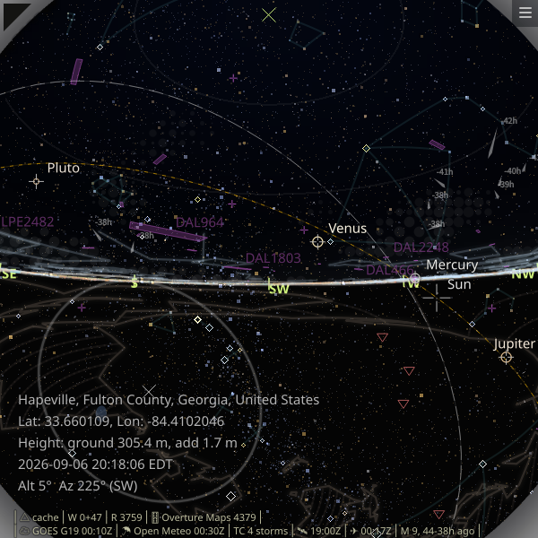
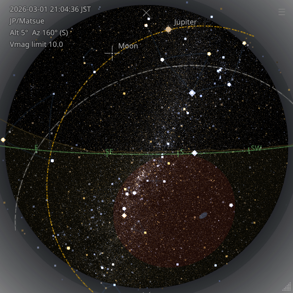
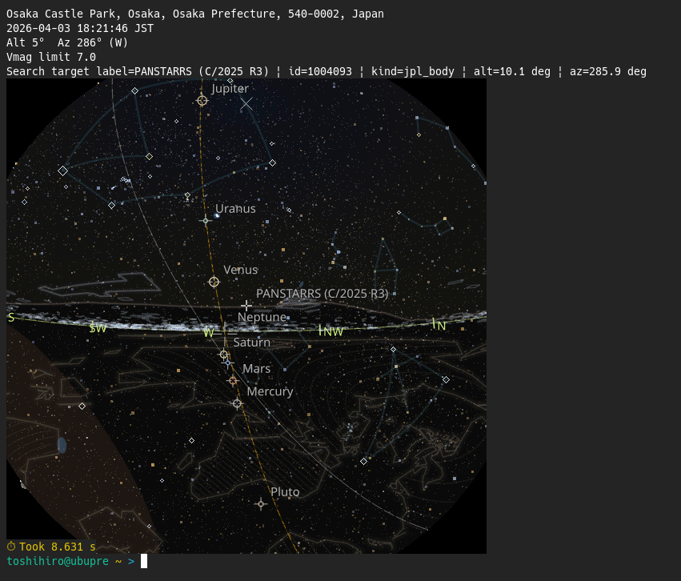
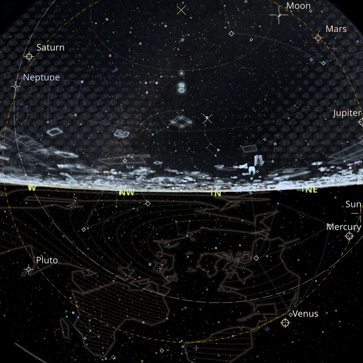
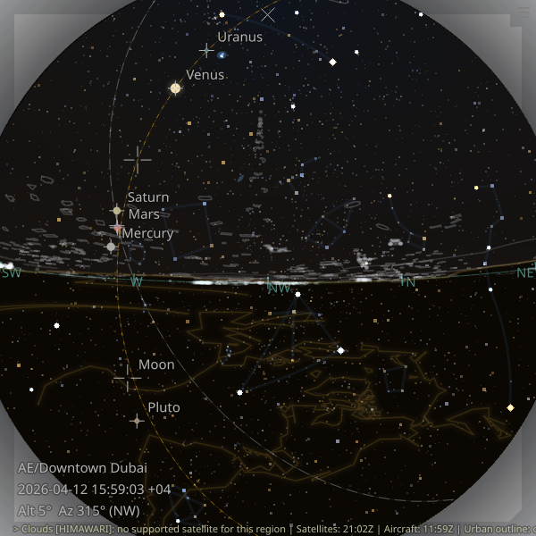
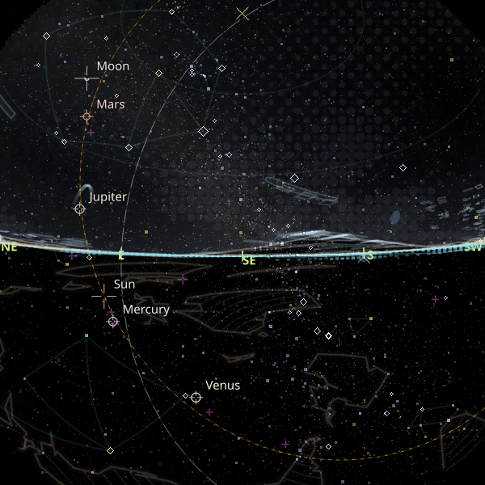
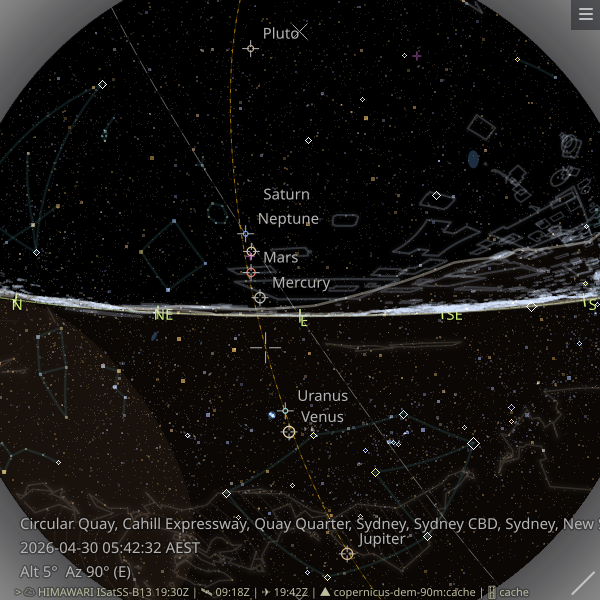

# zstarview 🌌

See the starry sky, even when it's cloudy or the sun is out.

**Zenith Star View** is a desktop sky viewer for your chosen location.
The name emphasizes the *zenith*, the point directly overhead.

It renders an all-sky view with stars, the Sun, Moon, planets, deep-sky objects, and guide overlays.
When enabled, it can also add real-time cloud imagery, terrain horizon, urban outlines, and nearby aircraft.
Locations can be set by city or viewpoint name, direct coordinates, online place search, or supported Google Maps URLs.

**Features:**

- **Solar-system bodies**: supports Sun, Moon, and major planets. Minor planets (asteroids) are not displayed yet.
- **Deep-sky objects**: named galaxies/open clusters/globular clusters are shown as soft blue extents.
- **Asterism overlay**: popular line patterns rather than formal IAU constellation boundaries are shown as dim ambient lines. Mouse-hovering a star in an asterism brightens the matching pattern and shows its label, with 3-second rotation when multiple asterisms share that star.
- **Satellite cloud imagery**: real-time Himawari/GOES satellite data are downloaded and rendered as a stylized hatched (striped) overlay. Missing regions are shown in faint yellow when satellite coverage is partial. See [an example with partial coverage and yellow missing-data tint](docs/images/screenshot5.png).
- **Aircraft overlay**: nearby aircraft from OpenSky can be drawn as purple predicted-motion polylines.
- **Artificial satellite overlay**: ISS can be drawn as a small purple cross marker between the planet and aircraft layers.
- **Urban outline overlay**: major rooflines are drawn as a white urban outline overlay for the current viewpoint. In some skyscraper-heavy cities, distant skyscrapers can also be added from within a 60km radius.
- **Terrain horizon and ground fill**: Copernicus DEM data can be downloaded to render the local terrain skyline. A subtle ocher terrain line follows the observer's surroundings, and the disc is filled with a ground color below the terrain horizon, or below the geometric horizon when terrain is disabled.
- **Guides**: guide overlays include the never-rises region in red, direction labels around the horizon, and a zenith marker.
- **Flexible location input**: specify the observer location through the CLI argument using a city name, tower name, mountain name, direct latitude/longitude input, supported Google Maps coordinate URLs, or online place/station search via Nominatim.
- **Adjustable view center**: adjust the view center with CLI options `-A` (altitude) and `-Z` (azimuth), or with the arrow keys. During view changes or window resize, the app briefly switches to a simplified interaction mode to keep navigation responsive.
- **Terminal image export**: `zstarview-export-image` can render the sky headlessly and write it to a file or display it directly in sixel-capable terminals.
- **Python support**: the project is routinely tested on CPython 3.10, 3.11, 3.12, and 3.13.

## Screenshots

The first screenshot shows the asterism overlay and also serves as a terrain-horizon example.
The second screenshot shows the aircraft overlay together with the never-rises region.
The third screenshot shows a denser star field rendered with `-V10.5 -s4.5`.
The fourth screenshot shows terminal output via sixel using `zstarview-export-image`.

  <p align="center">
    
    
  </p>

  <p align="center">
    
    
  </p>

Note: higher magnitude limits increase rendering time. See [about magnitude limit](#about-magnitude-limit).

Urban outline examples from several cities worldwide:

<table>
  <tr>
    <td align="center" width="25%"></td>
    <td align="center" width="25%"></td>
    <td align="center" width="25%"></td>
    <td align="center" width="25%"></td>
  </tr>
  <tr>
    <td align="center"><sub>Near Tokyo Tower, Tokyo</sub></td>
    <td align="center"><sub>Downtown Dubai</sub></td>
    <td align="center"><sub>Marina Bay, Singapore</sub></td>
    <td align="center"><sub>Circular Quay, Sydney</sub></td>
  </tr>
</table>

## Installation (Recommended: `pipx`)

Prerequisite for the urban outline overlay: install the `overturemaps` CLI separately.
Installation: <https://pypi.org/project/overturemaps/>

Confirm it with:

```bash
overturemaps --help
```

Zstarview is intended to be installed using [`pipx`](https://pypa.github.io/pipx/).

> Note: Linux x86_64 is the primary tested platform. The cloud-disc path no
> longer depends on `pyresample`, so its previous Windows on Arm64 installation
> blocker has been removed.

```bash
pipx install zstarview
```

Upgrade:

```bash
pipx upgrade zstarview
```

> Note: Troubleshooting tips (including X11 libraries and slow network) are summarized below.

## Usage

```bash
zstarview [options] [location]
```

> Note (Ubuntu/Wayland, GNOME): If the taskbar icon does not appear when launching from a terminal, follow the steps in [Generating a `.desktop` launcher (GNOME only)](#generating-a-desktop-launcher-gnome-only).

Quick examples:

```bash
zstarview Tokyo
zstarview "Tokyo Skytree"
zstarview "35.68;139.76" --datetime "2025-09-12 21 JST"
zstarview --place "Matsue Station" --place-countrycode jp
```

The CLI supports detailed startup configuration for location, time, rendering, and bundled viewpoint queries.

For one-shot image export without starting the GUI, use the separate CLI tool:

```bash
zstarview-export-image Matsue -o matsue.png
```

`zstarview-export-image` writes the usual location/time/view/vmag summary to `stderr` after rendering, or immediately before terminal image output when `--sixel` is used.

<details>
  <summary>CLI reference</summary>

### CLI

#### Argument

| Argument | Description                                                                                                                                                                                                                                                           | Default                           |
| :------- | :-------------------------------------------------------------------------------------------------------------------------------------------------------------------------------------------------------------------------------------------------------------------- | :-------------------------------- |
| `location`   | Specify a city name, a tower name, a mountain name, explicit `t/NAME` or `m/NAME`, or a direct coordinate form such as `"<lat>;<lon>"`, `"@<lat>,<lon>"`, or a supported Google Maps URL. Examples: `Tokyo`, `Tokyo Skytree`, `t/Tokyo Skytree`, `Mount Fuji`, `m/Mount Fuji`, `35.68;139.76`, `N35.68;E139.76`, `@35.68,139.76`, `www.google.com/maps/@35.68,139.76,17z`, `www.google.com/maps/place/...!3d35.68!4d139.76...`. If omitted, the last run location will be used (defaults to `Tokyo` on the first run). | Last run location (or `Tokyo`) |

#### Options

| Option                                      | Description                                                                 | Default |
| :------------------------------------------ | :-------------------------------------------------------------------------- | :------ |
| `-h`, `--help`                              | Show this help message and exit.                                            |         |
| `-p`, `--place QUERY`                     | Search a place, station, or facility name via OpenStreetMap Nominatim and use the top candidate as the observing location. Cannot be used together with the positional `location` argument. | |
| `--place-countrycode CODE`                 | Restrict `--place` search to an ISO 3166-1 alpha-2 country code such as `jp`. | |
| `--place-lang LANG`                        | `Accept-Language` sent to Nominatim for `--place` search results.           | `en`    |
| `--timezone TZ`                            | Override the resolved location timezone for `--datetime` and on-screen time. Accepts abbreviations, IANA names, and UTC offsets such as `JST`, `Asia/Tokyo`, or `UTC+9`. | |
| `-Z`, `--view-center-az VIEW_CENTER_AZ`     | Viewing azimuth (degrees or compass points).                                | `180`   |
| `-A`, `--view-center-alt VIEW_CENTER_ALT`   | Viewing altitude angle (90=zenith, 0=horizon).                              | `90`    |
| `--content-fov-deg DEGREES`                 | Shared overscan content FOV for all layers. The window edge still corresponds to `90°` from the view center; values above `90` let sky/cloud/background content extend beyond the window edge and reduce empty corner regions. Allowed range: `90`–`127`. | `100` |
| `--observer-height-m METERS`                | Observer eye height above the local observation surface in meters. This replaces the default eye height of `1.7` meters. For tower and mountain viewpoints, the viewpoint's own height/elevation remains separate from this value. | `1.7` |
| `--sky-opacity SKY_OPACITY`                 | Opacity of the simulated sky-color disc (0.0–1.0). Use 0.0 to disable.      | `0.15`   |
| `-c`, `--cloud-opacity CLOUD_OPACITY`       | Opacity of cloud rendering (0.0–1.0). Use 0.0 to disable. \*2                | `0.15`   |
| `--cloud-missing-tint-opacity OPACITY`      | Opacity of missing-cloud-data yellow tint (0.0–1.0).                          | `0.176` |
| `--satellite-opacity OPACITY`               | Opacity of the artificial satellite overlay (0.0–1.0). Use 0.0 to disable satellite element fetch and drawing for that run. | `0.5` |
| `--show-guidelines-initial true\|false`     | Whether guideline overlays are shown at startup. This controls the geometric horizon, celestial equator, ecliptic, direction labels, and zenith marker. | `show` |
| `--terrain-horizon-opacity OPACITY`         | Opacity of the terrain horizon polyline (0.0–1.0). Use 0.0 to disable DEM download, terrain-horizon calculation, and drawing. \*4 | `0.05` |
| `--ground-tint-opacity OPACITY`             | Strength of the ground-color fill below the geometric/terrain horizon (0.0–1.0). | `0.1` |
| `--urban-outline-opacity OPACITY`           | Opacity of the urban outline overlay (0.0–1.0). Use 0.0 to disable it for that run. | `0.2` |
| `--urban-outline-feature-type {both,building}` | Overture cache mode for the urban outline. `both` combines `building` and `building_part`, preferring parts when available. | `both` |
| `-r`, `--urban-outline-radius-km RADIUS_KM` | Fetch and render urban-outline buildings within this radius from the observer location. The value is also part of the cache key. | `2.5` |
| `--urban-outline-skyscraper-radius-km RADIUS_KM` | Outer radius of the far-range skyscraper helper layer. Use `0` to disable skyscraper-tile lookup for that run; otherwise the value must be greater than or equal to `--urban-outline-radius-km`. | `60.0` |
| `-b`, `--urban-outline-min-building-height-m METERS` | Ignore buildings lower than this height when fetching/caching the urban outline. The value is also part of the cache key. | `0.0` |
| `-a`, `--aircraft-opacity OPACITY`          | Opacity of the aircraft overlay (0.0–1.0). Use 0.0 to disable aircraft queries and drawing for that run. | `0.5` |
| `-m`, `--enlarge-moon`                      | Show the moon in 5x size.                                                   |         |
| `-s`, `--star-base-radius STAR_BASE_RADIUS` | Base size of 2nd-magnitude stars.                                           | `4.0`   |
| `-w`, `--expected-render-width EXPECTED_RENDER_WIDTH` | Expected window width for full-resolution star rendering. When celestial-disc width exceeds this, star rendering uses square-root scaling. | `600` |
| `--window-geometry restore\|X,Y,W,H` | Set initial window geometry. Use `restore` to load the last saved position/size, or `X,Y,W,H` to specify explicit integers. Note: on Wayland, window position restore is not available (size restore works). |         |
| `-V`, `--vmag-limit V_MAG_LIMIT`            | Maximum visual magnitude of stars to display.                               | `6.0`   |
| `--vmag-brightness-multiplier MULTIPLIER`   | Brightness multiplier per magnitude step (allowed range 1.58–2.512, default `2.5`; 2.512 is the historical Pogson ratio). \*3 | `2.5`   |
| `-i`, `--sky-update-interval SECONDS`       | Interval for updating stars/sky-color disc in seconds.                      | `60`   |
| `--show-dso-initial true\|false`            | Whether DSO overlays are shown at startup.                                  | auto (`show` when catalog is available) |
| `--show-asterisms-initial true\|false`      | Whether asterism overlays are shown at startup.                             | `show` |
| `-t`, `--theme {night,day,white,black,transparent}`     | Theme preset for background and star contrast. `transparent` keeps the dome dark but translucent so the desktop/window background shows through more strongly.                              | `night` |
| `--clear-long-lived-cache`                  | Troubleshooting option. Delete long-lived DEM and urban-outline caches before startup. If used again within 3 days, startup is refused and the app tells you when retry is allowed. | |
| `-H`, `--hours HOURS`                       | Number of hours to add to the current time. \*1                              | `0`     |
| `-D`, `--days DAYS`                         | Number of days to add to the current time. \*1                               | `0`     |
| `--datetime "YYYY-MM-DD HH[:MM[:SS]] [TZ]"` | Specify an absolute date/time. Time may be given as `HH`, `HH:MM`, or `HH:MM:SS`. If no TZ is specified, UTC is assumed. \*1 |         |

\*1 When using non-realtime sky options (`--hours`, `--days`, `--datetime`), cloud, aircraft, and artificial satellite overlays are not shown.

\*2 Cloud rendering uses infrared data from meteorological satellites (**Himawari** and **NOAA GOES** series), retrieved from their public S3 buckets.
   See Troubleshooting for tips on slow networks or offline use (e.g., disabling clouds with `-c 0`).

\*3 The brightest-magnitude multiplier cannot exceed the classical Pogson value of \(100^{1/5}\approx2.512\).

\*4 Terrain horizon rendering downloads Copernicus DEM tiles on first use and reuses the cached DEM later. When enabled, the terrain profile also becomes the boundary for the ground-color fill inside the disc.

\*5 `--place` uses the public OpenStreetMap Nominatim search service. It sends a single search request with a User-Agent and Accept-Language. See the Nominatim usage policy if you plan to rely on this option heavily or from automation.

For troubleshooting or manual cache maintenance, you can print the cache root directory without rendering:

```bash
zstarview-export-image --print-cache-dir
```

If you really need to bypass the `--clear-long-lived-cache` cooldown, first run `zstarview-export-image --print-cache-dir`, then remove these subdirectories under that cache root before startup:

- `copernicus-dem`
- `overture_buildings`
- `overture_skyscrapers`

#### `--place` behavior

`--place` is an explicit online resolver path separate from the normal offline-first `location` argument.

- The app sends a single Nominatim search request and sorts candidates by importance.
- Startup remains non-interactive: the top candidate is used automatically.
- When multiple candidates are found, they are logged to the terminal and the top candidate is still used.
- The full returned place name is shown in the GUI location label so mismatches are easier to notice.
- The selected result is saved in config and reused on the next launch without re-querying Nominatim.

#### Overlay visibility at startup

Use these options to control initial overlay states without post-launch menu operations:

```bash
# Start with DSO hidden and asterisms visible
zstarview --show-dso-initial false --show-asterisms-initial true Tokyo
```

To start with the guideline layer hidden:

```bash
zstarview --show-guidelines-initial false Tokyo
```

#### About the view center options

The `-Z` (azimuth) and `-A` (altitude) options specify the center of the displayed sky.

By default, `-Z 180` (facing south) and `-A 90` (zenith) are used.
In this view, the bottom of the screen is south, the left side is east, and the display is a circular view looking straight up toward the zenith.

For example, setting `-Z 90` (facing east) and `-A 25` (altitude 25° above the horizon) produces a sky view toward the eastern sky.  

Azimuth can be given in degrees or compass points (case-insensitive).
Examples: `-Z E`, `-Z ne`, `-Z SSW` (202.5°).
(Compass mapping: 0=N, 90=E, 180=S, 270=W; accepts N, NNE, NE, ENE, E, ESE, SE, SSE, S, SSW, SW, WSW, W, WNW, NW, NNW.)

<a id="about-magnitude-limit"></a>

#### About magnitude limit

Use `-V magnitude` to limit the displayed stars to those brighter than the given magnitude.
The default is `-V 6.0`. For example, specifying 10.0 will display about 324,000 stars.
Note that higher values will increase rendering time.

#### About theme presets

Use `--theme` to change the background treatment and contrast style.

* `night`: default dark theme
* `black`: darker opaque background
* `day`: bright sky/background treatment
* `white`: brightest light theme
* `transparent`: translucent dark dome and lighter outer background, intended for a frameless window that lets more of the desktop show through

#### About the datetime option

Use `--datetime "YYYY-MM-DD HH[:MM[:SS]] [TZ]"` to specify an absolute date and time.
The time part may be just hours, hours\:minutes, or hours\:minutes\:seconds.
If no timezone (TZ) is specified, the resolved location timezone is used. `--timezone TZ` overrides the resolved location timezone.

Supported timezone formats:

* A common abbreviation (JST, UTC, GMT, KST, HKT, AWST, ACST, AEST, NZST, NZDT, MSK, EAT)
* A full IANA timezone name (e.g., `Asia/Tokyo`, `Europe/Moscow`)
* A UTC offset (e.g., `UTC+9`, `UTC-07:30`)

Examples:

```bash
zstarview --datetime "2025-08-17 21:00:00 JST" Tokyo
zstarview --datetime "2025-09-12 9" Tokyo         # 9 o'clock
zstarview --datetime "2025-09-12 09:00" Tokyo     # 9:00
zstarview --datetime "2025-09-12 9:0:0 JST" Tokyo # 9:00:00 JST
```

## Developer Note: Cloud-Disc Parity Check

The repository includes [`dev-samples/compare_pyresample_cloud_disc.py`](dev-samples/compare_pyresample_cloud_disc.py) to compare the current internal geostationary `area` implementation against a `pyresample.AreaDefinition` path when `pyresample` is installed in the comparison environment.

This was used to validate the `pyresample` removal on both Himawari and GOES inputs across multiple `alt` / `az` combinations. The observed diffs were all zero for:

- `bt_warm`
- `bt_cold`
- sampled BT arrays
- visible-mask pixels
- final rendered LA image

#### Direct coordinate input

Instead of a city name, you can directly specify coordinates.

* Formats:
  * `latitude;longitude` (semicolon separated)
  * `@latitude,longitude`
  * Supported Google Maps shared URLs starting with `maps.google.com/` or `www.google.com/maps/`
* Examples:
  * `35.68;139.76`
  * `N35.68;E139.76`
  * `-35.68;139.76`
  * `S35.68;W139.76`
  * `@35.68,139.76`
  * `https://www.google.com/maps/@35.68,139.76,17z`
  * `maps.google.com/maps/@35.68,139.76`
  * `https://www.google.com/maps/place/...!3d35.68!4d139.76...`
* Latitude must be between -90 and 90, longitude between -180 and 180.
* Direction letters `N/S/E/W` can be used (negative sign takes precedence if both given).
* Supported Google Maps URLs currently include the widely observed shared-link forms starting with `maps.google.com/` or `www.google.com/maps/`. `https://` may be omitted.
* For supported Google Maps URLs, `!3dLAT!4dLON` is used when present. Otherwise `@LAT,LON` is used.
* Zoom, altitude, heading, pitch, and similar trailing URL components are ignored.
* When starting with direct coordinates, the timezone is resolved from the parsed location in the same way as `--place`. `--timezone TZ` overrides that result.
* `--observer-height-m` remains the only way to specify observer eye height. Google Maps URL altitude-like fields do not affect observer height.

Example:

```bash
zstarview "35.68;139.76"
zstarview "@35.68,139.76"
zstarview "www.google.com/maps/@35.68,139.76,17z"
zstarview "N35.68;E139.76" --datetime "2025-09-12 21 JST"
zstarview "35.68;139.76" --observer-height-m 120
```

#### Tower name input

You can also start from a built-in tower/viewpoint dataset generated from Wikidata.

* Examples:
  * `Tokyo Skytree`
  * `t/Tokyo Skytree` (explicit tower selection)
  * `Tsutenkaku` (ASCII fallback for `Tsūtenkaku`)
  * `Tokyo Tower`
  * `wikidata:Q57965`
* When a tower name is used, the tower's stored structural/viewpoint height is used as the base observation point.
* `--observer-height-m` replaces only the observer eye height above that base point (default `1.7m`); it does not replace the tower's own height.
* Tower resolution also accepts ASCII fallback spellings for names with diacritics.
* In the on-screen location info, tower viewpoints may show `Tower height ... m`; if `--observer-height-m` is explicitly set, `Observer height ... m` may be shown on a separate line.

Example:

```bash
zstarview "Tokyo Skytree"
zstarview "Tokyo Tower" --observer-height-m 150
```

You can also start from the bundled mountain/viewpoint dataset.

* Examples:
  * `Mount Fuji`
  * `m/Mount Fuji` (explicit mountain selection)
  * `Aconcagua`
  * `Snezka` (ASCII fallback for `Sněžka`)
  * `wikidata:Q39231`
* When a mountain name is used, the base observation point is the mountain summit viewpoint.
* `--observer-height-m` replaces only the observer eye height above that summit point (default `1.7m`).
* Mountain resolution also accepts ASCII fallback spellings for names with diacritics.
* In the on-screen location info, mountain viewpoints may show `Elevation ... m`; if `--observer-height-m` is explicitly set, `Observer height ... m` may be shown on a separate line.

Example:

```bash
zstarview "Mount Fuji"
zstarview "Snezka"
```

Time zone examples for `--datetime`:

- IANA zone name: `--datetime "2025-09-12 21 Asia/Tokyo"`
- UTC offset: `--datetime "2025-09-12 21 UTC+9"`

### Viewpoint Dataset CLI Queries

You can inspect the bundled tower/viewpoint and mountain/viewpoint datasets without launching the GUI.

| Option                                      | Description                                                                 | Default |
| :------------------------------------------ | :-------------------------------------------------------------------------- | :------ |
| `-h`, `--help`                              | Show this help message and exit.                                            |         |
| `--list-viewpoints {t,m}`                   | Print bundled tower (`t`) or mountain (`m`) primary names and exit. Output lines use `t/NAME` or `m/NAME`; ASCII fallback names are preferred when available. |         |
| `--list-viewpoint-names {t,m}`              | Print bundled tower (`t`) or mountain (`m`) names including localized and ASCII-fallback names, then exit. Output lines use `t/NAME` or `m/NAME`. |         |
| `--show-viewpoint-json NAME`                | Resolve a bundled viewpoint and print its JSON metadata, including `ascii_name` when available, then exit. Prefix `NAME` with `t/` or `m/` to force tower-only or mountain-only resolution. |         |

```bash
zstarview --list-viewpoints t
zstarview --list-viewpoint-names t
zstarview --show-viewpoint-json "t/Tokyo Skytree"
zstarview --list-viewpoints m
zstarview --show-viewpoint-json "m/Mount Fuji"
```

These options are mutually exclusive, do not accept the `location` argument, and cannot be combined with time/rendering options.
`--list-viewpoints` prefers ASCII fallback names when available.
`--list-viewpoint-names` includes both the original spellings and ASCII fallback spellings.
`--show-viewpoint-json` reports an ambiguity error with prefixed candidates if an unprefixed name matches both a tower and a mountain exactly.

While resizing the window, the same simplified viewport-interaction mode is used so that the view stays responsive.

### Supported Asterisms

These overlays are **asterisms** (popular line patterns), not formal IAU constellation boundaries.

- Winter: `Winter Triangle`, `Orion's Belt`, `Winter Hexagon`, `Southern Cross`, `Southern Pointers`, `Diamond Cross`, `False Cross`
- Spring: `Big Dipper`, `Little Dipper`, `Spring Triangle`, `Arc to Arcturus`, `Leo Sickle`, `Southern Triangle`
- Summer: `Summer Triangle`, `Northern Cross`, `Teapot`, `Keystone`
- Autumn: `Great Square of Pegasus`, `Circlet of Pisces`, `Water Jar of Aquarius`, `Cassiopeia W`, `House of Cepheus`, `Job's Coffin`

</details>

The GUI supports direct keyboard and menu-based navigation, search, and overlay toggles.

<details>
  <summary>GUI operations</summary>

### GUI

#### Key Operations

* **← / →**: Rotate view azimuth by ±5°
* **↑ / ↓**: Change view altitude by ±5° (clamped to 0°..90°)
  While arrow-key input continues, the app keeps a simplified viewport-interaction mode for about 0.7 seconds after the last input. In this mode, it shows stars up to `Vmag <= 4.0`, the celestial equator, ecliptic, horizon, terrain horizon, direction labels, and the zenith marker; planets, full star density, sky-color disc, clouds, DSO, asterisms, and urban outlines are temporarily hidden.
* **M**: Toggle moon enlarged to 5x size
* **D**: Toggle DSO overlays
* **A**: Toggle asterism overlays
* **G**: Toggle guideline overlays
* **S**: Toggle sky-color shading between gradient and flat-disc mode
* **C**: Toggle cloud overlays
* **P**: Toggle aircraft overlay
* **I**: Toggle artificial satellite overlay
* **T**: Toggle terrain horizon overlay
* **U**: Toggle urban outline overlay
* **Ctrl+J**: Open Jump to Named Star
* **Ctrl+F**: Open Search Stars and Asterisms
* **F11**: Toggle fullscreen display
* **ESC**: Exit fullscreen
* **Q**: Quit

#### Menu Operations

From the hamburger menu (`☰`), you can use:

* **Jump to Named Star...**: Choose from representative named stars (`Vmag <= 2.0`), grouped into North / Equatorial / South, then jump the view center to that star.
* **Search Stars and Asterisms...**: Search across named stars, supported asterisms, and ISS, then jump to the selected target.
* **Search Places...**: Open a separate place-search dialog backed by OpenStreetMap Nominatim, list matching places/stations/facilities, and jump toward the selected ground location.
* **Enlarge Moon**: Toggle moon enlarged to 5x size.
* **DSO**: Toggle deep-sky object overlays on/off.
* **Asterisms**: Toggle asterism overlays on/off (when enabled, dim overlays stay visible; hovering a member star brightens the matching asterism and shows its label).
* **Guidelines**: Toggle the geometric horizon, celestial equator, ecliptic, direction labels, and zenith marker on/off.
* **Sky Color Disc**: Switch between the full sky-color gradient and the flat dark-disc fallback.
* **Clouds**: Toggle real-time cloud overlays on/off.
* **Aircraft**: Toggle the OpenSky-based aircraft overlay on/off. If disabled from the CLI with `-a 0` / `--aircraft-opacity 0`, the menu item cannot re-enable it for that run.
* **Satellites**: Toggle the ISS artificial satellite overlay on/off. If disabled from the CLI with `--satellite-opacity 0`, the menu item cannot re-enable it for that run.
* **Terrain Horizon**: Toggle the terrain skyline overlay on/off. If disabled from the CLI with `--terrain-horizon-opacity 0`, the menu item cannot re-enable it for that run.
* **Urban Outline**: Toggle the Overture-derived urban roofline overlay on/off. If disabled from the CLI with `--urban-outline-opacity 0`, the menu item cannot re-enable it for that run.
* **Fullscreen**: Toggle fullscreen display.
* **Exit**: Quit the application.

After a jump/search, the selected star is highlighted for about 3 seconds using the same UI style as mouse hover (circle marker + name label).

The same simplified viewport-interaction mode is also used during window resize to keep interaction responsive while heavier layers catch up after idle.

</details>

<details>
  <summary>Urban Outline Data</summary>

`zstarview` now fetches urban-outline source data on demand from Overture Maps and
caches the derived building tiles under the app cache directory. The first launch
for a new viewpoint/radius/height combination may take a few seconds while the
download finishes; the outline appears automatically after the cache is ready.

This path requires the `overturemaps` CLI to be installed separately. Confirm it
with:

```bash
overturemaps --help
```

Useful startup options:

```bash
zstarview "Tokyo Tower" -r 2.5 -b 0
zstarview -p "Matsue Station" -r 2.0 -b 20
```

- `-r`, `--urban-outline-radius-km`: fetch radius in kilometers
- `-b`, `--urban-outline-min-building-height-m`: minimum building height in meters
- `--urban-outline-feature-type`: Overture cache mode; default `both`

The cache key includes location, radius, and minimum building height, so changing
those values creates a separate cached dataset.

</details>

<details>
  <summary>Troubleshooting and platform notes</summary>

## Generating a `.desktop` launcher (GNOME only)

On GNOME-based environments (including Ubuntu Dock and DockToPanel),
a `.desktop` file is required for the correct icon to appear in the taskbar.

This application includes a helper command to generate it:

```bash
# Create zstarview.desktop in the current directory
zstarview-make-desktop-file

# Install to ~/.local/share/applications
zstarview-make-desktop-file --write
```

* Without `--write`, the file `zstarview.desktop` is created in the current directory.
* With `--write`, it is installed to `~/.local/share/applications` and registered with the desktop database.

> **Note:** This launcher integration is only intended for GNOME-based environments.
> It is not required on other desktop environments, and may not work as intended elsewhere.

## Troubleshooting

### X11 (Ubuntu/Debian)
Qt's xcb platform plugin may require `libxcb-cursor0` at runtime.
If you're not watching for X11 vs Wayland differences, this can be confusing — running from a terminal may show errors like:

```sh
$ zstarview
qt.qpa.plugin: From 6.5.0, xcb-cursor0 or libxcb-cursor0 is needed to load the Qt xcb platform plugin.
qt.qpa.plugin: Could not load the Qt platform plugin "xcb" in "" even though it was found.
This application failed to start because no Qt platform plugin could be initialized. Reinstalling the application may fix this problem.

Available platform plugins are: eglfs, offscreen, wayland-egl, linuxfb, wayland, minimal, xcb, vkkhrdisplay, minimalegl, vnc.
```

Install the missing `libxcb-cursor0` package with:

`sudo apt install libxcb-cursor0`

### Slow or Unstable Network / Offline Use
1. Planetary ephemeris data

   On the very first launch, the app downloads a planetary ephemeris file (`de442s.bsp`).
   This requires network connectivity once. After it is cached, the app can run offline.

2. Cloud satellite imagery

   Cloud rendering downloads satellite imagery from public S3 buckets (Himawari / NOAA GOES) and relies on heavy dependencies.
   If your network is slow or unavailable, disable clouds with `-c 0`.
   You can still explore stars/planets and sky colors without cloud overlays.

3. Terrain horizon

   Terrain horizon rendering downloads Copernicus DEM tiles once and then reuses the local cache.
   If your network is slow or unavailable, disable terrain horizon rendering with `--terrain-horizon-opacity 0`.
   You can still explore stars/planets and sky colors without terrain overlays.

4. Artificial satellite data

   The artificial satellite overlay fetches ISS orbital data at runtime, using `wheretheiss.at` as the primary source and CelesTrak as a fallback. A fresh current cache is reused for up to 24 hours.
   The layer is available only for realtime views; time-shifted views do not fetch or display artificial satellites.
   If your network is slow or unavailable, disable the layer with `--satellite-opacity 0`.
   If a fresh cache is already present, the app can keep showing the satellite overlay without network access.

5. Aircraft data

   The aircraft overlay fetches OpenSky Network state data at runtime.
   By default it refreshes once every 5 minutes. This interval is intentionally conservative so the app keeps practical headroom for free-tier use, temporary failures, and retries rather than polling more aggressively.
   If you want to avoid OpenSky queries entirely, disable the layer with `-a 0`.

Cloud-related status text uses `idle` / `downloading` / `partial`:
- `downloading`: fetching source imagery from S3
- `partial`: rendered with available data only; missing regions are tinted faint yellow

After the GOES-East refresh to GOES-19, some places that previously showed only a generic "satellite not covering this region" result can now render as partial coverage instead. This now includes some locations in Europe. In those cases, covered parts of the sky show cloud imagery and uncovered parts show the faint yellow missing-data tint. See [screenshot5](docs/images/screenshot5.png) for an example around 77-87% coverage.

### Sky Update Interval and CPU Load
Frequent sky updates can be CPU‑intensive on lower‑end machines. Increase the interval to reduce load (e.g., `-i 300` for every 5 minutes). Lower it only if your machine can keep up.

### Viewing Logs
Launching from a terminal as `$ zstarview` shows startup messages and errors.
Logs are also written to a file (platform‑dependent). Examples:
- Linux: `~/.cache/zstarview/logs/app.log`
- macOS: `~/Library/Logs/zstarview/app.log`
- Windows: `%LOCALAPPDATA%/tos-kamiya/zstarview/Logs/app.log`

If normal startup closes too quickly to inspect, try `zstarview-debug` from a terminal.
It is mainly for Windows troubleshooting. On Linux, `zstarview-debug` behaves the same as `zstarview`.

On Windows, Windows Security may block loading Python extension modules and the app may stop during startup.
If that happens, changing the Smart App Control setting under Windows Security `App & browser control` may help.
However, this weakens security, so it is not recommended outside a trusted environment.
See [this Smart App Control screenshot](docs/images/windows-smart-app-control.png).

</details>

<details>
  <summary>Code, Data Licenses, and Credits</summary>

## Code, Data Licenses, and Credits

This software is provided under the [MIT](LICENSE.txt) License.

However, the **included data** is redistributed according to their respective licenses.

All paths below are relative to `src/zstarview/data/`.

| File                                                           | Content                                          | Source                                                             | License                                                                                                                             |
| -------------------------------------------------------------- | ------------------------------------------------ | ------------------------------------------------------------------ | ----------------------------------------------------------------------------------------------------------------------------------- |
| `cities1000.txt`, `admin1CodesASCII.txt`                       | List of cities with a population of 1000 or more | [GeoNames](https://download.geonames.org/export/dump/)             | [CC BY 4.0](https://creativecommons.org/licenses/by/4.0/)                                                                           |
| `viewpoints/tower_viewpoints.json`                             | Tower/viewpoint dataset packaged for tower-name startup resolution (derived and normalized from Wikidata) | [Wikidata](https://www.wikidata.org/) via local normalization/query workflow documented in `docs/developer/viewpoint-dataset-generation.md` | [CC0 1.0](https://creativecommons.org/publicdomain/zero/1.0/) (Wikidata data) |
| `viewpoints/mountain_viewpoints.json`                          | Mountain/viewpoint dataset packaged for mountain-name startup resolution (Wikipedia-curated candidates normalized with Wikidata metadata) | [Wikipedia](https://www.wikipedia.org/) candidate collection plus [Wikidata](https://www.wikidata.org/) normalization workflow documented in `docs/developer/viewpoint-dataset-generation.md` | [CC0 1.0](https://creativecommons.org/publicdomain/zero/1.0/) (Wikidata data) |
| Runtime `--place` geocoding requests sent to OpenStreetMap Nominatim | Online place-name geocoding used only when `--place` is requested | [OpenStreetMap Nominatim](https://nominatim.openstreetmap.org/) | [Nominatim Usage Policy](https://operations.osmfoundation.org/policies/nominatim/) |
| On-demand urban-outline cache under the app cache directory | Derived building tiles and `tile_index.json` files produced from downloaded Overture building data | [Overture Maps Buildings](https://docs.overturemaps.org/guides/buildings/) downloaded at runtime via the `overturemaps` CLI | [ODbL 1.0](https://opendatacommons.org/licenses/odbl/) |
| Runtime aircraft overlay data fetched from OpenSky Network | Aircraft state vectors used for the optional nearby-aircraft overlay | [OpenSky Network REST API](https://openskynetwork.github.io/opensky-api/rest.html) | [OpenSky Network Terms of Use](https://opensky-network.org/about/terms-of-use) |
| Runtime artificial satellite overlay data fetched from `wheretheiss.at` with CelesTrak fallback | Orbital-element data used for the optional ISS overlay | [wheretheiss.at](https://wheretheiss.at/w/developer), [CelesTrak](https://celestrak.org/) | See each source site for current terms and licensing details |
| `dso.csv`                                                       | Deep-sky object catalog (named galaxies/open clusters/globular clusters; generated from OpenNGC) | [OpenNGC](https://github.com/mattiaverga/OpenNGC) via [PyOngc](https://github.com/mattiaverga/PyOngc) | [CC BY-SA 4.0](https://creativecommons.org/licenses/by-sa/4.0/) (OpenNGC database) |
| On-demand terrain DEM cache under the app cache directory | Terrain horizon source data (Copernicus DEM GLO-90) | [Copernicus DEM / Copernicus Data Space Ecosystem](https://dataspace.copernicus.eu/explore-data/data-collections/copernicus-contributing-missions/collections-description/COP-DEM) via public AWS S3 distribution used by the app | Copernicus DEM GLO-90 access terms as described by Copernicus Data Space Ecosystem, including "Licence for COP-DEM-GLO-90-F Global 90m Full, Free & Open" / "Licence for the use of the Copernicus WorldDEM™-90" |
| `stars/IAU-Catalog of Star Names (always up to date).csv`      | IAU WGSN catalog of approved star names          | [exopla.net](https://exopla.net/star-names/modern-iau-star-names/) | [CC BY 4.0](https://creativecommons.org/licenses/by/4.0/)                                                                           |
| `Noto_Sans/*`                                                   | Font for displaying text                          | [Google Fonts](https://fonts.google.com/)                          | [SIL Open Font License 1.1](https://openfontlicense.org)                                                                            |

## Credits

* Astronomical data provided by CDS Strasbourg and the ESA Hipparcos Mission.
* City data based on GeoNames.
* Tower/viewpoint startup data are derived from Wikidata and redistributed under Wikidata's CC0 data terms.
* Mountain/viewpoint startup data are curated from Wikipedia candidates and normalized with Wikidata metadata; redistributed here under Wikidata's CC0 data terms.
* Urban outline source data are downloaded on demand from **Overture Maps Buildings** and converted into cached derived building tiles for runtime use.
* Star proper names provided by the IAU Working Group on Star Names (via [exopla.net](https://exopla.net/star-names/modern-iau-star-names/)).
* Cloud data are based on infrared observations from the **Himawari** satellite (provided by JMA) and the **NOAA GOES** series (provided by NOAA/NESDIS), retrieved from their public S3 buckets.
* Aircraft overlay data are fetched from **OpenSky Network** at runtime and are subject to the [OpenSky Network Terms of Use](https://opensky-network.org/about/terms-of-use).
* Orbital data (TLE/OMM) for the artificial satellite overlay are fetched from **wheretheiss.at** with **CelesTrak** as a fallback source.
* Terrain horizon data are based on **Copernicus DEM GLO-90**, managed by ESA on behalf of the European Commission and obtained by the app through its public AWS distribution/cache flow.
* Place/station search via `--place` uses the public OpenStreetMap Nominatim service and is subject to the [Nominatim Usage Policy](https://operations.osmfoundation.org/policies/nominatim/).
* Thanks to Overture Maps and its source data contributors for making large-scale building data available.
* Thanks to AWS and dataset providers for making the public S3 distribution/mirror endpoints available for cloud imagery and terrain DEM access.
* Fonts provided by the Google Noto Project.
* The window title "Zenith Star View" was suggested by ChatGPT.
* Specification discussions, code generation, and debugging were greatly assisted by Gemini and ChatGPT.

</details>

## Appendix

→ [Developer Docs](docs/developer/README.md)

→ [Specification](docs/specification.md), [Design](docs/design.md)

→ [Lunar eclipses in 2026-2028, Solar eclipses 2026-2028](docs/appendix-eclipses.md)
