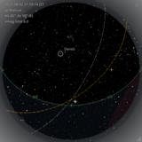
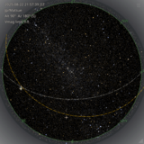

# zstarview 🌌

See the starry sky, even when it's cloudy or the sun is out.

**Zenith Star View** is an application that displays the starry sky from any city on Earth.  
The name emphasizes the *zenith*—the point directly overhead—conveying the experience of looking straight up into the night sky from your location.

**Features:**

- Real-time rendering of bright stars, planets, the celestial equator, and the ecliptic.
- Supports Sun, Moon, and major planets. Minor planets (asteroids) are not displayed yet.
- Location specified by city name (based on GeoNames), or directly by latitude/longitude.

  

- Adjustable view center: `-A` (altitude) and `-Z` (azimuth).
- Real-time satellite cloud imagery (Himawari/GOES), rendered as a stylized hatched (striped) overlay.

  

## Installation (Recommended: `pipx`)

It is intended to be installed using [`pipx`](https://pypa.github.io/pipx/).

```bash
pipx install git+https://github.com/tos-kamiya/zstarview.git
```

> Note: Troubleshooting tips (including X11 libraries and slow network) are summarized below.

## Usage

```bash
zstarview [options] [city]
```

### Argument

| Argument | Description                                                                                                                                                                                                                                                           | Default                           |
| :------- | :-------------------------------------------------------------------------------------------------------------------------------------------------------------------------------------------------------------------------------------------------------------------- | :-------------------------------- |
| `city`   | Specify the city name to display, **or** directly specify latitude/longitude in the form `"<lat>;<lon>"`. Examples: `35.68;139.76`, `N35.68;E139.76`, `-35.68;139.76`. If omitted, the last run city/coordinates will be used (defaults to `Tokyo` on the first run). | Last run city/coords (or `Tokyo`) |

### Options

| Option                                      | Description                                                                 | Default |
| :------------------------------------------ | :-------------------------------------------------------------------------- | :------ |
| `-h`, `--help`                              | Show this help message and exit.                                            |         |
| `-Z`, `--view-center-az VIEW_CENTER_AZ`     | Viewing azimuth (degrees or compass points).                                | `180`   |
| `-A`, `--view-center-alt VIEW_CENTER_ALT`   | Viewing altitude angle (90=zenith, 0=horizon).                              | `90`    |
| `-c`, `--cloud-opacity CLOUD_OPACITY`       | Opacity of cloud rendering (0.0–1.0). Use 0.0 to disable. \*2                | `0.2`   |
| `--sky-opacity SKY_OPACITY`                 | Opacity of the simulated sky-color disc (0.0–1.0). Use 0.0 to disable.      | `0.2`   |
| `-m`, `--enlarge-moon`                      | Show the moon in 5x size.                                                   |         |
| `-s`, `--star-base-radius STAR_BASE_RADIUS` | Base size of stars.                                                         | `8.0`   |
| `-V`, `--vmag-limit V_MAG_LIMIT`            | Maximum visual magnitude of stars to display.                               | `6.0`   |
| `-i`, `--sky-update-interval SECONDS`       | Interval for updating stars/sky-color disc in seconds.                      | `180`   |
| `-H`, `--hours HOURS`                       | Number of hours to add to the current time. \*1                              | `0`     |
| `-D`, `--days DAYS`                         | Number of days to add to the current time. \*1                               | `0`     |
| `--datetime "YYYY-MM-DD HH[:MM[:SS]] [TZ]"` | Specify an absolute date/time. Time may be given as `HH`, `HH:MM`, or `HH:MM:SS`. If no TZ is specified, UTC is assumed. \*1 |         |

\*1 When using non-realtime sky options (`--hours`, `--days`, `--datetime`), cloud rendering will not be shown.  

\*2 Cloud rendering uses infrared data from meteorological satellites (**Himawari** and **NOAA GOES** series), retrieved from their public S3 buckets.  
   See Troubleshooting for tips on slow networks or offline use (e.g., disabling clouds with `-c 0`).

**About the view center options**

The `-Z` (azimuth) and `-A` (altitude) options specify the center of the displayed sky.

By default, `-Z 180` (facing south) and `-A 90` (zenith) are used.
In this view, the bottom of the screen is south, the left side is east, and the display is a circular view looking straight up toward the zenith.

For example, setting `-Z 90` (facing east) and `-A 5` (altitude 5°, i.e., looking 5° above the horizon)
will produce a roughly semicircular sky view.

→ Eastern sky showing the Summer Triangle (Vega, Altair, Deneb) [](docs/images/screenshot2.png)

Azimuth can be given in degrees or compass points (case-insensitive).
Examples: `-Z E`, `-Z ne`, `-Z SSW` (202.5°).
(Compass mapping: 0=N, 90=E, 180=S, 270=W; accepts N, NNE, NE, ENE, E, ESE, SE, SSE, S, SSW, SW, WSW, W, WNW, NW, NNW.)

**About magnitude limit**

Use `-V magnitude` to limit the displayed stars to those brighter than the given magnitude.
The default is `-V 6.0`. For example, specifying 9.0 will display about 83,000 stars.
Note that higher values will increase rendering time.

→ Example: display up to magnitude 9.0 [](docs/images/screenshot3.png)

**About the datetime option**

Use `--datetime "YYYY-MM-DD HH[:MM[:SS]] [TZ]"` to specify an absolute date and time.
The time part may be just hours, hours\:minutes, or hours\:minutes\:seconds.
If no timezone (TZ) is specified, UTC is assumed.

Supported timezone formats:

* A common abbreviation (JST, UTC, GMT, KST, HKT, AWST, ACST, AEST, NZST, NZDT, MSK, EAT)
* A full IANA timezone name (e.g., `Asia/Tokyo`, `Europe/Moscow`)
* A UTC offset (e.g., `UTC+9`, `UTC-07:30`)

Examples:

```bash
zstarview --datetime "2025-08-17 21:00:00 JST" Tokyo
zstarview --datetime "2025-09-12 9" Tokyo         # 9 o'clock
zstarview --datetime "2025-09-12 09:00" Tokyo     # 9:00
zstarview --datetime "2025-09-12 9:0:0 JST" Tokyo # 9:00:00 JST
```

---

**Latitude/Longitude direct input**

Instead of a city name, you can directly specify coordinates as `"<lat>;<lon>"`.

* Format: `latitude;longitude` (semicolon separated)
* Examples:

  * `35.68;139.76`
  * `N35.68;E139.76`
  * `-35.68;139.76`
  * `S35.68;W139.76`
* Latitude must be between -90 and 90, longitude between -180 and 180.
* Direction letters `N/S/E/W` can be used (negative sign takes precedence if both given).
* When starting with coordinates, **the timezone defaults to UTC** (you can override with `--datetime` and a timezone).

Example:

```bash
zstarview "35.68;139.76"
zstarview "N35.68;E139.76" --datetime "2025-09-12 21 JST"
```

Time zone examples for `--datetime`:

- IANA zone name: `--datetime "2025-09-12 21 Asia/Tokyo"`
- UTC offset: `--datetime "2025-09-12 21 UTC+9"`

### Key Operations

* **← / →**: Rotate view azimuth by ±5°
* **M**: Toggle moon enlarged to 5x size
* **F11**: Toggle fullscreen display
* **ESC**: Exit fullscreen
* **Q**: Quit

## Generating a `.desktop` launcher (GNOME only)

On GNOME-based environments (including Ubuntu Dock and DockToPanel),
a `.desktop` file is required for the correct icon to appear in the taskbar.

This application includes a helper command to generate it:

```bash
# Create zstarview.desktop in the current directory
zstarview-make-desktop-file

# Install to ~/.local/share/applications
zstarview-make-desktop-file --write
```

* Without `--write`, the file `zstarview.desktop` is created in the current directory.
* With `--write`, it is installed to `~/.local/share/applications` and registered with the desktop database.

> **Note:** This launcher integration is only intended for GNOME-based environments.
> It is not required on other desktop environments, and may not work as intended elsewhere.

## Troubleshooting

### X11 (Ubuntu/Debian)
Qt's xcb platform plugin may require `libxcb-cursor0` at runtime.
Install it with:

`sudo apt install libxcb-cursor0`

### Slow or Unstable Network / Offline Use
Cloud rendering downloads satellite imagery from public S3 buckets (Himawari / NOAA GOES) and relies on heavy dependencies.
If your network is slow or unavailable, disable clouds with `-c 0`.
You can still explore stars/planets and sky colors without cloud overlays.

### Sky Update Interval and CPU Load
Frequent sky updates can be CPU‑intensive on lower‑end machines. Increase the interval to reduce load (e.g., `-i 300` for every 5 minutes). Lower it only if your machine can keep up.

### Viewing Logs
Launching from a terminal shows startup messages and errors: `zstarview` or `python -m zstarview.zstarview`.
Logs are also written to a file (platform‑dependent). Examples:
- Linux: `~/.cache/zstarview/logs/app.log`
- macOS: `~/Library/Logs/zstarview/app.log`
- Windows: `%LOCALAPPDATA%/tos-kamiya/zstarview/Logs/app.log`

## License

This software is provided under the [MIT](LICENSE.txt) License.

However, the **included data** is redistributed according to their respective licenses.

All paths below are relative to `src/zstarview/data/`.

| File                                                           | Content                                          | Source                                                             | License                                                                                                                             |
| -------------------------------------------------------------- | ------------------------------------------------ | ------------------------------------------------------------------ | ----------------------------------------------------------------------------------------------------------------------------------- |
| `cities1000.txt`, `admin1CodesASCII.txt`                       | List of cities with a population of 1000 or more | [GeoNames](https://download.geonames.org/export/dump/)             | [CC BY 4.0](https://creativecommons.org/licenses/by/4.0/)                                                                           |
| `stars/hip_main.dat.zip`                                       | Hipparcos and Tycho Catalogues (ESA 1997)        | [CDS Strasbourg](https://cdsarc.cds.unistra.fr/ftp/I/239/)         | [ODbL](https://www.data.gouv.fr/licences) or [CC BY-NC 3.0 IGO](https://creativecommons.org/licenses/by-nc/3.0/igo/) Non-commercial |
| `stars/IAU-Catalog of Star Names (always up to date).csv`      | IAU WGSN catalog of approved star names          | [exopla.net](https://exopla.net/star-names/modern-iau-star-names/) | [CC BY 4.0](https://creativecommons.org/licenses/by/4.0/)                                                                           |
| `Noto_Sans/*`, `Noto_Sans_Symbols/*`                           | Font for displaying text / planetary symbols     | [Google Fonts](https://fonts.google.com/)                          | [SIL Open Font License 1.1](https://openfontlicense.org)                                                                            |

## Credits

* Astronomical data provided by CDS Strasbourg and the ESA Hipparcos Mission.
* City data based on GeoNames.
* Star proper names provided by the IAU Working Group on Star Names (via [exopla.net](https://exopla.net/star-names/modern-iau-star-names/)).
* Cloud data are based on infrared observations from the **Himawari** satellite (provided by JMA) and the **NOAA GOES** series (provided by NOAA/NESDIS), retrieved from their public S3 buckets.
* Fonts provided by the Google Noto Project.
* The window title "Zenith Star View" was suggested by ChatGPT.
* Specification discussions, code generation, and debugging were greatly assisted by Gemini and ChatGPT.

## Appendix

→ [Lunar eclipses in 2025, Solar eclipses 2026-2028](docs/appendix-eclipses.md)
