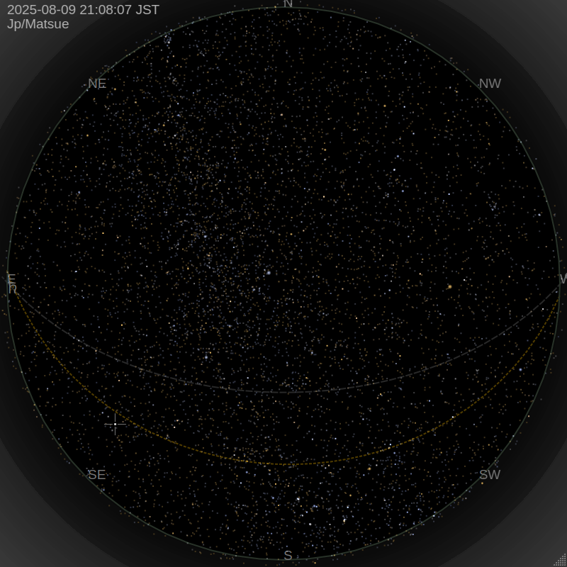

# zstarview 🌌

雲があっても、太陽が出ていても、満天の星空を。

Zenith Star View は、地球上の任意の都市を指定して、頭上の星空を描画するアプリケーションです。

- 明るい恒星、惑星、天の赤道、黄道をリアルタイムで描画
- 都市名で場所を指定可能（GeoNames 収録）



## インストール方法（推奨：`pipx`）

[`pipx`](https://pypa.github.io/pipx/) を使ってインストールする想定です。

```bash
pipx install git+https://github.com/tos-kamiya/zstarview.git
```

## 使い方

```bash
zstarview [options] [city]
```

### 引数

| 引数     | 説明                                                          | デフォルト              |
| :----- | :---------------------------------------------------------- | :----------------- |
| `city` | 表示する都市名を指定します。省略時は前回起動時の都市を使用します。初回起動時に省略すると `Tokyo` になります。 | 前回の都市（初回は `Tokyo`） |

### オプション

| オプション                                       | 説明                                            | デフォルト  |
| :------------------------------------------ | :-------------------------------------------- | :----- |
| `-h`, `--help`                              | ヘルプメッセージを表示して終了します。                           |        |
| `-H`, `--hours HOURS`                       | 現在時刻に加算する時間数を指定します。                           | `0`    |
| `-D`, `--days DAYS`                         | 現在時刻に加算する日数を指定します。                            | `0`    |
| `-m`, `--enlarge-moon`                      | 月を3倍の大きさで表示します。                               |        |
| `-s`, `--star-base-radius STAR_BASE_RADIUS` | 星の基本サイズを指定します。                                | `15.0` |
| `-Z`, `--view-center-az VIEW_CENTER_AZ`     | 表示中心の方位角を度単位で指定します (0=北, 90=東, 180=南, 270=西)。 | `180`  |
| `-A`, `--view-center-alt VIEW_CENTER_ALT`   | 表示中心の高度を度単位で指定します (90=天頂, 0=地平線)。             | `90`   |

デフォルトでは、指定された都市（または省略時は前回の都市）で、南を向いて(`-Z 180`)、天頂を見上げている(`-A 90`)状態の星空が表示されます。このとき、画面下が南、画面左が東になります。

### キー操作

* **F11**: フルスクリーン表示の切り替え
* **ESC**: フルスクリーンから復帰
* **Q**: 終了

## `.desktop` ランチャーの生成（GNOME専用）

GNOME系デスクトップ環境（Ubuntu Dock や DockToPanel を含む）では、
タスクバーに正しいアイコンを表示するために `.desktop` ファイルが必要です。
本アプリにはこれを生成する補助コマンドが付属しています。

```bash
# カレントディレクトリに zstarview.desktop を作成
zstarview-make-desktop-file

# ~/.local/share/applications にインストール
zstarview-make-desktop-file --write
```

* `--write` を付けない場合は、カレントディレクトリに `zstarview.desktop` が作成されます。
* `--write` を付けると `~/.local/share/applications` に書き込み、デスクトップデータベースに登録します。

> **注:** このランチャー機能は GNOME 系環境専用です。
> 他のデスクトップ環境では不要、または正しく動作しない場合があります。

## 依存パッケージ

* Python 3.10+
* [`appdirs`](https://pypi.org/project/appdirs/)
* [`PyQt5`](https://pypi.org/project/PyQt5/)
* [`astropy`](https://pypi.org/project/astropy/)
* [`skyfield`](https://pypi.org/project/skyfield/)
* [`numpy`](https://pypi.org/project/numpy/)
* [`Pillow`](https://pypi.org/project/Pillow/)

## ライセンス

このソフトウェアは [MIT](LICENSE.txt) の下で提供されています。

ただし、 **同梱されているデータ** はそれぞれのライセンスに従って再配布されます。

| ファイル                                         | 内容               | 出典                                                                       | ライセンス                                                                                                                      |
| -------------------------------------------- | ---------------- | ------------------------------------------------------------------------ | -------------------------------------------------------------------------------------------------------------------------- |
| `data/cities1000.txt`                        | 人口1000人以上の都市一覧   | [GeoNames](https://download.geonames.org/export/dump/)                   | [CC BY 4.0](https://creativecommons.org/licenses/by/4.0/)                                                                  |
| `data/catalog`                               | Hipparcos 恒星カタログ | [CDS Strasbourg](https://cdsarc.cds.unistra.fr/viz-bin/cat/V/50)         | [ODbL](https://www.data.gouv.fr/licences) または [CC BY-NC 3.0 IGO](https://creativecommons.org/licenses/by-nc/3.0/igo/)（非商用） |
| `data/NotoSansSymbols-VariableFont_wght.ttf` | 惑星記号表示用フォント      | [Google Fonts](https://fonts.google.com/noto/specimen/Noto+Sans+Symbols) | [SIL Open Font License 1.1](https://openfontlicense.org)                                                                   |

## クレジット

* 天文データを提供していただいている CDS Strasbourg および ESA Hipparcos Mission に感謝します。
* 都市データ GeoNames に基づいています。データの提供に感謝いたします。
* フォントは Google Noto Project を利用しています。感謝いたします。
* ウィンドウタイトル「Zenith Star View」は ChatGPT の提案に由来しています。
* Gemini および ChatGPT に、仕様の相談、コード生成、デバッグなど、多くの助力をいただいています。感謝いたします。
