# zstarview 🌌

雲があっても、太陽が出ていても、満天の星空を。

**Zenith Star View** は、指定した地点から見た天球に、大気の状態、地形、街並み、地平線などの要素を描く、デスクトップ向けの空景シミュレータです。

<table align="right">
  <tr>
    <td align="center">
      
      <br />
      <sub>2026-07-13 時点の clickpy Top 25</sub>
      <br />
      <sub><a href="https://clickpy.clickhouse.com/">clickpy で zstarview を検索</a></sub>
    </td>
  </tr>
</table>

指定した場所と時刻の天球に、恒星、太陽、月、惑星、DSO、アステリズムを表示します。
必要に応じて、地形地平線、都市アウトライン、夜間光、近傍の航空機と人工衛星も重ねて表示できます。
観測地点は都市名やビューポイント名、緯度経度、オンライン地名検索、Google Maps の URL などで指定できます。

<p align="center">
  <a href="https://pypi.org/project/zstarview/">
    
  </a>
  <a href="https://pepy.tech/projects/zstarview">
    
  </a>
  <a href="https://www.python.org/">
    
  </a>
</p>

https://github.com/user-attachments/assets/b0a4e340-1089-4256-9c48-b795d5c7b200

<p align="center">
  <video controls width="600" aria-label="松江駅から見た空のタイムラプス">
    <source src="docs/images/timelapse-matsueeki.mp4" type="video/mp4" />
  </video>
</p>

<p align="center"><em>松江駅から見た空のタイムラプス。</em></p>

**特徴:**

- **恒星**: 選択したカタログの恒星を天球に表示し、その上にアステリズムなどのオーバーレイを重ねます。
- **太陽系天体**: 太陽・月・主要惑星に対応しています。小惑星（アステロイド）は未対応です。
- **検索**: 固有名星、アステリズム、地名、ISS、JPL-backed spacecraft を 1 つのダイアログから検索できます。ローカル検索で見つからない場合は ISS をアプリ側の現在位置で解決します。ISS として認識されたのに現在位置を取得できない場合は、JPL へはフォールバックしません。`Keep marker` を有効にすると選択対象のマーカーとラベルを継続表示できます。
- **オーバレイのグループ**: 後述する表示機能は表示レイヤーごとにグループ化されています。各オーバレイはメニューまたは対応するキーボードショートカットで個別に切り替えできます。
- **柔軟な場所指定と表示中心**: 観測者の地点を、都市名、タワー名、山名、緯度経度、対応する Google Maps 座標 URL、または Nominatim を使った地名・駅名検索により指定できます。表示中心は `-A` / `-Z` または矢印キーで調整できます。HUD には、観測者の場所と現在の `alt/az` 視点中心も表示されます。
- **端末向け画像出力**: `zstarview-export-image` により、CLIコマンドとして空を描画してファイルへ保存したり、sixel 対応端末へ直接表示したりできます。
- **Python 対応**: CPython 3.10, 3.11, 3.12, 3.13, 3.14 で継続的にテストしています。

**天体のオーバレイ:**

- **DSO 表示**: 名前付きの DSO（銀河/散開星団/球状星団）を薄い青系の領域として表します。
- **AKARI IR bands**: 既定の表示では 90 / 140 マイクロメートルの遠赤外線ダストマップを、独立した空のレイヤーとして疑似カラー表示します。表示用データはオプションで準備できます。
- **アステリズム表示**: IAU の正式な星座境界ではなく、通称のパターンとしてのアステリズムを暗い線で常時表示します。アステリズムに含まれる恒星にマウスホバーすると、そのアステリズムを明るく強調してラベルを表示します。同一の恒星が複数のアステリズムに含まれる場合は 3 秒ごとに切り替えます。
- **天球ガイド**: 昇らない領域をグレーの実線円として表示し、天の赤道は長めの点線で同じグレー表示にして、地平線まわりの方位ラベル、天頂マーカー、天の極マーカーも重ねて表示します。

**大気と人工物のオーバレイ:**

- **空色**: 球形大気の散乱モデルで、レイリー散乱とミー散乱を組み合わせて空色ディスクを動的に生成します。太陽の位置や観測条件に応じて色が変化します。
- **雲**: リアルタイムに Himawari/GOES 衛星のデータをダウンロードし、丸いドットのハーフトーンによる重ね描きとして表示します。空色ディスクは雲の下に見えます。実験中オプションの `--geo-satellite true` を指定した場合は、Europe band 内で Geo-satellite 経路も使えます。衛星データが部分的な場合は欠損領域を薄い黄色で示します。[部分カバー時の黄色い欠損表示の例](docs/images/screenshot5.png) も参照してください。
- **台風・サイクロン**: 公開 ArcGIS `Active_Hurricanes_v1` FeatureServer の現行ハリケーン / 台風データを、小さなマーカーとして表示できます。投影済みの現在位置を使い、観測者からの距離が 128km を超える場合は表示しません。
- **人工衛星**: ISS / JWST / Voyager 1 / Voyager 2 / Parker / Europa Clipper / Lucy / Psyche / JUICE / Solar Orbiter / BepiColombo を、惑星レイヤーと航空機レイヤーの間に小さな紫色のマーカーとして表示できます。
- **航空機**: OpenSky ベースの近傍航空機オーバーレイは既定では無効です。正の値の `-a` / `--aircraft-opacity` を明示して有効化すると、予想移動方向付きの紫系ポリラインとして表示できます。
- **予報降水量**: Open-Meteo の予報レイヤーは既定では無効です。雲などの観測データに基づくレイヤーとは異なり、実際の降水量と異なる場合があるモデル予報を表示します。`zstarview` または `zstarview-gui` の起動ダイアログで降水量の不透明度に正の値を指定すると有効になります。対話的な起動で初めて使用する際には、非商用 Free API の利用規約への同意が必要です。`zstarview-export-image` で降水量を表示するには、事前に対話的な起動で同意を保存しておく必要があります。

**建築物と地表ガイドのオーバレイ:**

- **地球ガイド**: 参考情報として、向きの把握を助けるための独立した地球ガイドレイヤーが同じ地面トーンで簡略化した大陸アウトラインを描きます。
- **地形地平線**: Copernicus DEM データをダウンロードして、地形地平線オーバーレイを表示します。帯状の稜線を同じ地平線色で描き、近い帯ほど太く、遠い帯ほど細くなります。青く差した稜線は、観測者から見える、手前の稜線に隠れない部分を示します。地形地平線（地形地平線を表示しない場合には水平線）より下は同じ地面トーンで塗り分けます。
- **水面**: 近傍の水域を小さな青いドットとして表示します。海側の点は OSM Water Polygons の sea-mask タイル、川・湖・池などの内陸水域は Overpass API 経由で取得した OpenStreetMap データを使います。詳細は [水面について](docs/cli-overlays-ja_JP.md#about-water-surface) を参照してください。
- **都市アウトライン**: 現在の観測地点に対して、主要な建物屋根線を白い都市アウトラインとして表示し、閉じた輪郭の内側には薄い塗りを重ねます。高層建築が多い一部の都市では、半径 60km 以内の遠距離の高層建築も追加で表示されます。
- **夜間光**: Earth Observation Group (EOG) の 2025 年次 VIIRS Nighttime Lights VNL v2.2 GeoTIFF を GitHub Releases から必要時にダウンロードしてローカルにキャッシュし、地平線や地形稜線の少し上に独立したグローとして表示します。

## 画面の説明

> 注意: 以下のスクリーンショットでは、インストールのセクションでオプションとしている「海岸線データ」「都市アウトラインデータ」「AKARI IR bands データ」を有効にしています。

<table>
  <tr>
    <td valign="top" width="33%"></td>
    <td valign="top"><p><code>-p "Matsue Station" -A5 -Anw</code> で表示した、日本の一都市の夜空です。恒星 Vega のあたりにマウスをホバーしているため、この星が属するアステリズムの Summer Triangle が表示されています。建物は <em>urban outline</em> として表示されています。</p><p>画面左側の西の空には雲が表示され、円形のドットを並べたハーフトーンで表現されています。雲は、GOES や Himawari などの衛星データから推定した雲量をもとに描画しています。</p><p>建物のデータは基本的には Overture Maps から取得しますが、日本の都市のいくつかについては、<a href="#plateau-building-data-preparation">PLATEAU のデータ</a>も利用可能です。このスクリーンショットでは PLATEAU のデータを利用しています。</p></td>
  </tr>
</table>

<table>
  <tr>
    <td valign="top" width="33%"></td>
    <td valign="top"><p>アトランタ空港とその上空の画面で、忙しい空域を飛ぶ10機以上の航空機が表示されています。航空機の軌跡は紫色のリボンで描かれ、地平線の下にある楕円は <em>never-rises</em>（昇らない領域）、つまり天球上で水平線より上に来ることがない領域を示しています。天の赤道と黄道は点線の基準線として表示されています。</p><p>天の赤道は、天の北極と天の南極を結ぶ地軸を法線とする大円です。never-rises の境界は、同じ地軸を中心軸とする小円です。</p><p>注意: 航空機をリボンとして表示するには、CLI では <code>-a 0.4</code> などを指定してください。<code>zstarview-gui</code> では、起動時のダイアログの <code>Overlays</code> タブで <code>Aircraft opacity</code> を 0.4 などに設定してください。</p></td>
  </tr>
</table>

<table>
  <tr>
    <td valign="top" width="33%"></td>
    <td valign="top"><p>世界で最も平らな場所の一つとして知られているユウニ塩湖から、天頂を見上げた画面です。周囲をぐるっと囲む水平線は、地平線の高低差がほとんどないため、ほぼ円形に描かれています。<code>-V9</code> により、視等級 9 までの恒星を表示しています。また、<code>-s5</code> により、小さな恒星を目立たせるため、デフォルトより少し大きめに恒星を表示しています。<code>--akari-ir-bands 0.3</code>により、遠赤外線ダストマップを強調しています。</p><p>注意: 等級上限を大きくすると描画時間も増えます。<a href="docs/cli-sky-and-stars-ja_JP.md#about-magnitude-limit">等級上限オプションについて</a>も参照してください。</p></td>
  </tr>
</table>

<table>
  <tr>
    <td valign="top" width="33%">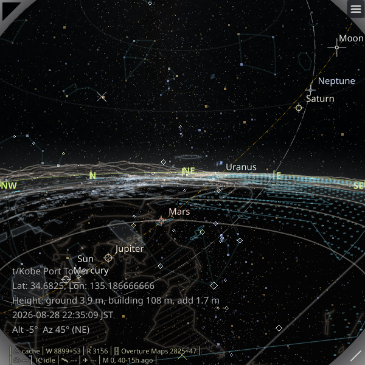</td>
    <td valign="top"><p>地表から 108m の高さにあるタワーから、視線方向の高度を少し下向き（<code>-A-5</code>、-5 度）にした画面です。Kobe Port Tower のように、いくつかのタワーは内部データベースに場所と高さが登録されています。利用可能なタワー名は <code>--list-viewpoints t</code> で、山名は <code>--list-viewpoints m</code> で一覧表示できます。この画面では、<em>night light</em>（宇宙から見た地表の明るさのデータ）によって地面が光る効果も付けています。これにより、都市の部分と海の部分で明るさが異なって見えます。</p></td>
  </tr>
</table>

<table>
  <tr>
    <td valign="top" width="33%">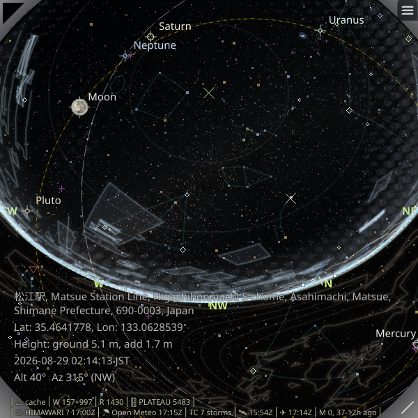</td>
    <td valign="top"><p>視線方向の高度を変更するオプションに <code>-A40</code> を指定し、空を見上げた状況を示しています。FOV は画面の端で 90 度になるため、少し魚眼レンズのような効果が現れます。</p><p>月の上にマウスを移動すると、月が通常の見かけの大きさの 5 倍に拡大されます。この拡大表示により、月齢、つまり月の明るい部分と暗い部分の形を確認しやすくなります。デフォルトの明るい天体モードでは、通常サイズの月も明るい側の外周弧と明暗境界の弧による月相アウトラインで表示されます。視等級に応じて描かれる恒星や惑星とは異なり、月は見かけの角直径を基準に円盤として描かれます。</p></td>
  </tr>
</table>

<table>
  <tr>
    <td valign="top" width="33%">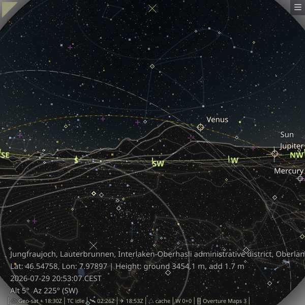</td>
    <td valign="top"><p>スイスの山岳地帯を表示した画面で、切り立った地形が水平線付近に見えています。太陽が地平線より上にあるため、空には色が付いています。稜線はオリーブ色で描かれています。</p><p>雲の描画については、ヨーロッパの大部分は GOES や Himawari の衛星のカバー範囲外なので、デフォルトでは雲は描かれません。<code>--geo-satellite true</code> を指定すると、静止衛星の雲画像を加工して表示する実験的なサポートを利用できます。</p></td>
  </tr>
</table>

<table>
  <tr>
    <td valign="top" width="33%"></td>
    <td valign="top"><p>GUI アプリではなく <code>zstarview-export-image</code> を用いて出力した星空画像です。オブジェクトの検索オプション <code>--search "Torifune"</code> を利用して、小天体の位置を表示しています。右側には日本の建物、大阪城も見えています。</p></td>
  </tr>
</table>

<table>
  <tr>
    <td valign="top" width="33%">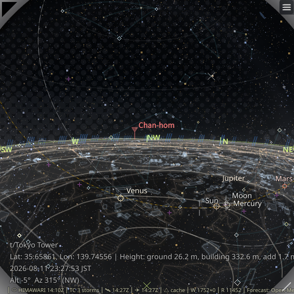</td>
    <td valign="top"><p>この画面では、東京近辺を移動する台風15号（Chan-hom）を表示しています。赤いマーカーが台風を、青い斜めの線がモデルによって予測された降水量を示します。雲などの観測に基づくレイヤーとは異なり、この予測は実際の降水と異なることがあります。予測降水量の多さは線の本数で表現しています。</p><p>降水量表示は、<code>--precipitation-opacity</code> に0以外の値を指定すると有効になります。初めて有効にするときは、Open-Meteo Free APIの利用条件への同意が必要です。</p></td>
  </tr>
</table>

<details>
<summary>その他のスクリーンショット</summary>

世界各地の都市アウトラインと地形地平線の例を示す画像です。これらの PNG は GUI のスクリーンショットではなく、`zstarview-export-image` の出力です。場所・時刻・視線方向のメタデータは PNG のテキストチャンクに埋め込まれており、`exiftool` などで確認できます。

<table>
  <tr>
    <td align="center" width="25%"></td>
    <td align="center" width="25%"></td>
    <td align="center" width="25%">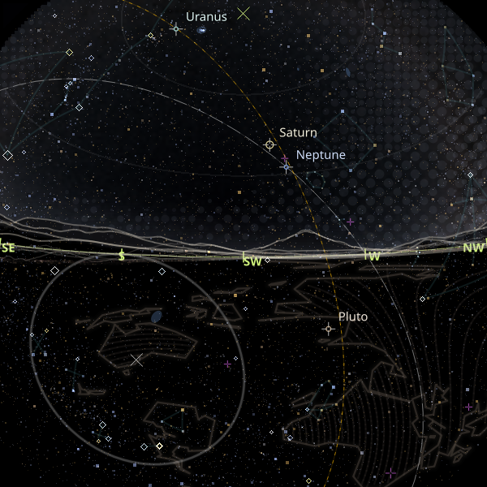</td>
    <td align="center" width="25%">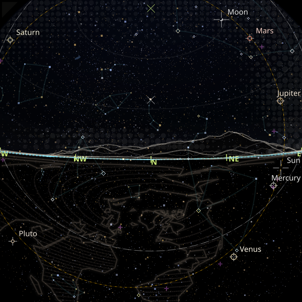</td>
  </tr>
  <tr>
    <td align="center"><sub>サーキュラー・キー（シドニー）</sub></td>
    <td align="center"><sub>東京タワー付近（東京）</sub></td>
    <td align="center"><sub>山中湖から望む富士山</sub></td>
    <td align="center"><sub>出雲大社（島根）</sub></td>
  </tr>
  <tr>
    <td align="center">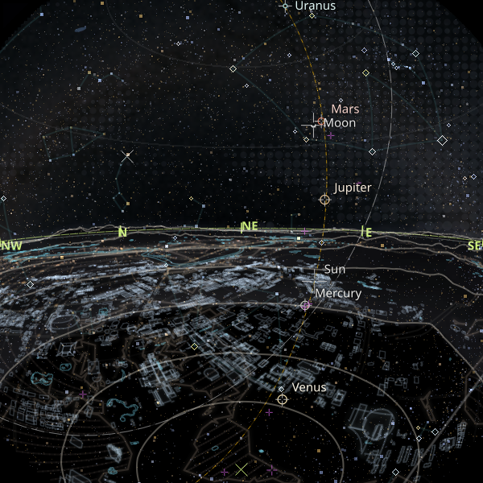</td>
    <td align="center"></td>
    <td align="center">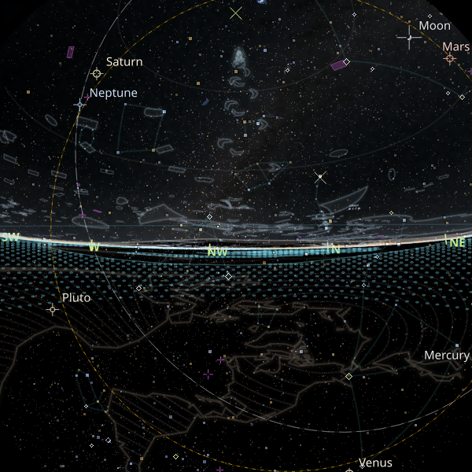</td>
    <td align="center">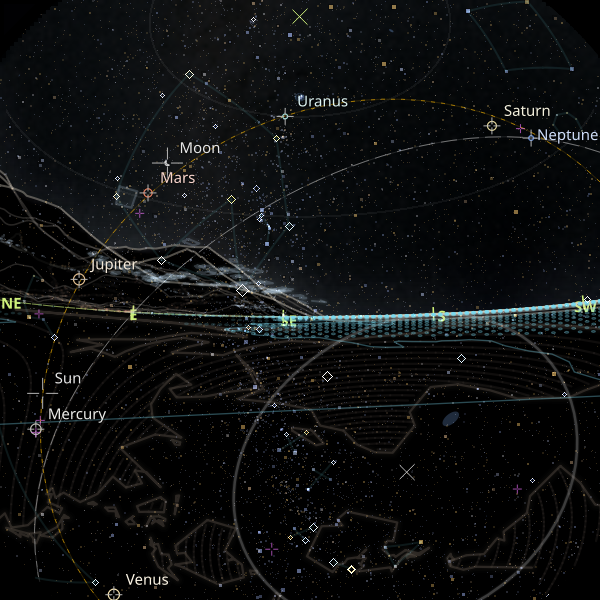</td>
  </tr>
  <tr>
    <td align="center"><sub>台北101（台湾）</sub></td>
    <td align="center"><sub>マリーナベイ（シンガポール）</sub></td>
    <td align="center"><sub>ブルジュ・ハリファ付近（ドバイ）</sub></td>
    <td align="center"><sub>マナローラ（イタリア）</sub></td>
  </tr>
  <tr>
    <td align="center">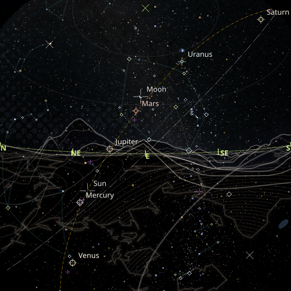</td>
    <td align="center">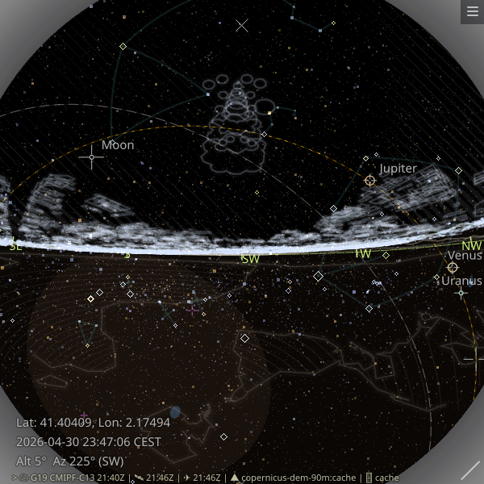</td>
    <td align="center">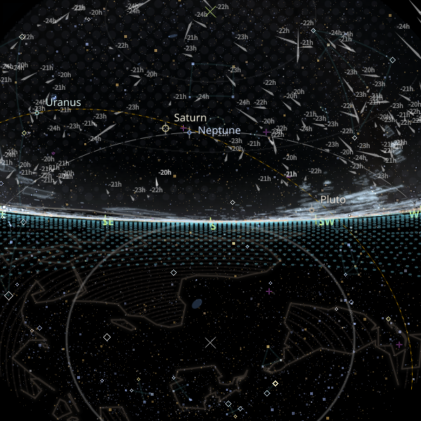</td>
    <td align="center">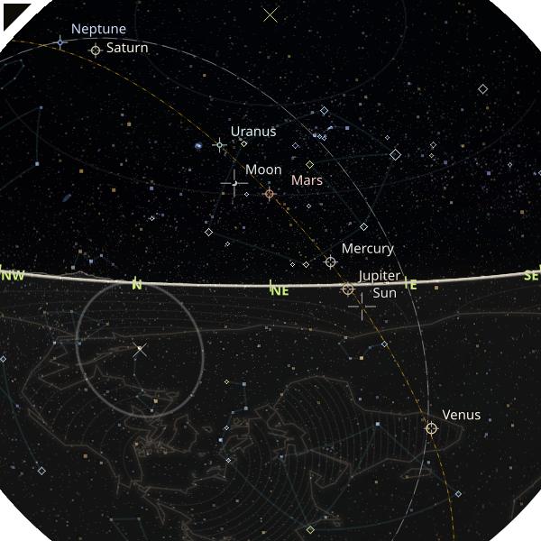</td>
  </tr>
  <tr>
    <td align="center"><sub>ユングフラウヨッホ（Jungfraujoch、スイス）</sub></td>
    <td align="center"><sub>サグラダファミリア（バルセロナ）</sub></td>
    <td align="center"><sub>ウェストミンスター橋（ロンドン）</sub></td>
    <td align="center"><sub>ユウニ塩湖の別の画像（ボリビア）</sub></td>
  </tr>
  <tr>
    <td align="center">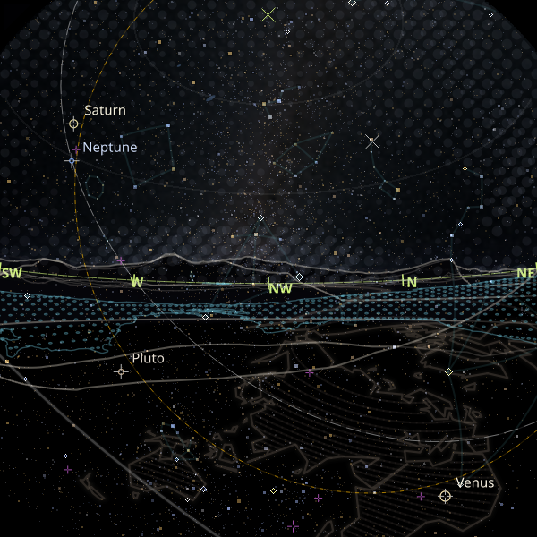</td>
    <td align="center">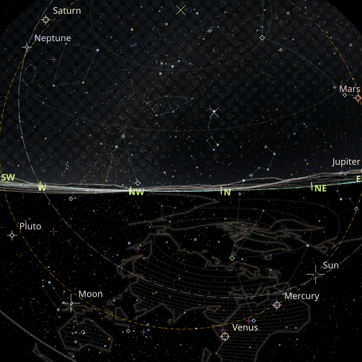</td>
    <td colspan="2"></td>
  </tr>
  <tr>
    <td align="center"><sub>ウィザード島（オレゴン）</sub></td>
    <td align="center"><sub>Bliss の丘（カリフォルニア）</sub></td>
    <td colspan="2"></td>
  </tr>
</table>

注記: 一部のスクリーンショットでは PLATEAU データを使用しています。詳細は
[PLATEAU 建物データの準備](#plateau-building-data-preparation) を参照してください。
</details>

## インストール方法（推奨：`pipx`）

Zstarview 自体は、[`pipx`](https://pypa.github.io/pipx/) を使ってインストールする想定です。

> 注記: 主に検証している環境は Linux x86_64 です。cloud-disc 系は
> `pyresample` 依存を削除したため、以前の Windows Arm64
> インストール阻害要因は解消されています。

```bash
pipx install zstarview
```

アップグレード:

```bash
pipx upgrade zstarview
```

最初の動作確認:

```bash
zstarview-gui
```

これは、起動前ダイアログを開いてから GUI を開始する既定の起動方法です。インストール直後は `zstarview-gui` を使ってください。Location source で `City` を選んでから `Auto Search` を押すと、現在位置を自動的に反映できます。

### (1) オプションの海岸線データ

オプションで海岸線を表示するには、[海岸線ベクタデータRelease](https://github.com/tos-kamiya/zstarview/releases/tag/coastline-data-20260725) から海岸線ベクトルデータをダウンロードしてください。GUI はこのデータを自動的にはダウンロードしません。全世界の海岸線列とオプションの25m全球水面マスクを取得する例は次のとおりです。

```bash
# 全世界の海岸線列とオプションの25m水面マスク
zstarview-download-coastline --all
```

データは zstarview のキャッシュへインストールされ、Release の manifest と SHA-256 チェックサムによる検証が完了してから利用可能になります。小さい範囲だけ取得する場合は `--lon-min` と `--lon-max` で経度範囲を指定できます。指定範囲は11.25度単位の完全なグリッド列へ拡張されます。オプションの25m全球水面マスクだけを取得する場合は `--water-25m`、キャッシュ先を変更する場合は `--cache-dir` を指定します。

### (2) オプションの AKARI IR bands データ

オプションの AKARI IR bands は、[AKARI Far-infrared All-Sky Survey Maps](https://darts.isas.jaxa.jp/en/datasets/darts%3Aakari-fis-image-allsky-map-2.1/) を表示します。簡単に言えば、これは AKARI の Far-Infrared Surveyor (FIS) が観測した、星間塵や、星が生まれる宇宙の分子雲が放つ遠赤外線の輝きを表す全天マップです。可視光の写真ではありません。元のデータセットには 65 / 90 / 140 / 160 マイクロメートルのバンドがあります。実行時の既定の疑似カラー表示は 90 / 140 マイクロメートルの2バンドを使用します。元ファイルは、ISAS/JAXA が提供するデータをミラーしている [NASA LAMBDA の AKARI 画像ディレクトリ](https://lambda.gsfc.nasa.gov/data/foregrounds/akari/images) からダウンロードされます。大きな元データはアプリ起動時に自動ダウンロードされません。次のコマンドでダウンロードし、表示用キャッシュを準備してください。

```bash
zstarview-download-akari-ir-bands
```

既定では AKARI の4バンドをダウンロードし、2048x1024 の表示用キャッシュへ縮約して zstarview のキャッシュへ保存します。`--bands` でバンド、`--width` と `--height` で表示用キャッシュのサイズ、`--cache-dir` でキャッシュ先を変更できます。準備に成功した後で元の FITS ファイルを削除する場合は `--delete-source` を指定します。元データは大きいため、ダウンロードと準備には時間とディスク容量が必要です。

### (3) オプションの都市アウトラインデータ

都市アウトライン表示は、選択した観測地点の周囲に建物の輪郭（主要な屋根線など）を描くためのオプション機能です。利用する場合は、`overturemaps` パッケージをインストールしてください。

Arm64 以外の環境では、`overturemaps` パッケージを `pipxu` でインストールしてください。

```bash
pipxu install -f overturemaps
```

Windows Arm64 では、`pipx` で `zstarview` をインストールした後、[Overture Maps の Releases](https://github.com/OvertureMaps/overturemaps-py/releases) から `overturemaps` 1.0.1 以上の Windows x64 実行ファイルをダウンロードし、`zstarview-install-overturemaps-exe-cli.exe` でキャッシュへ配置してください。`overturemaps` の依存パッケージが、Windows Arm64 用の必要な wheel をすべて提供していないためです。

## 使い方

`zstarview-gui` は起動前ダイアログ付きの対話的な GUI 起動用、
`zstarview` は CLI 指定で GUI を起動する用、
`zstarview-export-image` は GUI を起動せずに 1 枚書き出す用です。

`zstarview-gui` 起動後は、Location タブの `Auto` ボタンでネットワーク接続の情報を使って現在位置を観測者の位置として推定し、ダイアログへ反映できます。

以下の CLI リファレンスは `zstarview` と `zstarview-export-image` の引数について説明しています。

```bash
zstarview [options] [location]
```

> 注記（Ubuntu/Wayland, GNOME）: ターミナル起動時にタスクバーのアイコンが表示されない場合は、後述の [ツール](#ツール) 内の [`.desktop` ランチャーの生成（GNOME専用）](#desktop-ランチャーの生成gnome専用) を実行してください。

よく使う起動例:

```bash
zstarview Tokyo
zstarview auto
zstarview "Tokyo Skytree"
zstarview "35.68;139.76" --datetime "2025-09-12 21 JST"
zstarview -p "Matsue Station" --place-countrycode jp  # 地名を指定
zstarview Tokyo -A 5 -Z n  # 仰角5度で北の空を見る
zstarview --search Ceres
zstarview Tokyo -a 0.4  # 航空機を表示
zstarview Tokyo -P 0.4  # 予報降水量を表示
```

CLI では、場所・時刻・データセット・描画設定を細かく指定できます。

### CLI リファレンス

#### 引数

| 引数のフォーマット | 説明 | デフォルト |
| :--- | :--- | :--- |
| 都市名 | 都市名（例: `Tokyo`） | 前回の場所（初回は `Tokyo`） |
| タワー名/山名 | タワー（例: `t/Tokyo Skytree`）または山（例: `m/Mount Fuji`） | |
| 緯度経度 | 直接座標（例: `35.68;139.76`, `@35.68,139.76`）または Google Maps URL | |
| `auto` | IPアドレスによる現在地自動取得 | |

下のリンクは詳細なオプショングループです。各ドキュメントに、詳細なオプション表、注釈、例をまとめています。

<details>
  <summary>詳細なオプショングループ</summary>

  - [観測地点と時刻](docs/cli-observing-location-and-time-ja_JP.md)
  - [観測地点名参照ツール](docs/cli-viewpoint-dataset-queries-ja_JP.md)
  - [起動時の対象検索](docs/cli-search-objects-ja_JP.md)
  - [星空と天体](docs/cli-sky-and-stars-ja_JP.md)
  - [オーバーレイ](docs/cli-overlays-ja_JP.md)
  - [一般](docs/cli-general-ja_JP.md)
</details>


<details>
  <summary>ツール</summary>

## ツール

### `zstarview-export-image`

GUI を起動せずに画像ファイルを 1 枚生成して終了する場合は、`zstarview-export-image` を使います。

```bash
zstarview-export-image Matsue -o matsue.png
```

`zstarview-export-image` は、通常 GUI 左上に出る場所・時刻・視線方向・vmag limit の要約を、描画後に `stderr` へ出力します。`--sixel` の場合は端末画像を出す直前に出力します。
PNG へ保存した場合は、アプリのバージョン情報や HUD 関連のメタデータも埋め込まれます。`exiftool` などで確認できます。`--place` や `--search` を使った場合は、その解決結果も含まれます。

トラブルシュートや手動キャッシュ削除のために、描画せず cache root だけを表示することもできます。

```bash
zstarview-export-image --print-cache-dir
```

`--clear-long-lived-cache` のクールダウンを回避したい場合は、まず `zstarview-export-image --print-cache-dir` で cache root を確認し、その配下の次のサブディレクトリを起動前に手動削除してください。

- `copernicus-dem`
- `overture_buildings`
- `overture_skyscrapers`

### `.desktop` ランチャーの生成（GNOME専用）

GNOME 系デスクトップ環境（Ubuntu Dock や DockToPanel を含む）では、
タスクバーに正しいアイコンを表示するために `.desktop` ファイルが必要です。

本アプリにはこれを生成する補助コマンドが付属しています。

```bash
# カレントディレクトリに zstarview-gui.desktop を作成
zstarview-make-desktop-file

# ~/.local/share/applications にインストール
zstarview-make-desktop-file --write
```

* `--write` を付けない場合は、カレントディレクトリに `zstarview-gui.desktop` が作成されます。
* `--write` を付けると `~/.local/share/applications` に書き込み、デスクトップデータベースに登録します。

> **注:** このランチャー機能は GNOME 系環境専用です。  
> 他のデスクトップ環境では不要、または正しく動作しない場合があります。

</details>

GUI では、キーボード操作・マウス操作・メニュー操作で視点移動、検索、各種オーバーレイ切り替えを行えます。マウスホバーでは、固有名付き恒星のラベル表示、DSO の補助情報表示、アステリウムの強調表示とラベル表示、方位ラベル上でのグリッド表示を行えます。

<details>
  <summary>GUI 操作</summary>

### GUI

#### キー操作

* **← / →**: 視線の方位を ±5° 回転
* **↑ / ↓**: 視線の高度を ±5° 変更（0°..90° にクランプ）
  方向キー入力が続く間と最後の入力から約 0.7 秒の間は、ビューポート操作用の簡易描画モードになります。この間は `Vmag <= 4.0` の恒星、天の赤道、黄道、地平線、地形地平線、方位ラベル、天頂マーカー、天の極マーカーのみを表示し、惑星、全星等の星空、空ディスク、雲、夜間光、DSO、アステリウム、都市アウトラインは一時的に非表示になります。
* **Space**: 簡易表示を `通常` -> `ラベルなし` -> `ラベルあり` -> `通常` の 3 状態で切り替えます。簡易表示中は HUD に `Simplified: no labels [Space]` または `Simplified: with labels [Space]` を表示します。
* **M**: 月の 5 倍表示をトグル
* **D**: DSO 重ね表示の表示/非表示を切り替え
* **A**: アステリウム重ね表示の表示/非表示を切り替え
* **G**: Sky Guides の表示/非表示を切り替え
* **S**: Sky Color の表示を切り替え
* **C**: 雲の重ね表示の表示/非表示を切り替え
* **L**: 夜間光オーバーレイの表示/非表示を切り替え
* **P**: 航空機オーバーレイの表示/非表示を切り替え
* **I**: 人工衛星オーバーレイの表示/非表示を切り替え
* **T**: 地形地平線の重ね表示の表示/非表示を切り替え
* **E**: 地平線下の地球ガイドの重ね表示の表示/非表示を切り替え
* **U**: 都市アウトラインの重ね表示の表示/非表示を切り替え
* **Ctrl+J**: Jump to Named Star を開く
* **Ctrl+F**: 対象検索を開く
* **F11**: フルスクリーン表示の切り替え
* **ESC**: フルスクリーンから復帰
* **Q**: 終了

#### マウス操作

* **天体ホバー**: マウスを固有名付き恒星に重ねるとラベルを表示し、DSO に重ねると補助情報を表示し、アステリウム構成星に重ねると該当パターンを強調してラベルを表示します。
* **方位ラベルのホバー**: 方位ラベルに重ねると方位グリッドのホバー表示を出します。
* **簡易表示 [Space]**: `Space` で、天体以外をなるべく消して見やすくする簡易表示を `通常` -> `ラベルなし` -> `ラベルあり` -> `通常` の 3 状態で切り替えます。この間は雲、夜間光、地球ガイド、副稜線、水面、都市アウトラインを非表示にし、主稜線は fast-mode 相当の細い線で残し、ホバーラベルは維持します。
* **ウィンドウのドラッグ**: ウィンドウをドラッグすると移動できます。
* **リサイズグリップ**: リサイズグリップをドラッグするとウィンドウサイズを変更できます。

ウィンドウサイズ変更中も、同じ簡易描画モードを使って表示の追随性を保ちます。

#### メニュー操作

ハンバーガーメニュー（`☰`）から次を利用できます。

* **Search**
  * **Jump to Named Star...**: 代表的な固有名星（`Vmag <= 2.0`）を北天 / 赤道付近 / 南天で選んで、視点中心をその星へ移動します。
  * **対象検索...**: 固有名付き恒星、対応アステリウム、地名、ISS、JPL-backed spacecraft を横断検索し、選択した対象へ移動します。ローカル検索で見つからない場合は ISS をアプリ側の現在位置で解決し、ISS として認識されたのに現在位置を取得できない場合はエラーにして JPL へはフォールバックしません。`Keep marker` を有効にすると、移動後もマーカーとラベルを継続表示します。
  * **Search Places...**: OpenStreetMap Nominatim を使う別ダイアログを開き、地名・駅名・施設名の候補から選んだ地表地点の方向へ視点中心を移動します。
* **Layers**
  * **Enlarge Moon**: 月の 5 倍表示を切り替えます。
  * **DSO**: DSO の重ね表示の表示/非表示を切り替えます。
  * **Asterisms**: アステリウムの重ね表示の表示/非表示を切り替えます（有効時は暗い線を常時表示し、構成星にホバーすると該当アステリウムを明るく強調してラベルを表示します）。
  * **Guidelines**: 幾何学的地平線、天の赤道、黄道、グレーの実線 never-rises 円、方位ラベル、天頂マーカー、天の極マーカーの表示/非表示を切り替えます。天の赤道は長めの点線で、never-rises 円と同じグレーです。
  * **Sky Color**: 空ディスク表示を、空色グラデーション表示とフラットな暗色ディスク表示で切り替えます。
  * **Clouds**: リアルタイム雲の重ね表示の表示/非表示を切り替えます。
  * **Night Lights**: EOG VNL の夜間光オーバーレイの表示/非表示を切り替えます。CLI で `--night-light-opacity 0` を指定して起動した場合、その起動中はメニューから再有効化できません。
  * **Aircraft**: OpenSky ベースの航空機オーバーレイの表示/非表示を切り替えます。既定では無効で、起動時に正の値の `-a` / `--aircraft-opacity` を指定した場合だけ有効化できます。`-a 0` / `--aircraft-opacity 0` を指定して起動した場合は OpenSky への問い合わせが無効になり、その起動中はメニューから再有効化できません。
  * **Satellites**: 人工衛星 / spacecraft オーバーレイの表示/非表示を切り替えます。CLI で `--satellite-opacity 0` を指定して起動した場合、その起動中はメニューから再有効化できません。
  * **Terrain Horizon**: 地形地平線の重ね表示の表示/非表示を切り替えます。CLI で `-d 0` / `--terrain-horizon-opacity 0` を指定して起動した場合、その起動中はメニューから再有効化できません。
  * **Earth Guide**: 地平線下の地球ガイドの重ね表示の表示/非表示を切り替えます。CLI で `-e 0` / `--earth-guide-opacity 0` を指定して起動した場合、その起動中はメニューから再有効化できません。
  * **Urban Outline**: 都市アウトラインの重ね表示の表示/非表示を切り替えます。CLI で `-u 0` / `--urban-outline-opacity 0` を指定して起動した場合、その起動中はメニューから再有効化できません。
* **View Direction**
  * **Set View Center...**: 現在値をあらかじめ入れた Alt/Az ダイアログを開き、入力した視点中心をそのまま適用します。
* **File**
  * **Square Window**: 正方形ウィンドウ補正の表示/非表示を切り替えます。有効時は、リサイズ操作の応答性を保ったまま、fast-mode から通常描画へ戻るタイミングで、短辺に合わせてクライアント領域を正方形に補正します。補正後の最初の再描画は fast-mode のままです。
  * **Fullscreen**: フルスクリーン表示を切り替えます。
  * **Exit**: アプリケーションを終了します。

ジャンプ/検索の確定後は約 3 秒間、マウスホバー時と同じ見た目（円マーカー + 名称ラベル）で対象星を強調表示します。

</details>

<details>
  <summary>都市アウトライン用データ</summary>

`zstarview` は都市アウトライン用の元データを Overture Maps から必要時に取得し、
アプリのキャッシュディレクトリに派生タイルとして保存します。新しい
地点・半径・建物高さ条件の組み合わせでは、初回だけ数秒待ってから都市
アウトラインが表示されます。

この機能には `overturemaps` CLI の別途インストールが必要です。次で確認できます。

```bash
overturemaps --help
```

起動例:

```bash
zstarview "Tokyo Tower" -r 2.5 -b 0
zstarview -p "Matsue Station" -r 2.0 -b 20
```

- `-r`, `--urban-outline-radius-km`: 取得半径（km）
- `-b`, `--urban-outline-min-building-height-m`: 建物の最小高さ（m）
- `--urban-outline-feature-type`: 都市アウトラインに含まれるデータのうち、表示に使うものを選びます。既定値は `both`

</details>

<a id="plateau-building-data-preparation"></a>
<details>
  <summary>PLATEAU 建物データの準備（日本向け）</summary>

PLATEAU の建物データ準備には、5桁の日本の自治体コードを指定します（例: 松江市は
`32201`）。自治体の「標準地域コード」は、公式の [e-Stat 市区町村の標準地域コード
ページ](https://www.e-stat.go.jp/municipalities/cities/areacode) で調べてください。

すべての自治体コードに対して PLATEAU の建物データが用意されているわけでは
ありません。指定した地域に建物カタログがない場合、準備コマンドは HTTP 404
エラーを報告します。範囲指定または複数指定の場合は、データのない地域を報告した
うえで、他の自治体の処理を続行します。

`zstarview-download-plateau-buildings` は、日本の PLATEAU CityGML 建物データを
ダウンロードし、`zstarview` が利用する軽量な派生キャッシュへ変換します。
これは明示的に実行する準備コマンドです。`zstarview` の起動時に PLATEAU の
データをダウンロードしたり、更新確認を行ったりすることはありません。

準備済みの有効なキャッシュは、`--list` で一覧できます。通常表示は自治体コード、
データ年度、保存パスだけを1行ずつ表示します。`--city-code` を指定すると、その
自治体だけに絞り込めます。`--jsonl` を指定すると、キャッシュメタデータを1件1行の
JSONとして出力します。いずれもネットワーク接続やファイル変更は行いません。

```bash
zstarview-download-plateau-buildings --list
zstarview-download-plateau-buildings --list --city-code 27100
zstarview-download-plateau-buildings --list --jsonl
```

複数の自治体については、範囲指定またはカンマ区切りを利用できます。

```bash
# 松江市
zstarview-download-plateau-buildings --city-code 32201

# 東京23区（13100から13122まで）
zstarview-download-plateau-buildings --city-code 13100-13122

# 自治体を選択して指定
zstarview-download-plateau-buildings --city-code 13100,13103,13122
```

範囲または複数指定の場合、最初にすべてのカタログを確認し、合計の推定
ダウンロードサイズを表示してから、1回だけ確認を求めます。例えば東京23区では、
次のように表示されます。

```text
PLATEAU batch download estimate:
  13101: 21 files, 1.96 GiB (CityGML ZIP)
  13102: 22 files, 2.31 GiB (CityGML ZIP)
  ...
Total estimated download size: 19.83 GiB
Continue with PLATEAU batch download? [y/N]
```

自治体ごとに、ダウンロードと CityGML 変換の進捗が表示されます。正常に準備が
完了すると、派生建物タイルは
`~/.cache/zstarview/plateau_buildings/<city-code>_<year>/` に保存されます。
観測地点をキャッシュがカバーしている場合、`zstarview` は PLATEAU の建物データを
利用し、対応する Overture Maps の建物データをダウンロードしません。

準備コマンドを再度実行すると、PLATEAU の最新カタログとキャッシュのメタデータを
照合します。データ整備年度、登録年度、仕様、建物ファイル数、建物ファイルサイズ
合計が一致すればキャッシュを再利用します。カタログが変わっている場合は、既存の
キャッシュを `*.outdated-<timestamp>` ディレクトリへ退避し、確認後に新しい
キャッシュを作成します。これらのメタデータがない古いキャッシュも、次回の準備時に
更新対象として扱われます。

ダウンロードした元の CityGML ZIP は、変換成功後にデフォルトで削除されます。
保存したい場合は `--keep-zip` を指定してください。準備済みキャッシュ内に
`source-citygml.zip` として保存されるため、追加のディスク容量が必要になります。

</details>

<details>
  <summary>トラブルシューティングとプラットフォーム補足</summary>


## トラブルシューティング

### X11（Ubuntu/Debian）

Qt の xcb プラグインが `libxcb-cursor0` を必要とする場合があります。
X11/Wayland を意識していないと分かりづらいですが、ターミナルから実行すると次のようなエラーが表示されます:

```sh
$ zstarview
qt.qpa.plugin: From 6.5.0, xcb-cursor0 or libxcb-cursor0 is needed to load the Qt xcb platform plugin.
qt.qpa.plugin: Could not load the Qt platform plugin "xcb" in "" even though it was found.
This application failed to start because no Qt platform plugin could be initialized. Reinstalling the application may fix this problem.

Available platform plugins are: eglfs, offscreen, wayland-egl, linuxfb, wayland, minimal, xcb, vkkhrdisplay, minimalegl, vnc.
```

この場合は以下で `libxcb-cursor0` をインストールしてください:

`sudo apt install libxcb-cursor0`

### PLATEAU 準備時の「No space left on device」
OS によっては、`/tmp` が容量制限のあるメモリ上の `tmpfs` として
設定されています。そのため、メインのファイルシステムに十分な空きがあっても、
大容量の PLATEAU CityGML を展開すると `OSError: [Errno 28] No space left on device`
になることがあります。コマンドが `--temp-dir` を案内した場合は、十分な空き容量のある
ファイルシステム上のディレクトリを指定して再実行してください。

```bash
zstarview-download-plateau-buildings \
  --city-code 32201 \
  --temp-dir "$HOME/zstarview-tmp"
```

指定したディレクトリが存在しない場合は自動的に作成されます。`--temp-dir` を省略した
場合の既定の一時ディレクトリ動作は変わりません。

### Wayland 環境でウィンドウの影が表示されない

Wayland のデスクトップ環境では、通常のフレーム付きウィンドウとして
`zstarview --window-frame window` を起動しても、外側の影が表示されないことがあります。
これは zstarview 自身のウィンドウ設定というより、Wayland の window decoration /
compositor 側の挙動によることが多いです。

X11 系の見た目でウィンドウ影を出したい場合は、実用的な回避策として
XWayland 経由で起動できます:

```sh
QT_QPA_PLATFORM=xcb zstarview --window-frame window
```

`QT_QPA_PLATFORM=xcb` を付けると影が表示される場合は、その差分は
Wayland と X11 のウィンドウ装飾経路の違いによるものと考えてよいです。

### Wayland 環境で `QT_QPA_PLATFORM=xcb` を付けるとウィンドウがちらつく

Wayland 環境では、`QT_QPA_PLATFORM=xcb` を強制すると、frameless ウィンドウが
ちらつくことがあります。特に最大化時に、再描画の途中で背後のデスクトップや
他ウィンドウが一瞬見えることがあります。

この症状が出る場合は、通常の frameless UI では `QT_QPA_PLATFORM=xcb` を
付けずに起動してください。XWayland を使いたい場合は、標準のフレーム付き
ウィンドウで起動するのが安全です:

```sh
zstarview
zstarview --window-frame window
```

### ネットワークが遅い / オフラインで使いたい
1. 惑星暦データ

   初回起動時は惑星暦データ（`de442s.bsp`）を自動ダウンロードします。  
   この一度だけはネットワーク接続が必要です。ダウンロード後はキャッシュを利用してオフラインでも動作します。

2. 雲衛星画像

   雲の描画は公開 S3 バケットから衛星画像を取得し、依存も比較的重めです。
   回線が細い、またはオフラインの場合は `-c 0` で雲描画を無効化してください。
   雲を無効化しても、恒星・惑星・空の色の表示は利用できます。

   ステータス行に `GOES G19 failed` のような雲ソース失敗が表示された場合は、
   ターミナルから明示的な出力ディレクトリを指定して以下を実行すると、
   failed となった理由を診断することができます:

   ```bash
   zstarview-diagnose-cloud-source --output-dir cloud-diagnosis --lat 33.660109 --lon -84.4102046
   ```

   既定では、診断時のダウンロードとログは出力ディレクトリ配下（`cloud-diagnosis/cache` など）に書き込まれるため、
   通常の zstarview 雲キャッシュは変更されません。
   このコマンドは、S3 オブジェクトの列挙、プロダクトの選択、ソースファイルのダウンロード、
   衛星データのオープン、投影メタデータの構築、雲グリッドの構築のいずれの段階で失敗したかを報告します。

   GUI ワーカーのリクエストを正確に再現するには、`Launching cloud source worker:` のログ行から引数をコピーし、
   `--work-dir ...` を `--output-dir cloud-diagnosis` に置き換えて `zstarview-diagnose-cloud-source` を実行してください。
   診断コマンドは `--request-id`、`--lat`、`--lon`、`--when-utc`、`--sat-priority`、
   `--search-back-minutes`、`--connect-timeout`、`--read-timeout`、`--cloud-shells-km` など、
   同じ主要なワーカー引数を受け付けます。

   ダウンロード済みの GOES `.nc` または `.nc.tmp` ファイルが既に存在する場合は、
   ネットワークアクセスなしでローカルファイル読み込みパスだけをテストできます:

   ```bash
   zstarview-diagnose-cloud-source --output-dir cloud-diagnosis --source-file OR_ABI-L2-CMIPF-M6C13_G19_sample.nc.tmp --satellite G19 --no-grid
   ```

3. 地形地平線

   地形地平線表示は初回に Copernicus DEM タイルをダウンロードし、その後はローカルキャッシュを再利用します。
   回線が細い、またはオフラインの場合は `-d 0` / `--terrain-horizon-opacity 0` で地形地平線表示を無効化してください。
   地球ガイドだけを止めたい場合は `-e 0` / `--earth-guide-opacity 0` を使えます。
   地形地平線を無効化しても、恒星・惑星・空の色の表示は利用できます。

4. 夜間光データ

   夜間光は EOG の 2025 年次 VIIRS Nighttime Lights VNL v2.2 GeoTIFF を使います。大容量のためPyPIパッケージには同梱せず、GitHub Releases から観測地点付近で必要なタイルだけを取得してキャッシュします。manifestと各タイルはSHA-256を検証してからキャッシュへ保存します。
   回線が細い、またはオフラインの場合は `--night-light-opacity 0` で夜間光レイヤーを無効化してください。
   キャッシュがすでにあれば、ネットワークがなくても夜間光オーバーレイを表示し続けられます。

5. 人工衛星データ

   人工衛星オーバーレイは実行時に ISS の軌道要素データを取得し、取得元は `wheretheiss.at` を優先し、失敗時だけ CelesTrak を使います。JWST / Voyager 1 / Voyager 2 / Parker / Europa Clipper / Lucy / Psyche / JUICE / Solar Orbiter / BepiColombo は JPL Horizons を使います。fresh な current cache は ISS と Horizons 側の両方で最大 24 時間まで再利用します。
   このレイヤーはリアルタイム表示でのみ利用でき、タイムシフト表示では人工衛星の取得も描画も行いません。
   回線が細い、またはオフラインの場合は `--satellite-opacity 0` で人工衛星レイヤーを無効化してください。
   新しいキャッシュがすでにあれば、ネットワークがなくても人工衛星オーバーレイを表示し続けられます。

6. 航空機データ

   航空機オーバーレイは既定では無効です。正の値の `-a` / `--aircraft-opacity` を明示して有効化した場合だけ、実行時に OpenSky Network の state data を取得します。データはユーザーのPCから直接取得し、観測地点周辺の bounding box に限定します。
   有効化した場合の取得間隔は最大 5 分に 1 回です。この間隔は、無料枠での利用や一時的な取得失敗・再試行に対して余裕を持たせるため、過度に短くせず保守的に設定しています。
   複数の GUI を起動している場合は、OpenSky への問い合わせを抑えるため、別の観測地点について最近取得済みなら、その更新周期の航空機表示を省略することがあります。`zstarview-export-image` は単発出力として扱うため、GUI の共有マーカーが新しい場合でも取得することがありますが、同時問い合わせは共有ロックで抑制します。
   取得した航空機データはオーバーレイ表示だけに使用し、再配布せず、短時間のローカルキャッシュにだけ保持します。各問い合わせでは、HTTP の `User-Agent` として `zstarview/<version> (+opensky)` を送信します。OpenSky への問い合わせ自体を避けたい場合は、既定値のままにするか、`-a 0` で明示的に無効化してください。

雲関連のステータス表示は `idle` / `downloading` / `partial` を使います:
- `downloading`: S3 から衛星ソースを取得中
- `partial`: 入手済みデータのみで描画（欠損領域は薄い黄色で表示）

GOES-East の参照先を GOES-19 に更新したことで、以前は単に「衛星のカバー外」となっていた場所でも、場所によっては部分カバーとして表示されるようになりました。ヨーロッパでも一部の地点でこの挙動になります。その場合、カバーされている部分には雲画像が描かれ、カバー外の部分には薄い黄色の欠損色が表示されます。77〜87% 程度のカバー率の例は [screenshot5](docs/images/screenshot5.png) を参照してください。

### 星空の更新間隔と CPU 負荷

CPU 性能によっては星空の自動更新が負荷になる場合があります。更新間隔を長くして負荷を下げてください（例: `-i 300` で 5 分ごと）。余裕があれば短くして構いません。

### ログの確認

ターミナルから `$ zstarview` で起動すると、起動メッセージやエラーを確認できます。
併せてログファイルにも出力されます（OS 依存）。例:
- Linux: `~/.cache/zstarview/logs/app.log`
- macOS: `~/Library/Logs/zstarview/app.log`
- Windows: `%LOCALAPPDATA%/tos-kamiya/zstarview/Logs/app.log`

通常起動だとすぐ閉じて確認しづらい場合は、ターミナルから `zstarview-debug` を試してください。
`zstarview-debug` は `zstarview` と同じ GUI 起動処理を console script として配布したもので、Windows では起動メッセージやエラーをターミナルで確認しやすくします。
主に Windows のトラブルシュート用です。

Linux では `zstarview-debug` は `zstarview` と実質同じ動作なので、Windows 向けの診断用ランチャーと考えてください。

Windows では、Windows セキュリティにより Python 拡張モジュールの読み込みがブロックされ、起動時に止まることがあります。
その場合は、Windows セキュリティの `App & browser control` にある `Smart App Control` の設定を変更すると回避できることがあるようです。
ただし、セキュリティを弱くすることになるので、安全な環境以外での実行は推奨しません。
[Smart App Control の画面例](docs/images/windows-smart-app-control_ja.png) も参照してください。

</details>

<details>
  <summary>同梱データ、ライセンス、クレジット</summary>

## 同梱データのバージョン一覧

次の表は、同梱データについて判明している元データのバージョンまたは
スナップショットの日付を記録したものです。Overture Maps、PLATEAU、惑星暦など、
実行時にダウンロードするデータは含めません。

以下のパスは `src/zstarview/data/` 配下を基準としています。

| 同梱データ | 元データ/バージョン | 生成または取得 |
| :--- | :--- | :--- |
| `dso.csv` | OpenNGC（PyOngc 1.2.2 経由） | 2026-07-30 生成 |
| `stars/*` | Hipparcos I/311（van Leeuwen 2007、Tycho-2 I/259 入力を任意で追加） | Hipparcos I/311 と IAU 表は 2026-07-31 取得、Tycho-2 I/259 入力は 2026-03-01 取得 |
| `stars/IAU-Catalog of Star Names (always up to date).csv` | exopla.net 経由の IAU WGSN 恒星名カタログ | 同梱スナップショットの最終採用日: 2026-07-16、取得日: 2026-07-31 |
| `cities1000.txt`, `admin1CodesASCII.txt` | GeoNames | GeoNames 2026-07-30 配布版（`cities1000.txt` の最終レコード日: 2026-07-29） |
| `viewpoints/*.json` | Wikidata と Wikipedia 由来のローカル整形データ | 元データのスナップショット未記録 |
| `earth_guide_land_110m.json` | Natural Earth 1:110m land polygons | 元データ: 2017-11、zstarview用簡略化: 2026-04-12 |
| `Noto_Sans/*` | Google Noto Sans | フォントのバージョン未記録 |
| `aerosol/cams_aod550_climatology.npz` | CAMS EAC4から作成した全球12か月分のAOD550気候値 | CAMS EAC4 `moda` ストリーム、2003〜2024年、2026-08-06生成 |

## ライセンスとクレジット

このソフトウェアは [MIT](LICENSE.txt) の下で提供されています。

ただし、**同梱されているデータ** はそれぞれのライセンスに従って再配布されます。

| ファイル | 内容 | 出典 | ライセンス |
| :--- | :--- | :--- | :--- |
| `cities1000.txt`, `admin1CodesASCII.txt` | 人口 1000 人以上の都市一覧 | [GeoNames](https://download.geonames.org/export/dump/) | [CC BY 4.0](https://creativecommons.org/licenses/by/4.0/) |
| `viewpoints/tower_viewpoints.json` | タワー名起動用に同梱している展望塔/タワーデータ（Wikidata 由来の整形データ） | [Wikidata](https://www.wikidata.org/) をローカル整形したもの（手順は `dev-samples/` に記録） | [CC0 1.0](https://creativecommons.org/publicdomain/zero/1.0/)（Wikidata データ） |
| `viewpoints/mountain_viewpoints.json` | 山名起動用に同梱している山頂ビューポイントデータ（Wikipedia で収集した候補を Wikidata メタデータで正規化したデータ） | [Wikipedia](https://www.wikipedia.org/) での候補収集と [Wikidata](https://www.wikidata.org/) による正規化手順（`dev-samples/` に記録） | [CC0 1.0](https://creativecommons.org/publicdomain/zero/1.0/)（Wikidata データ） |
| `earth_guide_land_110m.json` | 地平線下の地球ガイド用ハッチングを生成するための簡略化した陸地形状（Natural Earth 1:110m land polygons 由来） | [Natural Earth](https://www.naturalearthdata.com/) | [Public domain](https://www.naturalearthdata.com/about/terms-of-use/) |
| 実行時に OpenStreetMap Nominatim へ送る `--place` ジオコーディング要求 | `--place` 指定時だけ使うオンライン地名検索 | [OpenStreetMap Nominatim](https://nominatim.openstreetmap.org/) | [Nominatim Usage Policy](https://operations.osmfoundation.org/policies/nominatim/) |
| 実行時に `ip-api.com` へ送る IP ジオロケーション要求 | `auto` 指定時に使う IP ベースの現在地取得 | [ip-api.com](https://ip-api.com/) | [ip-api.com の利用条件 / プライバシーポリシー](https://ip-api.com/docs/legal) |
| 実行時に Overpass API 経由で取得する水面オーバーレイデータ | オプションの川・湖・池レイヤー向けに OpenStreetMap の内陸水域データから生成した点群。海水面のタイルは `https://osmdata.openstreetmap.de/data/water-polygons.html` を元にしています | [OpenStreetMap](https://www.openstreetmap.org/)、[Overpass API](https://overpass-api.de/)、[OSM Water Polygons](https://osmdata.openstreetmap.de/data/water-polygons.html) | [ODbL 1.0](https://opendatacommons.org/licenses/odbl/) |
| 実行時に Overpass API 経由で取得する道路オーバーレイデータ | オプションの Road Lights レイヤーを生成するために使う OpenStreetMap の道路 `way` 形状と `highway` 分類 | [OpenStreetMap](https://www.openstreetmap.org/)（[Overpass API](https://overpass-api.de/) 経由） | [ODbL 1.0](https://opendatacommons.org/licenses/odbl/)。OpenStreetMap の帰属表示が必要です |
| アプリのキャッシュディレクトリ配下にオンデマンドで保存される都市アウトラインキャッシュ | ダウンロードした Overture 建物データから生成した派生建物タイルと `tile_index.json` | `overturemaps` CLI を通じて実行時に取得する [Overture Maps Buildings](https://docs.overturemaps.org/guides/buildings/) | [ODbL 1.0](https://opendatacommons.org/licenses/odbl/) |
| アプリのキャッシュディレクトリ配下にオンデマンドで保存される PLATEAU 建物キャッシュ | 日本の PLATEAU CityGML 建物データから変換した派生建物タイル | [Project PLATEAU](https://www.mlit.go.jp/plateau/) および各自治体の該当データセット | 該当データセットの利用条件と [PLATEAU サイトポリシー](https://www.mlit.go.jp/plateau/site-policy/) を参照してください。サイトポリシーは [CC BY 4.0](https://creativecommons.org/licenses/by/4.0/) と互換性があります |
| アプリのキャッシュディレクトリ配下にオンデマンドで保存される夜間光キャッシュ | 夜間光オーバーレイ用の EOG 2025 年次 VIIRS Nighttime Lights VNL v2.2 GeoTIFF | [EOG VIIRS Nighttime Lights](https://eogdata.mines.edu/products/vnl/) | [CC BY 4.0](https://creativecommons.org/licenses/by/4.0/)。変換・再配布時はEOGの帰属表示と変更内容の明示が必要です。 |
| アプリのキャッシュディレクトリ配下にオンデマンドで保存される AKARI IR bands キャッシュ | AKARI の 65 / 90 / 140 / 160 マイクロメートル遠赤外線全天マップから作成した表示用の派生キャッシュ | ISAS/JAXA の [AKARI Far-infrared All-Sky Survey Maps](https://darts.isas.jaxa.jp/en/datasets/darts%3Aakari-fis-image-allsky-map-2.1/)、[NASA LAMBDA](https://lambda.gsfc.nasa.gov/product/foreground/fg_akari_info.html) にミラー | [ISAS データポリシー](https://www.isas.jaxa.jp/en/researchers/data-policy/) に基づくオープンデータ利用。ISAS/JAXA の帰属表示と変更内容の明示が必要です。 |
| 実行時に JPL Horizons / Small-Body Database へ送る検索・エフェメリス要求 | 天体検索結果と observer ephemeris / JWST, Voyager 1, Voyager 2, Parker, Europa Clipper, Lucy, Psyche, JUICE, Solar Orbiter, BepiColombo の表示に使う observer ephemeris | [JPL Horizons](https://ssd.jpl.nasa.gov/horizons/), [JPL Small-Body Database](https://ssd.jpl.nasa.gov/tools/sbdb_lookup.html) | 利用条件やデータに関する案内は各 JPL / JPL SSD サイトを参照 |
| 実行時に `wheretheiss.at` から取得し、失敗時は CelesTrak を使う人工衛星オーバーレイ用データ | ISS 表示に使う軌道要素データと JPL Horizons 由来の spacecraft 表示 | [wheretheiss.at](https://wheretheiss.at/w/developer), [CelesTrak](https://celestrak.org/), [JPL Horizons](https://ssd.jpl.nasa.gov/horizons/) | 利用条件やライセンスは各出典サイトを参照 |
| 実行時に公開 ArcGIS FeatureServer から取得する台風オーバーレイデータ | 現行ハリケーン / 台風の補助オーバーレイに使うデータ | [Active_Hurricanes_v1 FeatureServer](https://services9.arcgis.com/RHVPKKiFTONKtxq3/arcgis/rest/services/Active_Hurricanes_v1/FeatureServer) | ArcGIS サービスのメタデータと出典条件を参照 |
| `dso.csv` | DSO（銀河/散開星団/球状星団）カタログ（OpenNGC 由来の生成データ） | [OpenNGC](https://github.com/mattiaverga/OpenNGC)（[PyOngc](https://github.com/mattiaverga/PyOngc) 経由で生成） | [CC BY-SA 4.0](https://creativecommons.org/licenses/by-sa/4.0/)（OpenNGC データベース） |
| アプリのキャッシュディレクトリ配下にオンデマンドで保存される地形 DEM キャッシュ | 地形地平線用の地形データ（Copernicus DEM GLO-90） | [Copernicus DEM / Copernicus Data Space Ecosystem](https://dataspace.copernicus.eu/explore-data/data-collections/copernicus-contributing-missions/collections-description/COP-DEM)（アプリは公開 AWS 配布を利用） | Copernicus Data Space Ecosystem の案内する Copernicus DEM GLO-90 の利用条件（"Licence for COP-DEM-GLO-90-F Global 90m Full, Free & Open" / "Licence for the use of the Copernicus WorldDEM™-90"） |
| `stars/IAU-Catalog of Star Names (always up to date).csv` | IAU 恒星名作業部会 (WGSN) による恒星固有名カタログ | [exopla.net](https://exopla.net/star-names/modern-iau-star-names/) | [CC BY 4.0](https://creativecommons.org/licenses/by/4.0/) |
| `Noto_Sans/*` | テキスト表示フォント | [Google Fonts](https://fonts.google.com/) | [SIL Open Font License 1.1](https://openfontlicense.org) |
| `aerosol/cams_aod550_climatology.npz` | 空色の大気散乱モデルで使用する全球月別エアロゾル光学的厚さ気候値 | [Copernicus Atmosphere Monitoring Service (CAMS) EAC4](https://ads.atmosphere.copernicus.eu/datasets/cams-global-reanalysis-eac4-monthly) | [CAMSライセンス](https://apps.ecmwf.int/datasets/licences/cams/)。以下の出典・改変表示を付けて配布 |

## クレジット

* 天文データを提供していただいている **CDS Strasbourg** および **ESA Hipparcos Mission** に感謝します。
* 都市データは **GeoNames** に基づいています。
* タワー/展望塔の起動データは **Wikidata** に基づく整形データであり、Wikidata の CC0 条件に従って再配布しています。
* 山頂ビューポイントの起動データは **Wikipedia** で収集した候補を **Wikidata** メタデータで正規化したものであり、ここでは Wikidata の CC0 条件に従って再配布しています。
* 地球ガイド用の大陸ポリゴンは **Natural Earth** 1:110m land polygons を簡略化したもので、Natural Earth はこれを public domain としています。ここでは出典として明記しています。
* 地形地平線用の地形データは **Copernicus DEM GLO-90** に基づいており、欧州委員会のために **ESA** が管理するデータを、アプリでは公開 AWS 配布とローカルキャッシュを通じて利用しています。
* 都市アウトライン用の元データは **Overture Maps Buildings** から必要時に取得し、実行時利用向けに派生タイルへ変換したものです。
* PLATEAU の建物データは、**Project PLATEAU** が提供する日本の CityGML データセットからオンデマンドで取得・変換しています。帰属表示と再利用条件は、該当する自治体データセットおよび [PLATEAU サイトポリシー](https://www.mlit.go.jp/plateau/site-policy/) に従います。
* 夜間光用データは **EOG** の 2025 年次 VIIRS Nighttime Lights VNL v2.2 を変換したGeoTIFFとしてGitHub Releasesから必要時に取得し、実行時利用向けにローカルにキャッシュされます。再配布物にはEOGの帰属表示とGeoTIFFへの変換を行った旨を記載します。
* AKARI IR bands は **ISAS/JAXA** が提供し、**NASA LAMBDA** にミラーされている **AKARI Far-infrared All-Sky Survey Maps** の 65 / 90 / 140 / 160 マイクロメートルマップを使用しています。利用者が明示的に要求した場合だけ元マップをダウンロードし、表示用の派生キャッシュを作成します。出典が求める謝辞は「Based on observations with AKARI, a JAXA project with the participation of ESA.」です。派生キャッシュは科学的な測定には適さず、変更内容はマニフェストに記録されます。
* 台風・サイクロンのオーバーレイデータは、公開 **ArcGIS** `Active_Hurricanes_v1` FeatureServer から取得しています。
* 恒星の固有名は **IAU** 恒星名作業部会 (**WGSN**) による承認済みリスト（exopla.net 経由）を使用しています。
* 雲データは気象衛星 **Himawari**（提供: **JMA**）および **NOAA GOES** シリーズ（提供: **NOAA/NESDIS**）による赤外線観測データを、それぞれの公開 S3 バケットから取得して利用しています。
* 同梱のエアロゾル気候値は **Copernicus Atmosphere Monitoring Service (CAMS)** EAC4月別再解析から作成したものです。[CAMSライセンス](https://apps.ecmwf.int/datasets/licences/cams/) に従い、次の表示を付けています。「Generated using Copernicus Atmosphere Monitoring Service Information 2026. Contains modified Copernicus Atmosphere Monitoring Service Information 2026.」この情報の利用について、欧州委員会およびECMWFは責任を負いません。
* 人工衛星オーバーレイで使う軌道要素データは、**ISS** については **wheretheiss.at** を優先し、失敗時は **CelesTrak** を fallback として利用します。**JWST** / **Voyager 1** / **Voyager 2** / **Parker** / **Europa Clipper** / **Lucy** / **Psyche** / **JUICE** / **Solar Orbiter** / **BepiColombo** は **JPL Horizons** の observer ephemeris を利用します。
* JPL 天体検索は **JPL Horizons** と **JPL Small-Body Database** を使って天体名の解決と observer ephemeris の取得を行います。検索結果やエフェメリスの利用条件・注意事項は各 JPL / JPL SSD サイトを参照してください。
* `--place` による地名・駅名検索は公開の **OpenStreetMap Nominatim** サービスを使っており、Nominatim の利用ポリシーの対象です。
* `auto` による IP ベースの現在地取得は **ip-api.com** を使っており、ip-api.com の利用条件 / プライバシーポリシーの対象です。非商用利用の制限と 1 分あたり 45 リクエストの上限があります。
* 川・湖・池の水面オーバーレイデータと Road Lights の道路オーバーレイデータは、**OpenStreetMap** のデータを **Overpass API** 経由で取得したもので、**OpenStreetMap contributors** に帰属し、**ODbL 1.0** の下で提供されます。
* 海水面のタイルは [OSM Water Polygons](https://osmdata.openstreetmap.de/data/water-polygons.html) を元にしており、このデータセットの **OpenStreetMap** 帰属 / **ODbL 1.0** 条件に従います。
* 大規模建物データを公開している **Overture Maps** とそのソースデータ提供者に感謝します。
* 自動的な依存関係のセキュリティチェックを行う [GitHub Dependabot](https://github.com/dependabot) に感謝します。
* 雲画像や地形 DEM の取得に利用している公開 S3 配布/ミラーを提供している **AWS** および各データ提供者に感謝します。
* フォントは **Google Noto Project** を利用しています。
* ウィンドウタイトル「Zenith Star View」は **ChatGPT** の提案に由来します。
* **Gemini** および **ChatGPT** に、仕様の相談、コード生成、デバッグなど、多くの助力をいただきました。

</details>

## 付録

→ [開発者向けドキュメント](docs/developer/README.md)

→ [仕様書](docs/specification.md), [設計書](docs/design.md)

→ [リリースノート](release-notes.md)

→ [2026〜2028年の月食（皆既・部分）, 2026〜2028年の皆既日食](docs/appendix-eclipses-ja_JP.md)
