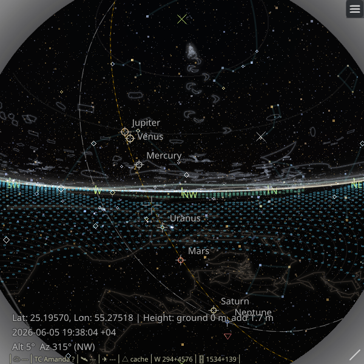

# zstarview 🌌

雲があっても、太陽が出ていても、満天の星空を。

**Zenith Star View** は、選んだ場所の空を表示するデスクトップ向けのスカイビューアです。

指定した場所と時刻の天球に、恒星、太陽、月、惑星、DSO、アステリズムを表示します。
必要に応じて、地形地平線、都市アウトライン、夜間光、近傍の航空機と人工衛星も重ねて表示できます。
観測地点は都市名やビューポイント名、緯度経度、オンライン地名検索、Google Maps の URL などで指定できます。

**特徴:**

- **恒星**: 選択したカタログの恒星を天球に表示し、その上にアステリズムなどのオーバーレイを重ねます。
- **太陽系天体**: 太陽・月・主要惑星に対応しています。小惑星（アステロイド）は未対応です。
- **検索**: 固有名星、アステリズム、地名、既知の人工衛星、JPL の天体を 1 つのダイアログから検索できます。ローカル検索で見つからない場合は既知の人工衛星をアプリ側の現在位置で解決します。`Keep marker` を有効にすると選択対象のマーカーとラベルを継続表示できます。
- **オーバレイのグループ**: 後述する表示機能は表示レイヤーごとにグループ化されています。各オーバレイはメニューまたは対応するキーボードショートカットで個別に切り替えできます。
- **柔軟な場所指定と表示中心**: 観測者の地点を、都市名、タワー名、山名、緯度経度、対応する Google Maps 座標 URL、または Nominatim を使った地名・駅名検索により指定できます。表示中心は `-A` / `-Z` または矢印キーで調整できます。HUD には、観測者の場所と現在の `alt/az` 視点中心も表示されます。
- **端末向け画像出力**: `zstarview-export-image` により、CLIコマンドとして空を描画してファイルへ保存したり、sixel 対応端末へ直接表示したりできます。
- **Python 対応**: CPython 3.10, 3.11, 3.12, 3.13 で継続的にテストしています。

**天体のオーバレイ:**

- **DSO 表示**: 名前付きの DSO（銀河/散開星団/球状星団）を薄い青系の領域として表します。
- **アステリズム表示**: IAU の正式な星座境界ではなく、通称のパターンとしてのアステリズムを暗い線で常時表示します。アステリズムに含まれる恒星にマウスホバーすると、そのアステリズムを明るく強調してラベルを表示します。同一の恒星が複数のアステリズムに含まれる場合は 3 秒ごとに切り替えます。
- **天球ガイド**: 昇らない領域を、天の赤道と同じ見た目のガイド線風の実線円として表示し、地平線まわりの方位ラベルと天頂マーカーも重ねて表示します。

**大気と人工物のオーバレイ:**

- **空色**: 空色ディスクを、グラデーション表示とフラットな暗色ディスク表示で切り替えます。
- **雲**: リアルタイムに Himawari/GOES 衛星のデータをダウンロードし、縞模様（ハッチ）の重ね描きとして表示します。空色ディスクは雲の下に見えるままで、衛星データが部分的な場合は欠損領域を薄い黄色で示します。[部分カバー時の黄色い欠損表示の例](docs/images/screenshot5.png) も参照してください。
- **人工衛星**: ISS / JWST / Voyager 1 / Voyager 2 / Parker を、惑星レイヤーと航空機レイヤーの間に小さな紫色のマーカーとして表示できます。
- **航空機**: OpenSky の近傍航空機を、予想移動方向付きの紫系ポリラインとして表示できます。

**建築物と地表ガイドのオーバレイ:**

- **地球ガイド**: 参考情報として、向きの把握を助けるための独立した地球ガイドレイヤーが同じ地面トーンで簡略化した大陸アウトラインを描きます。
- **地形地平線**: Copernicus DEM データをダウンロードして、地形地平線オーバーレイを表示します。帯状の稜線を同じ地平線色で描き、近い帯ほど太く、遠い帯ほど細くなります。青く差した稜線は、観測者から見える、手前の稜線に隠れない部分を示します。地形地平線（地形地平線を表示しない場合には水平線）より下は同じ地面トーンで塗り分けます。
- **都市アウトライン**: 現在の観測地点に対して、主要な建物屋根線を白い都市アウトラインとして表示します。高層建築が多い一部の都市では、半径 60km 以内の遠距離の高層建築も追加で表示されます。
- **水面**: 近傍の水域を小さな青いドットとして表示し、現在の観測地点のまわりの湖・海・河川敷の水面を示します。詳細は [水面について](docs/cli-overlays-ja_JP.md#about-water-surface) を参照してください。
- **夜間光**: NASA Earth at Night / Black Marble の 2016 Grayscale 500m GeoTIFF タイルを必要時にダウンロードしてローカルにキャッシュし、地平線や地形稜線の少し上に独立したグローとして表示します。

## スクリーンショット

1枚目の画像は、アステリズム表示と地形地平線の例を示しています。
2枚目の画像は、航空機オーバレイと昇らない領域を示しています。
3枚目の画像は、`-V10.5 -s4.5` でより高密度に星を描画した例です。
4枚目の画像は、`zstarview-export-image --search "C/1861 G1" --sixel` でサッチャー彗星 (`C/1861 G1 Thatcher`) を表示した例です。

  <p align="center">
    
    
  </p>

  <p align="center">
    
    
  </p>

注意: 等級上限を大きくすると描画時間も増えます。[等級上限オプションについて](docs/cli-sky-and-stars-ja_JP.md#about-magnitude-limit) も参照してください。

都市アウトラインと地形地平線の都市別スクリーンショット例:

<table>
  <tr>
    <td align="center" width="25%"></td>
    <td align="center" width="25%"></td>
    <td align="center" width="25%"></td>
    <td align="center" width="25%"></td>
  </tr>
  <tr>
    <td align="center"><sub>サーキュラー・キー（シドニー）</sub></td>
    <td align="center"><sub>東京タワー付近（東京）</sub></td>
    <td align="center"><sub>山中湖から望む富士山</sub></td>
    <td align="center"><sub>マリーナベイ（シンガポール）</sub></td>
  </tr>
</table>

<div style="height: 0.8em;"></div>

<table>
  <tr>
    <td align="center" width="25%"></td>
    <td align="center" width="25%"></td>
    <td align="center" width="25%"></td>
    <td align="center" width="25%"></td>
  </tr>
  <tr>
    <td align="center"><sub>ブルジュ・ハリファ付近（ドバイ）</sub></td>
    <td align="center"><sub>ユングフラウヨッホ（Jungfraujoch, スイス）</sub></td>
    <td align="center"><sub>マナローラ（イタリア）</sub></td>
    <td align="center"><sub>サグラダファミリア（バルセロナ）</sub></td>
  </tr>
</table>

## インストール方法（推奨：`pipx`）

**前提条件:**

都市アウトライン表示を使うには、`overturemaps` CLI も別途インストールしてください。
インストール方法は <https://pypi.org/project/overturemaps/> を参照してください。

次で確認できます。

```bash
overturemaps --help
```

Zstarview 自体は、[`pipx`](https://pypa.github.io/pipx/) を使ってインストールする想定です。

> 注記: 主に検証している環境は Linux x86_64 です。cloud-disc 系は
> `pyresample` 依存を削除したため、以前の Windows Arm64
> インストール阻害要因は解消されています。

```bash
pipx install zstarview
```

アップグレード:

```bash
pipx upgrade zstarview
```

最初の動作確認:

```bash
zstarview auto -A5 -Zn
```

これは、現在地を自動検出して (`auto`)、北側の低い空を中心に表示する (`-A5 -Zn`) 起動例です。

> 注記: X11 ライブラリやネットワークが細い場合の回避策などは、下のトラブルシューティングを参照してください。

## 使い方

```bash
zstarview [options] [location]
```

> 注記（Ubuntu/Wayland, GNOME）: ターミナル起動時にタスクバーのアイコンが表示されない場合は、後述の [ツール](#ツール) 内の [`.desktop` ランチャーの生成（GNOME専用）](#desktop-ランチャーの生成gnome専用) を実行してください。

よく使う起動例:

```bash
zstarview Tokyo
zstarview auto
zstarview "Tokyo Skytree"
zstarview "35.68;139.76" --datetime "2025-09-12 21 JST"
zstarview --place "Matsue Station" --place-countrycode jp
zstarview --search Ceres
```

CLI では、場所・時刻・データセット・描画設定を細かく指定できます。

### CLI リファレンス

#### 引数

| 引数のフォーマット | 説明 | デフォルト |
| :--- | :--- | :--- |
| 都市名 | 都市名（例: `Tokyo`） | 前回の場所（初回は `Tokyo`） |
| タワー名/山名 | タワー（例: `t/Tokyo Skytree`）または山（例: `m/Mount Fuji`） | |
| 緯度経度 | 直接座標（例: `35.68;139.76`, `@35.68,139.76`）または Google Maps URL | |
| `auto` | IPアドレスによる現在地自動取得 | |

下のリンクは詳細なオプショングループです。各ドキュメントに、詳細なオプション表、注釈、例をまとめています。

- [観測地点と時刻](docs/cli-observing-location-and-time-ja_JP.md)
- [観測地点名参照ツール](docs/cli-viewpoint-dataset-queries-ja_JP.md)
- [起動時の対象検索](docs/cli-search-objects-ja_JP.md)
- [星空と天体](docs/cli-sky-and-stars-ja_JP.md)
- [オーバーレイ](docs/cli-overlays-ja_JP.md)
- [一般](docs/cli-general-ja_JP.md)


<details>
  <summary>ツール</summary>

## ツール

### `zstarview-export-image`

GUI を起動せずに画像ファイルを 1 枚生成して終了する場合は、`zstarview-export-image` を使います。

```bash
zstarview-export-image Matsue -o matsue.png
```

`zstarview-export-image` は、通常 GUI 左上に出る場所・時刻・視線方向・vmag limit の要約を、描画後に `stderr` へ出力します。`--sixel` の場合は端末画像を出す直前に出力します。

トラブルシュートや手動キャッシュ削除のために、描画せず cache root だけを表示することもできます。

```bash
zstarview-export-image --print-cache-dir
```

`--clear-long-lived-cache` のクールダウンを回避したい場合は、まず `zstarview-export-image --print-cache-dir` で cache root を確認し、その配下の次のサブディレクトリを起動前に手動削除してください。

- `copernicus-dem`
- `overture_buildings`
- `overture_skyscrapers`

### `.desktop` ランチャーの生成（GNOME専用）

GNOME 系デスクトップ環境（Ubuntu Dock や DockToPanel を含む）では、
タスクバーに正しいアイコンを表示するために `.desktop` ファイルが必要です。

本アプリにはこれを生成する補助コマンドが付属しています。

```bash
# カレントディレクトリに zstarview.desktop を作成
zstarview-make-desktop-file

# ~/.local/share/applications にインストール
zstarview-make-desktop-file --write
```

* `--write` を付けない場合は、カレントディレクトリに `zstarview.desktop` が作成されます。
* `--write` を付けると `~/.local/share/applications` に書き込み、デスクトップデータベースに登録します。

> **注:** このランチャー機能は GNOME 系環境専用です。  
> 他のデスクトップ環境では不要、または正しく動作しない場合があります。

</details>

GUI では、キーボード操作とメニュー操作で視点移動、検索、各種オーバーレイ切り替えを行えます。

<details>
  <summary>GUI 操作</summary>

### GUI

#### キー操作

* **← / →**: 視線の方位を ±5° 回転
* **↑ / ↓**: 視線の高度を ±5° 変更（0°..90° にクランプ）
  方向キー入力が続く間と最後の入力から約 0.7 秒の間は、ビューポート操作用の簡易描画モードになります。この間は `Vmag <= 4.0` の恒星、天の赤道、黄道、地平線、地形地平線、方位ラベル、天頂マーカーのみを表示し、惑星、全星等の星空、空ディスク、雲、夜間光、DSO、アステリウム、都市アウトラインは一時的に非表示になります。
* **M**: 月の 5 倍表示をトグル
* **D**: DSO 重ね表示の表示/非表示を切り替え
* **A**: アステリウム重ね表示の表示/非表示を切り替え
* **G**: Sky Guides の表示/非表示を切り替え
* **S**: Sky Color の表示を切り替え
* **C**: 雲の重ね表示の表示/非表示を切り替え
* **L**: 夜間光オーバーレイの表示/非表示を切り替え
* **P**: 航空機オーバーレイの表示/非表示を切り替え
* **I**: 人工衛星オーバーレイの表示/非表示を切り替え
* **T**: 地形地平線の重ね表示の表示/非表示を切り替え
* **E**: 地平線下の地球ガイドの重ね表示の表示/非表示を切り替え
* **U**: 都市アウトラインの重ね表示の表示/非表示を切り替え
* **Ctrl+J**: Jump to Named Star を開く
* **Ctrl+F**: 対象検索を開く
* **F11**: フルスクリーン表示の切り替え
* **ESC**: フルスクリーンから復帰
* **Q**: 終了

#### メニュー操作

ハンバーガーメニュー（`☰`）から次を利用できます。

* **Jump to Named Star...**: 代表的な固有名星（`Vmag <= 2.0`）を北天 / 赤道付近 / 南天で選んで、視点中心をその星へ移動します。
* **対象検索...**: 固有名付き恒星、対応アステリウム、地名、既知の人工衛星、JPL の天体を横断検索し、選択した対象へ移動します。ローカル検索で見つからない場合は既知の人工衛星をアプリ側の現在位置で解決し、人工衛星として認識されたのに現在位置を取得できない場合はエラーにして JPL へはフォールバックしません。`Keep marker` を有効にすると、移動後もマーカーとラベルを継続表示します。
* **Search Places...**: OpenStreetMap Nominatim を使う別ダイアログを開き、地名・駅名・施設名の候補から選んだ地表地点の方向へ視点中心を移動します。
* **Enlarge Moon**: 月の 5 倍表示を切り替えます。
* **DSO**: DSO の重ね表示の表示/非表示を切り替えます。
* **Asterisms**: アステリウムの重ね表示の表示/非表示を切り替えます（有効時は暗い線を常時表示し、構成星にホバーすると該当アステリウムを明るく強調してラベルを表示します）。
* **Guidelines**: 幾何学的地平線、天の赤道、黄道、実線の never-rises 円、方位ラベル、天頂マーカーの表示/非表示を切り替えます。
* **Sky Color**: 空ディスク表示を、空色グラデーション表示とフラットな暗色ディスク表示で切り替えます。
* **Clouds**: リアルタイム雲の重ね表示の表示/非表示を切り替えます。
* **Night Lights**: NASA Earth at Night / Black Marble の夜間光オーバーレイの表示/非表示を切り替えます。CLI で `--night-light-opacity 0` を指定して起動した場合、その起動中はメニューから再有効化できません。
* **Aircraft**: OpenSky ベースの航空機オーバーレイの表示/非表示を切り替えます。CLI で `-a 0` / `--aircraft-opacity 0` を指定して起動した場合、その起動中はメニューから再有効化できません。
* **Satellites**: ISS / JWST / Voyager 1 / Voyager 2 / Parker の人工衛星オーバーレイの表示/非表示を切り替えます。CLI で `--satellite-opacity 0` を指定して起動した場合、その起動中はメニューから再有効化できません。
* **Terrain Horizon**: 地形地平線の重ね表示の表示/非表示を切り替えます。CLI で `-d 0` / `--terrain-horizon-opacity 0` を指定して起動した場合、その起動中はメニューから再有効化できません。
* **Earth Guide**: 地平線下の地球ガイドの重ね表示の表示/非表示を切り替えます。CLI で `-e 0` / `--earth-guide-opacity 0` を指定して起動した場合、その起動中はメニューから再有効化できません。
* **Urban Outline**: 都市アウトラインの重ね表示の表示/非表示を切り替えます。CLI で `-u 0` / `--urban-outline-opacity 0` を指定して起動した場合、その起動中はメニューから再有効化できません。
* **Fullscreen**: フルスクリーン表示を切り替えます。
* **Exit**: アプリケーションを終了します。

ジャンプ/検索の確定後は約 3 秒間、マウスホバー時と同じ見た目（円マーカー + 名称ラベル）で対象星を強調表示します。

ウィンドウサイズ変更中も同じ簡易描画モードを使うため、表示の追随性を保ちます。

</details>

<details>
  <summary>都市アウトライン用データ</summary>

`zstarview` は都市アウトライン用の元データを Overture Maps から必要時に取得し、
アプリのキャッシュディレクトリに派生タイルとして保存します。新しい
地点・半径・建物高さ条件の組み合わせでは、初回だけ数秒待ってから都市
アウトラインが表示されます。

この機能には `overturemaps` CLI の別途インストールが必要です。次で確認できます。

```bash
overturemaps --help
```

起動例:

```bash
zstarview "Tokyo Tower" -r 2.5 -b 0
zstarview -p "Matsue Station" -r 2.0 -b 20
```

- `-r`, `--urban-outline-radius-km`: 取得半径（km）
- `-b`, `--urban-outline-min-building-height-m`: 建物の最小高さ（m）
- `--urban-outline-feature-type`: Overture キャッシュモード。既定値は `both`

キャッシュキーには地点・半径・最小建物高さが含まれるため、これらを変えると
別のキャッシュデータセットが作られます。

</details>

<details>
  <summary>トラブルシューティングとプラットフォーム補足</summary>


## トラブルシューティング

### X11（Ubuntu/Debian）

Qt の xcb プラグインが `libxcb-cursor0` を必要とする場合があります。
X11/Wayland を意識していないと分かりづらいですが、ターミナルから実行すると次のようなエラーが表示されます:

```sh
$ zstarview
qt.qpa.plugin: From 6.5.0, xcb-cursor0 or libxcb-cursor0 is needed to load the Qt xcb platform plugin.
qt.qpa.plugin: Could not load the Qt platform plugin "xcb" in "" even though it was found.
This application failed to start because no Qt platform plugin could be initialized. Reinstalling the application may fix this problem.

Available platform plugins are: eglfs, offscreen, wayland-egl, linuxfb, wayland, minimal, xcb, vkkhrdisplay, minimalegl, vnc.
```

この場合は以下で `libxcb-cursor0` をインストールしてください:

`sudo apt install libxcb-cursor0`

### Wayland 環境でウィンドウの影が表示されない

Wayland のデスクトップ環境では、通常のフレーム付きウィンドウとして
`zstarview --window-frame window` を起動しても、外側の影が表示されないことがあります。
これは zstarview 自身のウィンドウ設定というより、Wayland の window decoration /
compositor 側の挙動によることが多いです。

X11 系の見た目でウィンドウ影を出したい場合は、実用的な回避策として
XWayland 経由で起動できます:

```sh
QT_QPA_PLATFORM=xcb zstarview --window-frame window
```

`QT_QPA_PLATFORM=xcb` を付けると影が表示される場合は、その差分は
Wayland と X11 のウィンドウ装飾経路の違いによるものと考えてよいです。

### Wayland 環境で `QT_QPA_PLATFORM=xcb` を付けるとウィンドウがちらつく

Wayland 環境では、`QT_QPA_PLATFORM=xcb` を強制すると、frameless ウィンドウが
ちらつくことがあります。特に最大化時に、再描画の途中で背後のデスクトップや
他ウィンドウが一瞬見えることがあります。

この症状が出る場合は、通常の frameless UI では `QT_QPA_PLATFORM=xcb` を
付けずに起動してください。XWayland を使いたい場合は、標準のフレーム付き
ウィンドウで起動するのが安全です:

```sh
zstarview
zstarview --window-frame window
```

### ネットワークが遅い / オフラインで使いたい
1. 惑星暦データ

   初回起動時は惑星暦データ（`de442s.bsp`）を自動ダウンロードします。  
   この一度だけはネットワーク接続が必要です。ダウンロード後はキャッシュを利用してオフラインでも動作します。

2. 雲衛星画像

   雲の描画は公開 S3 バケットから衛星画像を取得し、依存も比較的重めです。
   回線が細い、またはオフラインの場合は `-c 0` で雲描画を無効化してください。
   雲を無効化しても、恒星・惑星・空の色の表示は利用できます。

3. 地形地平線

   地形地平線表示は初回に Copernicus DEM タイルをダウンロードし、その後はローカルキャッシュを再利用します。
   回線が細い、またはオフラインの場合は `-d 0` / `--terrain-horizon-opacity 0` で地形地平線表示を無効化してください。
   地球ガイドだけを止めたい場合は `-e 0` / `--earth-guide-opacity 0` を使えます。
   地形地平線を無効化しても、恒星・惑星・空の色の表示は利用できます。

4. 夜間光データ

   夜間光は NASA Earth at Night / Black Marble の 2016 Grayscale 500m GeoTIFF タイルを使います。
   タイルは必要時にダウンロードされ、ローカルにキャッシュされます。
   回線が細い、またはオフラインの場合は `--night-light-opacity 0` で夜間光レイヤーを無効化してください。
   キャッシュがすでにあれば、ネットワークがなくても夜間光オーバーレイを表示し続けられます。

5. 人工衛星データ

   人工衛星オーバーレイは実行時に ISS の軌道要素データを取得し、取得元は `wheretheiss.at` を優先し、失敗時だけ CelesTrak を使います。JWST / Voyager 1 / Voyager 2 / Parker は JPL Horizons を使います。fresh な current cache は ISS と Horizons 側の両方で最大 24 時間まで再利用します。
   このレイヤーはリアルタイム表示でのみ利用でき、タイムシフト表示では人工衛星の取得も描画も行いません。
   回線が細い、またはオフラインの場合は `--satellite-opacity 0` で人工衛星レイヤーを無効化してください。
   新しいキャッシュがすでにあれば、ネットワークがなくても人工衛星オーバーレイを表示し続けられます。

6. 航空機データ

   航空機オーバーレイは実行時に OpenSky Network の state data を取得します。
   既定では 5 分ごとに再取得します。この間隔は、無料枠での利用や一時的な取得失敗・再試行に対して余裕を持たせるため、過度に短くせず保守的に設定しています。
   OpenSky への問い合わせ自体を避けたい場合は、`-a 0` で航空機レイヤーを無効化してください。

雲関連のステータス表示は `idle` / `downloading` / `partial` を使います:
- `downloading`: S3 から衛星ソースを取得中
- `partial`: 入手済みデータのみで描画（欠損領域は薄い黄色で表示）

GOES-East の参照先を GOES-19 に更新したことで、以前は単に「衛星のカバー外」となっていた場所でも、場所によっては部分カバーとして表示されるようになりました。ヨーロッパでも一部の地点でこの挙動になります。その場合、カバーされている部分には雲画像が描かれ、カバー外の部分には薄い黄色の欠損色が表示されます。77〜87% 程度のカバー率の例は [screenshot5](docs/images/screenshot5.png) を参照してください。

### 星空の更新間隔と CPU 負荷

CPU 性能によっては星空の自動更新が負荷になる場合があります。更新間隔を長くして負荷を下げてください（例: `-i 300` で 5 分ごと）。余裕があれば短くして構いません。

### ログの確認

ターミナルから `$ zstarview` で起動すると、起動メッセージやエラーを確認できます。
併せてログファイルにも出力されます（OS 依存）。例:
- Linux: `~/.cache/zstarview/logs/app.log`
- macOS: `~/Library/Logs/zstarview/app.log`
- Windows: `%LOCALAPPDATA%/tos-kamiya/zstarview/Logs/app.log`

通常起動だとすぐ閉じて確認しづらい場合は、ターミナルから `zstarview-debug` を試してください。
これは主に Windows でのトラブルシュート用です。Linux では `zstarview-debug` は `zstarview` と実質同じ動作です。

Windows では、Windows セキュリティにより Python 拡張モジュールの読み込みがブロックされ、起動時に止まることがあります。
その場合は、Windows セキュリティの `App & browser control` にある `Smart App Control` の設定を変更すると回避できることがあるようです。
ただし、セキュリティを弱くすることになるので、安全な環境以外での実行は推奨しません。
[Smart App Control の画面例](docs/images/windows-smart-app-control_ja.png) も参照してください。

</details>

<details>
  <summary>コード・データのライセンスとクレジット</summary>

## コード・データのライセンスとクレジット

このソフトウェアは [MIT](LICENSE.txt) の下で提供されています。

ただし、**同梱されているデータ** はそれぞれのライセンスに従って再配布されます。

以下のパスは `src/zstarview/data/` 配下を基準としています。

| ファイル | 内容 | 出典 | ライセンス |
| :--- | :--- | :--- | :--- |
| `cities1000.txt`, `admin1CodesASCII.txt` | 人口 1000 人以上の都市一覧 | [GeoNames](https://download.geonames.org/export/dump/) | [CC BY 4.0](https://creativecommons.org/licenses/by/4.0/) |
| `viewpoints/tower_viewpoints.json` | タワー名起動用に同梱している展望塔/タワーデータ（Wikidata 由来の整形データ） | [Wikidata](https://www.wikidata.org/) をローカル整形したもの（手順は `dev-samples/` に記録） | [CC0 1.0](https://creativecommons.org/publicdomain/zero/1.0/)（Wikidata データ） |
| `viewpoints/mountain_viewpoints.json` | 山名起動用に同梱している山頂ビューポイントデータ（Wikipedia で収集した候補を Wikidata メタデータで正規化したデータ） | [Wikipedia](https://www.wikipedia.org/) での候補収集と [Wikidata](https://www.wikidata.org/) による正規化手順（`dev-samples/` に記録） | [CC0 1.0](https://creativecommons.org/publicdomain/zero/1.0/)（Wikidata データ） |
| `earth_guide_land_110m.json` | 地平線下の地球ガイド用ハッチングを生成するための簡略化した陸地形状（Natural Earth 1:110m land polygons 由来） | [Natural Earth](https://www.naturalearthdata.com/) | [Public domain](https://www.naturalearthdata.com/about/terms-of-use/) |
| 実行時に OpenStreetMap Nominatim へ送る `--place` ジオコーディング要求 | `--place` 指定時だけ使うオンライン地名検索 | [OpenStreetMap Nominatim](https://nominatim.openstreetmap.org/) | [Nominatim Usage Policy](https://operations.osmfoundation.org/policies/nominatim/) |
| 実行時に `ip-api.com` へ送る IP ジオロケーション要求 | `auto` 指定時に使う IP ベースの現在地取得 | [ip-api.com](https://ip-api.com/) | [ip-api.com の利用条件 / プライバシーポリシー](https://ip-api.com/docs/legal) |
| 実行時に Overpass API 経由で取得する水面オーバーレイデータ | オプションの水面レイヤー向けに OpenStreetMap の水域データから生成した点群 | [OpenStreetMap](https://www.openstreetmap.org/)、[Overpass API](https://overpass-api.de/) | [ODbL 1.0](https://opendatacommons.org/licenses/odbl/) |
| アプリのキャッシュディレクトリ配下にオンデマンドで保存される都市アウトラインキャッシュ | ダウンロードした Overture 建物データから生成した派生建物タイルと `tile_index.json` | `overturemaps` CLI を通じて実行時に取得する [Overture Maps Buildings](https://docs.overturemaps.org/guides/buildings/) | [ODbL 1.0](https://opendatacommons.org/licenses/odbl/) |
| アプリのキャッシュディレクトリ配下にオンデマンドで保存される夜間光キャッシュ | 夜間光オーバーレイ用の NASA Earth at Night / Black Marble 2016 Grayscale 500m GeoTIFF タイル | [NASA Earth at Night / Black Marble maps](https://science.nasa.gov/earth/earth-observatory/earth-at-night/maps/) | [NASA Earth at Night / Black Marble maps](https://science.nasa.gov/earth/earth-observatory/earth-at-night/maps/) に記載された NASA のデータ利用条件 |
| 実行時に JPL Horizons / Small-Body Database へ送る検索・エフェメリス要求 | 天体検索結果と observer ephemeris / JWST, Voyager 1, Voyager 2, Parker の表示に使う observer ephemeris | [JPL Horizons](https://ssd.jpl.nasa.gov/horizons/), [JPL Small-Body Database](https://ssd.jpl.nasa.gov/tools/sbdb_lookup.html) | 利用条件やデータに関する案内は各 JPL / JPL SSD サイトを参照 |
| 実行時に `wheretheiss.at` から取得し、失敗時は CelesTrak を使う人工衛星オーバーレイ用データ | ISS 表示に使う軌道要素データ | [wheretheiss.at](https://wheretheiss.at/w/developer), [CelesTrak](https://celestrak.org/) | 利用条件やライセンスは各出典サイトを参照 |
| `dso.csv` | DSO（銀河/散開星団/球状星団）カタログ（OpenNGC 由来の生成データ） | [OpenNGC](https://github.com/mattiaverga/OpenNGC)（[PyOngc](https://github.com/mattiaverga/PyOngc) 経由で生成） | [CC BY-SA 4.0](https://creativecommons.org/licenses/by-sa/4.0/)（OpenNGC データベース） |
| アプリのキャッシュディレクトリ配下にオンデマンドで保存される地形 DEM キャッシュ | 地形地平線用の地形データ（Copernicus DEM GLO-90） | [Copernicus DEM / Copernicus Data Space Ecosystem](https://dataspace.copernicus.eu/explore-data/data-collections/copernicus-contributing-missions/collections-description/COP-DEM)（アプリは公開 AWS 配布を利用） | Copernicus Data Space Ecosystem の案内する Copernicus DEM GLO-90 の利用条件（"Licence for COP-DEM-GLO-90-F Global 90m Full, Free & Open" / "Licence for the use of the Copernicus WorldDEM™-90"） |
| `stars/IAU-Catalog of Star Names (always up to date).csv` | IAU 恒星名作業部会 (WGSN) による恒星固有名カタログ | [exopla.net](https://exopla.net/star-names/modern-iau-star-names/) | [CC BY 4.0](https://creativecommons.org/licenses/by/4.0/) |
| `Noto_Sans/*` | テキスト表示フォント | [Google Fonts](https://fonts.google.com/) | [SIL Open Font License 1.1](https://openfontlicense.org) |

## クレジット

* 天文データを提供していただいている **CDS Strasbourg** および **ESA Hipparcos Mission** に感謝します。
* 都市データは **GeoNames** に基づいています。
* タワー/展望塔の起動データは **Wikidata** に基づく整形データであり、Wikidata の CC0 条件に従って再配布しています。
* 山頂ビューポイントの起動データは **Wikipedia** で収集した候補を **Wikidata** メタデータで正規化したものであり、ここでは Wikidata の CC0 条件に従って再配布しています。
* 地球ガイド用の大陸ポリゴンは **Natural Earth** 1:110m land polygons を簡略化したもので、Natural Earth はこれを public domain としています。ここでは出典として明記しています。
* 地形地平線用の地形データは **Copernicus DEM GLO-90** に基づいており、欧州委員会のために **ESA** が管理するデータを、アプリでは公開 AWS 配布とローカルキャッシュを通じて利用しています。
* 都市アウトライン用の元データは **Overture Maps Buildings** から必要時に取得し、実行時利用向けに派生タイルへ変換したものです。
* 夜間光用データは **NASA** Earth at Night / Black Marble から必要時に取得し、実行時利用向けに GeoTIFF タイルとしてローカルにキャッシュされます。
* 恒星の固有名は **IAU** 恒星名作業部会 (**WGSN**) による承認済みリスト（exopla.net 経由）を使用しています。
* 雲データは気象衛星 **Himawari**（提供: **JMA**）および **NOAA GOES** シリーズ（提供: **NOAA/NESDIS**）による赤外線観測データを、それぞれの公開 S3 バケットから取得して利用しています。
* 人工衛星オーバーレイで使う軌道要素データは、**ISS** については **wheretheiss.at** を優先し、失敗時は **CelesTrak** を fallback として利用します。**JWST** / **Voyager 1** / **Voyager 2** / **Parker** は **JPL Horizons** の observer ephemeris を利用します。
* JPL 天体検索は **JPL Horizons** と **JPL Small-Body Database** を使って天体名の解決と observer ephemeris の取得を行います。検索結果やエフェメリスの利用条件・注意事項は各 JPL / JPL SSD サイトを参照してください。
* `--place` による地名・駅名検索は公開の **OpenStreetMap Nominatim** サービスを使っており、Nominatim の利用ポリシーの対象です。
* `auto` による IP ベースの現在地取得は **ip-api.com** を使っており、ip-api.com の利用条件 / プライバシーポリシーの対象です。非商用利用の制限と 1 分あたり 45 リクエストの上限があります。
* 水面オーバーレイデータは **OpenStreetMap** の水域データを **Overpass API** 経由で取得したもので、**OpenStreetMap contributors** に帰属し、**ODbL 1.0** の下で提供されます。
* 大規模建物データを公開している **Overture Maps** とそのソースデータ提供者に感謝します。
* 雲画像や地形 DEM の取得に利用している公開 S3 配布/ミラーを提供している **AWS** および各データ提供者に感謝します。
* フォントは **Google Noto Project** を利用しています。
* ウィンドウタイトル「Zenith Star View」は **ChatGPT** の提案に由来します。
* **Gemini** および **ChatGPT** に、仕様の相談、コード生成、デバッグなど、多くの助力をいただきました。

</details>

## 付録

→ [開発者向けドキュメント](docs/developer/README.md)

→ [仕様書](docs/specification.md), [設計書](docs/design.md)

→ [2026〜2028年の月食（皆既・部分）, 2026〜2028年の皆既日食](docs/appendix-eclipses-ja_JP.md)
