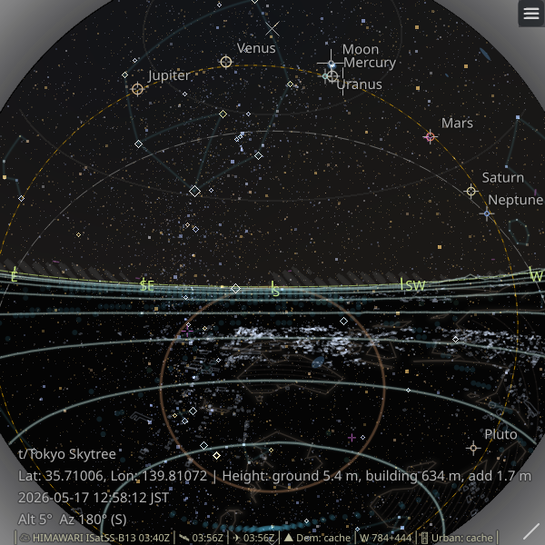
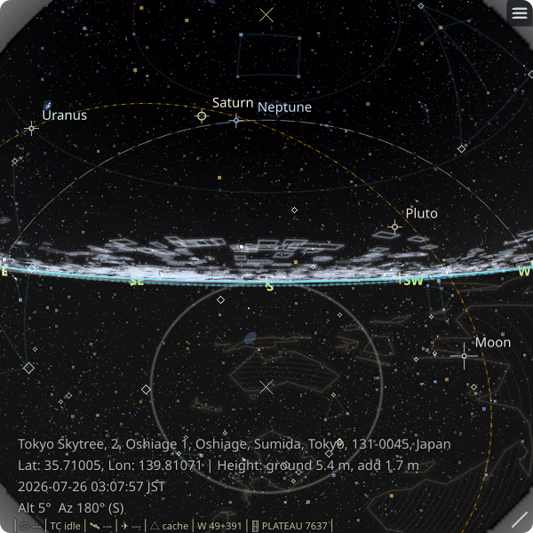
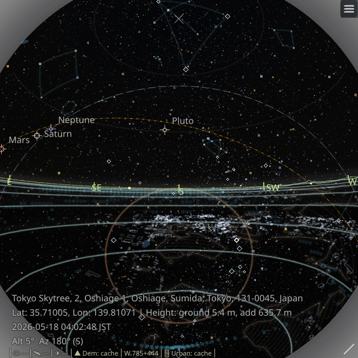

# Observing Location and Time

| Option | Description | Default |
| :----- | :---------- | :------ |
| `-p`, `--place QUERY` | Search a place, station, or facility name via OpenStreetMap Nominatim and use the top candidate as the observing location. Cannot be used together with the positional `location` argument. | |
| `--place-countrycode CODE` | Restrict `--place` search to an ISO 3166-1 alpha-2 country code such as `jp`. | |
| `--place-lang LANG` | `Accept-Language` sent to Nominatim for `--place` search results. | `en` |
| `--timezone TZ` | Override the resolved location timezone for `--datetime` and on-screen time. Accepts abbreviations, IANA names, and UTC offsets such as `JST`, `Asia/Tokyo`, or `UTC+9`. | |
| `-H`, `--hours HOURS` | Number of hours to add to the current time. \*1 | `0` |
| `-D`, `--days DAYS` | Number of days to add to the current time. \*1 | `0` |
| `--datetime "YYYY-MM-DD HH[:MM[:SS]] [TZ]"` | Specify an absolute date/time. Time may be given as `HH`, `HH:MM`, or `HH:MM:SS`. If no TZ is specified, UTC is assumed. \*1 | |
| `-Z`, `--view-center-az VIEW_CENTER_AZ` | Viewing azimuth (degrees or compass points). | `180` |
| `-A`, `--view-center-alt VIEW_CENTER_ALT` | Viewing altitude angle (90=zenith, 0=horizon). | `90` |
| `--edge-fov-deg DEGREES` | Projection scale for the window edge. `90` means the window edge corresponds to `90°` from the view center. | `90` |
| `--content-fov-deg DEGREES` | Shared overscan content FOV for all layers. The window edge still corresponds to `90°` from the view center; values above `90` let sky/cloud/background content extend beyond the window edge and reduce empty corner regions. Allowed range: `90`–`127`. | `115` |
| `--height-add-m METERS` | Additional height above the active observation base in meters. This replaces the default add height of `1.7` meters, which assumes a typical standing observer height. For tower and mountain viewpoints, the viewpoint's own height/elevation remains separate from this value. | `1.7` |
| `--use-building-top` | Use a nearby building top as the active observation base when one is found within about 5 meters of the resolved location. | off |

Note: `--observer-height-m` remains available as a compatibility alias for `--height-add-m`.

#### About `--place`

`--place` is an explicit online resolver path separate from the normal offline-first `location` argument.

- The app sends a single Nominatim search request and sorts candidates by importance.
- Startup remains non-interactive: the top candidate is used automatically.
- When multiple candidates are found, they are logged to the terminal and the top candidate is still used.
- The full returned place name is shown in the GUI location label so mismatches are easier to notice.
- The selected result is saved in config and reused on the next launch without re-querying Nominatim.

#### Tower name input

You can also start from a built-in tower/viewpoint dataset generated from Wikidata.

* Examples:
  * `Tokyo Skytree`
  * `t/Tokyo Skytree` (explicit tower selection)
  * `Tsutenkaku` (ASCII fallback for `Tsūtenkaku`)
  * `Tokyo Tower`
  * `wikidata:Q57965`
* When a tower name is used, the tower's stored structural/viewpoint height is used as the base observation point.
* `--height-add-m` adds only the extra height above that base point (default `1.7m`); it does not replace the tower's own height.
* Tower resolution also accepts ASCII fallback spellings for names with diacritics.
* In the on-screen location info, tower viewpoints may show `Height: ground ..., building ..., add ...` on a separate line.

Example:

```bash
zstarview "Tokyo Skytree"
zstarview "Tokyo Tower" --height-add-m 150
```

#### Tower names vs `--place`

* A built-in tower/viewpoint name such as `Tokyo Skytree` uses the stored tower height from the viewpoint dataset. In the current dataset, Tokyo Skytree is 634 m tall, so with the default `1.7 m` add height the total comes to `635.7 m`.
* `--place "Tokyo Skytree"` resolves the same text as a place name through Nominatim and returns only the ground location. It does not load the tower dataset height.
* If you want the tower-like viewpoint while using `--place`, set the additive height manually, for example `--place "Tokyo Skytree" --height-add-m 635.7`.
* For a building that is not registered in the built-in tower dataset, `--height-add-m` is the way to set the viewing height manually.

<table>
  <tr>
    <td align="center" width="33%"></td>
    <td align="center" width="33%"></td>
    <td align="center" width="33%"></td>
  </tr>
  <tr>
    <td align="center">Built-in tower name</td>
    <td align="center">`--place` search</td>
    <td align="center">`--place` + manual height</td>
  </tr>
</table>

#### Footnotes

\*1 `--hours`, `--days`, and `--datetime` do not show cloud, aircraft, artificial satellite, or tropical cyclone overlays when the sky is not real-time.

#### Mountain name input

You can also start from the bundled mountain/viewpoint dataset.

* Examples:
  * `Mount Fuji`
  * `m/Mount Fuji` (explicit mountain selection)
  * `Aconcagua`
  * `Snezka` (ASCII fallback for `Sněžka`)
  * `wikidata:Q39231`
* When a mountain name is used, the base observation point is the mountain summit viewpoint.
* `--height-add-m` adds only the extra height above that summit point (default `1.7m`).
* Mountain resolution also accepts ASCII fallback spellings for names with diacritics.
* In the on-screen location info, mountain viewpoints may show `Height: ground ..., add ...` on a separate line.

Example:

```bash
zstarview "Mount Fuji"
zstarview "Snezka"
```

#### About the datetime option

Use `--datetime "YYYY-MM-DD HH[:MM[:SS]] [TZ]"` to specify an absolute date and time.
The time part may be just hours, hours\:minutes, or hours\:minutes\:seconds.
If no timezone (TZ) is specified, the resolved location timezone is used. `--timezone TZ` overrides the resolved location timezone.

Supported timezone formats:

* A common abbreviation (JST, UTC, GMT, KST, HKT, AWST, ACST, AEST, NZST, NZDT, MSK, EAT)
* A full IANA timezone name (e.g., `Asia/Tokyo`, `Europe/Moscow`)
* A UTC offset (e.g., `UTC+9`, `UTC-07:30`)

Examples:

```bash
zstarview --datetime "2025-08-17 21:00:00 JST" Tokyo
zstarview --datetime "2025-09-12 9" Tokyo         # 9 o'clock
zstarview --datetime "2025-09-12 09:00" Tokyo     # 9:00
zstarview --datetime "2025-09-12 9:0:0 JST" Tokyo # 9:00:00 JST
```

#### Direct coordinate input

Instead of a city name, you can directly specify coordinates.

* Formats:
  * `latitude;longitude` (semicolon separated)
  * `@latitude,longitude`
  * Supported Google Maps shared URLs starting with `maps.google.com/` or `www.google.com/maps/`
* Examples:
  * `35.68;139.76`
  * `N35.68;E139.76`
  * `-35.68;139.76`
  * `S35.68;W139.76`
  * `@35.68,139.76`
  * `https://www.google.com/maps/@35.68,139.76,17z`
  * `maps.google.com/maps/@35.68,139.76`
  * `https://www.google.com/maps/place/...!3d35.68!4d139.76...`
* Latitude must be between -90 and 90, longitude between -180 and 180.
* Direction letters `N/S/E/W` can be used (negative sign takes precedence if both given).
* Supported Google Maps URLs currently include the widely observed shared-link forms starting with `maps.google.com/` or `www.google.com/maps/`. `https://` may be omitted.
* For supported Google Maps URLs, `!3dLAT!4dLON` is used when present. Otherwise `@LAT,LON` is used.
* Zoom, altitude, heading, pitch, and similar trailing URL components are ignored.
* When starting with direct coordinates, the timezone is resolved from the parsed location in the same way as `--place`. `--timezone TZ` overrides that result.
* `--height-add-m` remains the primary way to specify the additive height above the active base. Google Maps URL altitude-like fields do not affect this value.

#### Footnotes

\*1 `--hours`, `--days`, and `--datetime` do not show cloud, aircraft, artificial satellite, or tropical cyclone overlays when the sky is not real-time.
